# Concevoir une carte : l'éditeur de cartes

But : concevoir une carte **simplement, sans bug et amusante**, puis la jouer
aussitôt. L'**éditeur de cartes** est une scène du jeu (menu principal >
ÉDITEUR DE CARTES) : on y dessine les pièces vues de dessus, on pose portes,
fenêtres, atouts, armes, boîte… depuis un inventaire façon Minecraft, un
validateur vérifie la carte avec des règles « façon BO1 », et le bouton
**TESTER** lance une partie solo dessus. La carte est enregistrée en cinq
fichiers JSON lisibles et écrivables à la main (un outil peut aussi les
écrire), exportables en archive `.zip`.

Preuve : la carte d'essai **DRAFT ARENA** (`assets/maps/draft_arena/`, hors
menus, `--map=draft_arena`) est faite dans ce format et se joue (scénarios
`draft_arena` et `map_editor_play`).

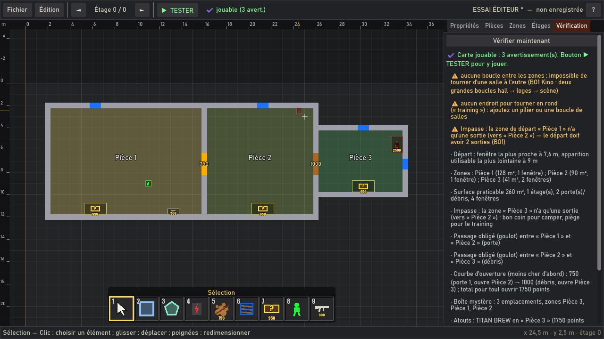
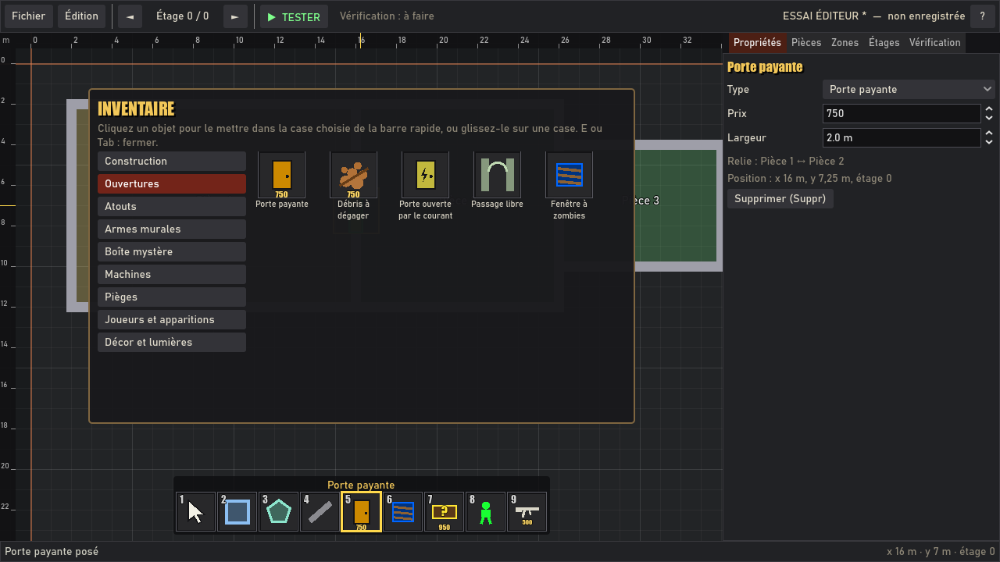
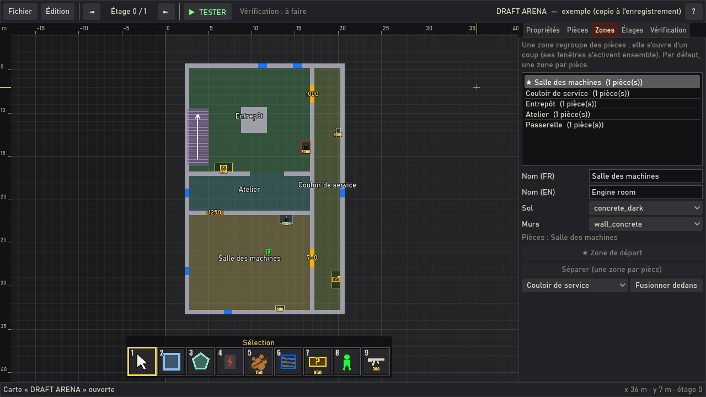
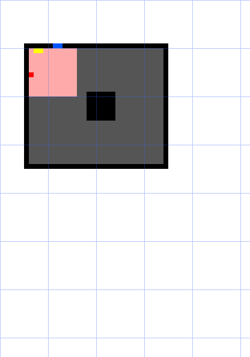
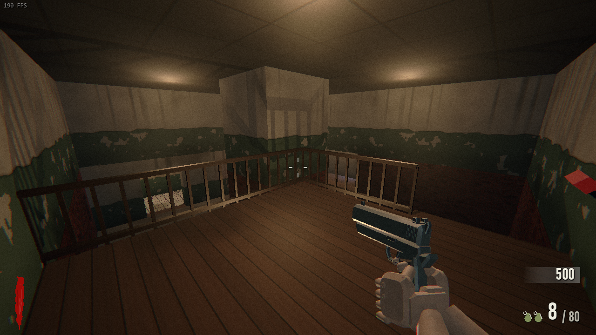
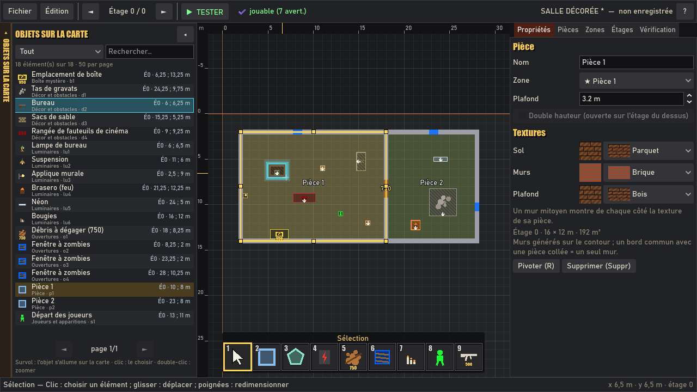
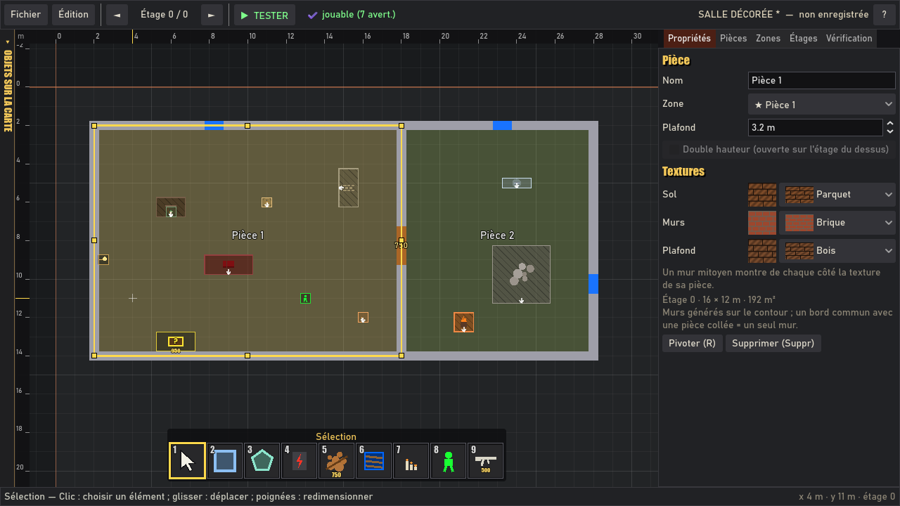
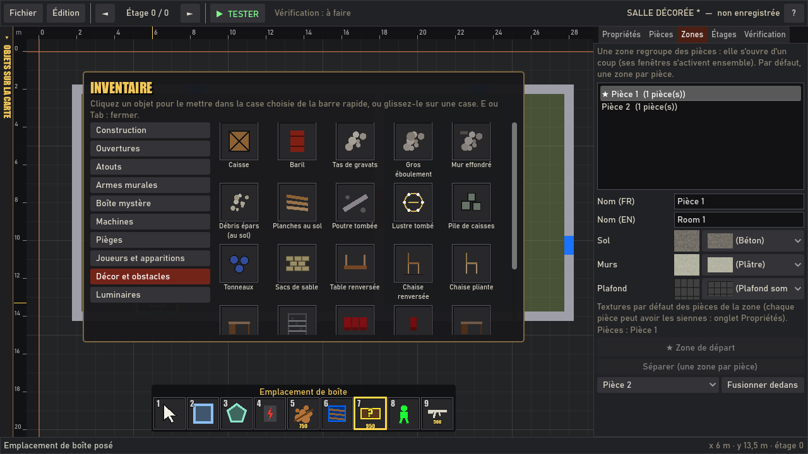
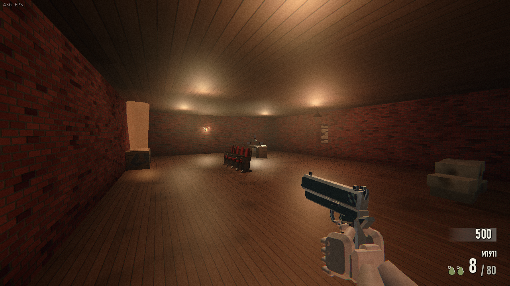

---

## 1. Lancer l'éditeur

- Depuis le jeu : menu principal > **ÉDITEUR DE CARTES** (aussi dans le `.exe`).
- Directement : `godot --path . res://scenes/editor/map_editor.tscn`, ou
  double-clic sur `tools/map_editor.bat` (Godot dans le PATH, ou `set GODOT=…`).
- Vérifier une carte sans fenêtre (outil, intégration) :
  `godot --headless --path . res://scenes/editor/map_editor.tscn -- --check=<dossier ou archive.zip>`
  affiche le rapport du validateur ; code de sortie 0 si la carte est jouable.

Au démarrage, l'éditeur rouvre la dernière carte ; s'il reste une sauvegarde
automatique non enregistrée, il propose de la reprendre.

## 2. L'écran

| Zone | Rôle |
|---|---|
| Barre du haut | **Fichier** (Nouvelle, Ouvrir, Enregistrer, Enregistrer sous, exporter / importer l'archive .zip, cartes récentes, retour au menu), **Édition** (annuler, rétablir, copier, coller, pivoter, supprimer, inventaire, recadrer), étage courant (◄ ►), **▶ TESTER**, état de la vérification. |
| Vue de dessus | Grille de 1 m (traits forts tous les 5 m ; traits fins au pas de la grille fine), règles graduées en mètres en haut et à gauche, coordonnées du curseur aimanté en bas à droite. |
| Barre rapide | 9 cases au bas de la vue (touches 1 à 9, molette) : l'objet tenu. |
| Inventaire | Touche **E** ou **Tab** : toutes les catégories ; cliquer un objet le met dans la case choisie, ou le glisser sur une case. |
| Panneaux | **Propriétés** (élément choisi, sinon la carte), **Pièces**, **Zones**, **Étages**, **Vérification**. |
| Objets sur la carte | Onglet déployable à gauche de la vue (languette, bouton ◂ ou touche **L** ; ouvert / replié : mémorisé) : voir §2 bis. |
| Aperçu 3D | Bouton **APERÇU 3D** de la barre du haut ou touche **P** : la carte telle qu'en jeu, en direct, dans un panneau flottant ou une fenêtre séparée : voir §2 ter. |
| Barre d'état | Aide de l'outil, raison d'un refus, résultat des actions. |

### Commandes

| Action | Commande |
|---|---|
| Poser / choisir | clic gauche |
| Tracer (pièce, forme, mur, pilier, escalier, piège) | glisser, ou clic puis clic (le tracé suit le curseur entre les deux) |
| Annuler le tracé, désélectionner | clic droit, Échap |
| Zoom | Ctrl + molette (ou + / -) |
| Déplacer la vue | clic milieu + glisser, ou Espace + glisser |
| Aimantation | **G** : grille 1 m → grille fine → libre (sans grille) ; **Maj+G** : pas de la grille fine (0,5 / 0,25 / 0,1 m) ; **Maj** maintenu : inverse le mode (grille ↔ libre) ; mémorisé ; bouton « Aimantation » de la barre du haut |
| Angle d'un mur ou d'un côté de polygone | sur la grille : 0, 45 ou 90° ; sans grille : par pas de 15° ; angle libre en maintenant Alt ; longueur et direction affichées pendant le tracé |
| Saisie au clavier pendant le tracé | taper la longueur, **Tab**, l'angle (degrés depuis l'est, sens trigonométrique : 90 = nord), **Entrée** ; rectangle, ellipse, triangle, L : largeur, hauteur ; cercle : rayon, points ; mur courbe : rayon, ouverture ; Retour arrière efface, Échap annule la saisie |
| Points d'un cercle ou d'une ellipse, segments d'un mur courbe | molette ou + / - pendant le tracé ; puis dans l'onglet Propriétés |
| Rotation libre | **poignée ronde** au-dessus de l'élément choisi : pas de 15°, au degré près avec Alt ; champ « Angle » des propriétés |
| Rectangle à 45° | Pièce rectangle en main : R (le glisser va d'un coin au coin opposé du losange) |
| Case de la barre rapide | 1 à 9, molette |
| Inventaire | E ou Tab |
| Pivoter de 90° | R (une pièce pivote avec son contenu ; un décor ou un luminaire tenu pivote avant d'être posé) |
| Liste des objets sur la carte | L |
| Aperçu 3D (afficher / masquer) | P (voir §2 ter pour ses caméras) |
| Placer la caméra de l'aperçu à un endroit | Ctrl + double-clic sur la carte (aperçu affiché) |
| Supprimer | Suppr (une pièce emporte ses objets et ses ouvertures) |
| Copier / coller sous le curseur | Ctrl+C / Ctrl+V |
| Annuler / rétablir (illimité) | Ctrl+Z / Ctrl+Y (ou Ctrl+Maj+Z) |
| Enregistrer | Ctrl+S |
| Étage du dessous / du dessus | Page préc. / Page suiv. |
| Recadrer sur la carte | Origine |
| Fermer un polygone | double-clic, clic sur le premier point, ou Entrée ; Retour arrière retire le dernier point |

Outil **Sélection** (case 1) : clic sur un élément pour le choisir, glisser
pour le déplacer (il reste accroché à son mur), **poignées** jaunes pour
redimensionner (coins et milieux des côtés d'une pièce rectangle, sommets d'un
polygone ou d'une forme, coins d'un pilier, d'un escalier ou d'un piège, même
tournés, bouts d'un mur), **poignée ronde** au-dessus pour tourner. Un
élément devenu invalide (une fenêtre restée sur l'ancien mur d'une pièce
agrandie…) est entouré de rouge avec la raison dans la barre d'état.

### Murs en biais

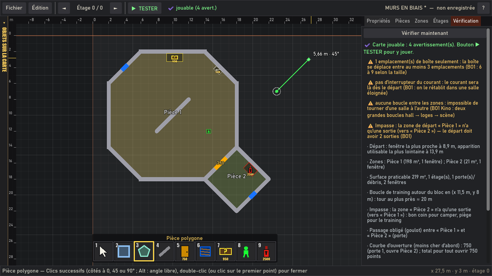
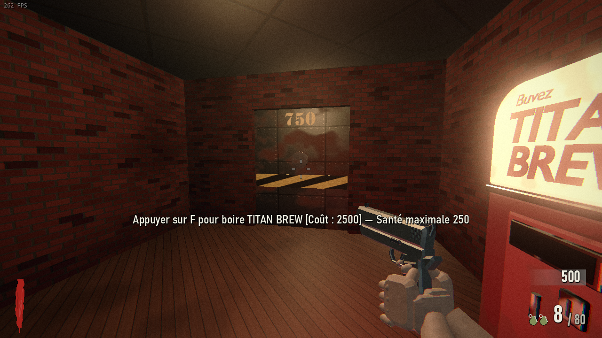

- **Tracer** : avec la Pièce polygone ou le Mur, chaque côté part du point
  précédent à 0, 45 ou 90° (sur la grille, les sommets restent sur la
  grille) ; **Alt** maintenu : angle libre. La longueur et la direction du
  côté en cours s'affichent à côté du curseur (« 5,66 m · 45° », degrés
  depuis l'est). **Pièce rectangle + R** : rectangle tourné de 45°
  (losange), glissé d'un coin au coin opposé. Sans grille, voir « Formes
  libres » ci-dessous.
- **Mur mitoyen** : deux pièces qui partagent un côté en biais n'ont qu'un
  mur, qui montre de chaque côté la texture de sa pièce.
- **Ouvertures** (porte, débris, porte du courant, passage, fenêtre) et
  **objets muraux** (atouts, armes, boîte, machines, levier, applique) se
  posent aussi sur un mur en biais, orientés selon le mur, avec les mêmes
  règles (porte seulement sur le bord commun de deux pièces collées, fenêtre
  sur un mur extérieur avec 2,5 × 3 m de vide dehors, 0,5 m de mur plein aux
  bouts, mur plein derrière un objet). Sur un côté à 45°, le milieu d'une
  ouverture tombe sur la grille de 0,25 m.
- **En jeu** : de vrais murs droits obliques (pas de marches), collisions en
  pavés `CollisionBox` tournés (balles, grenades, joueurs et zombies suivent le
  vrai mur), un raccord aux angles entre deux murs en biais ; le sol et le
  plafond suivent le vrai contour.

### Formes libres

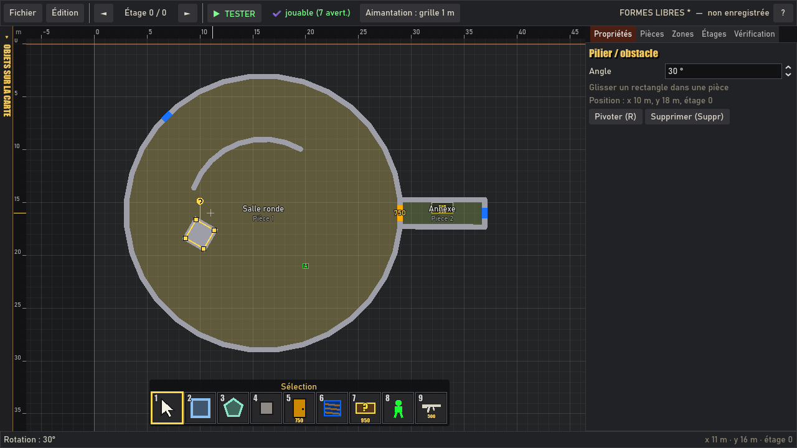
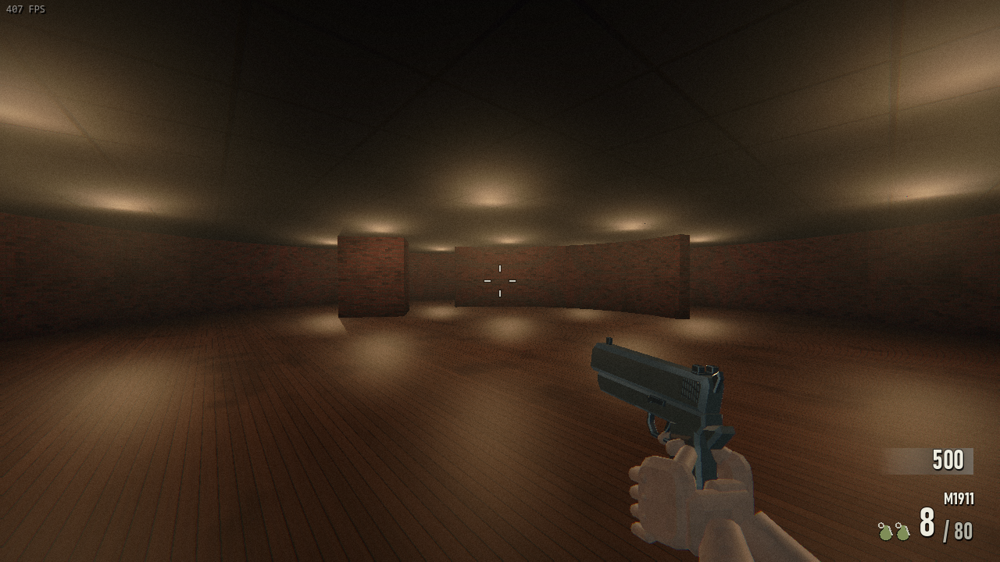

- **Aimantation au choix** (touche **G**, ou le bouton « Aimantation » de la
  barre du haut ; mémorisée) : **grille 1 m** (comme avant), **grille fine**
  (0,5, 0,25 ou 0,1 m : **Maj+G** change le pas ; traits fins affichés quand
  le zoom le permet) ou **libre** (sans grille : coordonnées au centimètre,
  lisibles dans le JSON). **Maj** maintenu inverse le mode courant (grille →
  libre, libre → la dernière grille). En libre : **aimants** aux sommets des
  pièces et aux bouts des murs (carré bleu), sinon aux côtés des pièces (rond
  bleu) pour coller deux pièces ; un côté part du point précédent **à 15°
  près** (Alt : angle libre) ; une pièce déplacée se colle par son sommet le
  plus proche au sommet ou au côté d'une autre pièce.
- **Saisie au clavier** pendant un tracé (côté de polygone, mur, rectangle,
  forme, mur courbe, pilier, escalier, piège) : taper la longueur, **Tab**,
  l'angle, **Entrée** (« 4 Tab 30 Entrée » : 4 m à 30°) ; l'angle se compte
  depuis l'est, dans le sens trigonométrique (90 = nord, -90 = sud), comme la
  direction affichée à côté du curseur ; un champ laissé vide suit le curseur.
  Rectangle, ellipse, triangle, L : largeur, hauteur ; cercle : rayon,
  nombre de points ; mur courbe : rayon, ouverture. Un **simple clic** (sans
  glisser) commence le tracé, qui suit le curseur jusqu'au clic suivant ou à
  Entrée. Le champ s'affiche près du curseur ; Retour arrière efface, Échap
  annule la saisie.
- **Formes de base** (inventaire, Construction) : **cercle / polygone
  régulier** (glisser du centre au bord ; **3 à 64 points**, à la molette ou
  avec + / - pendant le tracé, aperçu en direct ; à 0°, un côté est à plat au
  sud, et avec un nombre de points multiple de 4 les côtés nord, est, ouest et
  sud sont droits : une pièce s'y colle), **ellipse** (d'un coin à l'autre,
  N points), **triangle** (pointe en haut ; glissé vers le haut : pointe en
  bas), **pièce en L** (épaisseur des branches réglable), **mur courbe** (arc
  de cercle en 1 à 64 segments droits : glisser du centre vers le premier
  bout, 90° dans le sens horaire ; rayon, ouverture et segments réglables).
  Une forme posée reste un **polygone éditable** ; elle garde son type et
  ses paramètres (clé `forme`) : dans l'onglet Propriétés, changer le nombre
  de points, le rayon, la largeur, la hauteur, les branches ou l'angle la
  **régénère** (ses ouvertures et ses objets muraux se raccrochent au mur le
  plus proche). Déplacer un sommet à la main en fait un polygone libre.
- **Rotation libre** : **poignée ronde** au-dessus de l'élément choisi (pièce,
  pilier, escalier, piège, décor, luminaire au sol ou au plafond, mur, mur
  courbe) : pas de **15°**, au **degré près avec Alt** ; champ **Angle** de
  l'onglet Propriétés (« Pivoter de » pour une pièce quelconque) ; **R** :
  90° comme avant. Une pièce tourne **avec son contenu** : ses ouvertures et
  ses objets muraux restent collés à leur mur (face vers l'intérieur), son
  décor, ses piliers, escaliers et pièges tournent avec elle. Les objets
  muraux ne tournent pas seuls : ils suivent leur mur.
- **Portes sur un côté court** (côté d'un cercle) : posée à la souris, une
  porte trop large pour le mur visé est réduite par pas de 0,5 m (1 m au
  moins) ; il faut toujours 0,5 m de mur plein à chaque bout (un côté de
  2,5 m pour une porte de 1,5 m : un cercle de 32 points de 13 m de rayon).
- **En jeu** : tout côté qui n'est pas un côté droit de la grille (en biais,
  ou droit mais hors de la grille de 0,5 m) est un **vrai mur oblique**
  (collisions `CollisionBox` tournées), sol et plafond découpés selon le vrai
  contour ; deux pièces collées **sans grille** (côtés parallèles à moins de
  3 cm) n'ont qu'**un mur mitoyen** ; une pièce sans grille collée au côté
  d'une pièce de la grille garde ce mur de la grille (pas de second mur).
  Piliers tournés : un pavé plein tourné ; escaliers tournés : marches et
  rampe dans le sens de montée ; pièges tournés : zone électrifiée tournée ;
  décor tourné au degré près : modèle et `CollisionBox` tournés. Les murs
  obliques sont **fusionnés en un maillage par matériau** (un cercle de 64
  côtés ne coûte pas plus de rendu qu'un mur droit).

## 2 bis. Objets sur la carte (liste)

Onglet déployable à gauche de la vue (`MapObjectList`) : **tous les éléments
posés** (pièces, ouvertures, objets de jeu, construction, décor, luminaires),
une ligne chacun avec son icône, son nom, son type, son étage (É0, É1…) et sa
position en mètres ; triés par identifiant (ordre naturel : `p2` avant `p10`).

- **Pages de 50** : ◄ ► et « page 2/7 » au bas de la liste.
- **Filtre** par catégorie (Tout, Pièces, Ouvertures, Construction, Objets de
  jeu, Décor et obstacles, Luminaires ; mémorisé) et **recherche** dans le
  nom, le type et l'identifiant.
- **Survol** d'un élément sur la carte : sa ligne est surlignée et la liste
  saute à sa page ; survol d'une ligne : l'élément s'entoure d'un **contour
  lumineux** sur la carte (portée d'un luminaire en cercle), sans déplacer la
  vue. **Clic** sur une ligne : choisir l'élément et centrer la vue (change
  d'étage au besoin) ; **double-clic** : centrer et zoomer.
- Fluide avec 2000 éléments : la liste n'est refaite qu'après une
  modification de la carte (et seulement onglet ouvert), les 50 lignes sont
  dessinées par un seul contrôle, le survol ne cherche que parmi les objets
  proches (index par cases de 4 m). Mesuré par les tests : survol < 1 ms,
  pose d'un objet ≈ 0,6 s avec 2000 objets.

## 2 ter. Aperçu 3D en direct

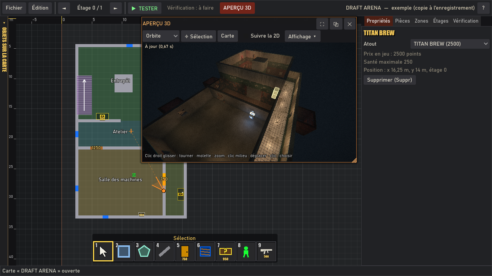
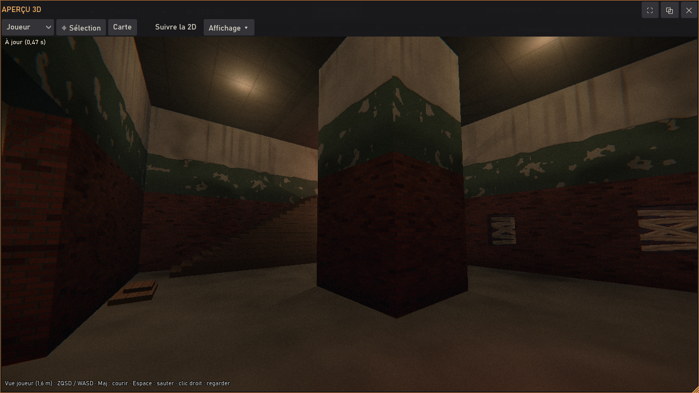

Bouton **APERÇU 3D** (barre du haut) ou touche **P** : un panneau flottant
au-dessus de la vue 2D montre la carte **telle qu'elle sera en jeu** (mêmes
murs, sols, plafonds et textures, portes et débris, fenêtres barricadées,
décor, luminaires, atouts, armes, boîte, courant, étages), construite par le
**même code que la partie** (`MapLayoutExport`, `MeshMapGeometry`,
`MeshMapBuilder`, `MapProps.add_lamp`, et les fonctions de construction de
`Game` pour les objets de jeu), avec l'éclairage du jeu (`WorldLook`,
`RenderQuality`, grain de film).

- **Fenêtre** : glisser la barre de titre pour la déplacer, le coin en bas à
  droite pour la redimensionner ; **⛶** (ou double-clic sur le titre) :
  agrandie à tout l'éditeur ; **⧉** : détachée dans une vraie fenêtre (à
  mettre sur un deuxième écran ; la fermer la ramène dans l'éditeur) ;
  **✕** ou P : masquée. Position, taille, fenêtre détachée, caméra et
  options sont mémorisées (`_editeur.cfg`, clé `apercu`).
- **En direct** : après chaque modification (pose, déplacement, suppression,
  annuler / rétablir, propriétés), l'aperçu se met à jour tout seul 0,3 s
  après la dernière retouche. La conversion de la carte tourne **hors du fil
  principal** ; seuls les morceaux qui ont changé sont refaits
  (architecture, décor, lampes, objets de jeu), un par image, l'ancien
  restant affiché jusque-là : l'éditeur ne se fige pas. Une carte pas encore
  jouable (sans départ, sans fenêtre...) s'affiche quand même, avec la
  mention « aperçu indicatif ».
- **Caméras** (liste de la barre d'outils) :
  - **Orbite** : clic droit glisser pour tourner autour du point visé,
    molette pour zoomer, clic milieu glisser pour déplacer le point ;
  - **Vol libre** : touches de déplacement du jeu (ZQSD / WASD, celles des
    options), Maj pour aller plus vite, clic droit maintenu pour regarder,
    Espace / accroupi pour monter / descendre ;
  - **Joueur** : à hauteur d'yeux (1,62 m), avec la capsule, la gravité, les
    vitesses et le saut du joueur ; les murs, fenêtres et décor arrêtent,
    les portes fermées se traversent (pour visiter).
  - Les touches vont à l'aperçu quand la souris est dessus.
  - **⌖ Sélection** : centre la caméra sur l'élément choisi ; **Carte** :
    recadre sur toute la carte ; **Suivre la 2D** : la caméra vise ce que
    montre la vue 2D ; **Ctrl + double-clic** sur la carte 2D : la caméra va
    à cet endroit (un clic avec Ctrl ne pose rien tant que l'aperçu est
    affiché).
  - La vue 2D montre un **repère orange** : position de la caméra, son champ
    de vision et, en orbite, le point visé (estompé si la caméra est à un
    autre étage).
- **Sélection** : l'élément choisi (jaune) et celui survolé dans la vue 2D ou
  la liste (bleu) sont surlignés dans l'aperçu, vus à travers les murs ; un
  **clic dans l'aperçu** choisit l'élément touché (rayon sur les collisions
  visibles), un double-clic le choisit et centre la caméra dessus.
- **Affichage ▾** : courant rétabli ou coupé (luminaires liés au courant),
  éclairage plein (tout voir, sans brume), plafonds masqués (vue de dessus
  en coupe), étages (tous, jusqu'à l'étage affiché en 2D, ou seulement
  celui-là), résolution du rendu (100, 75, 50 ou 35 %, en plus de celle de
  la qualité graphique), pause quand l'éditeur n'a pas le focus.
- **Performances** : aperçu masqué, rien n'est construit ni rendu ; au repos,
  24 images/s au plus (chaque mouvement de caméra est rendu aussitôt) ;
  objets de jeu figés (ni son ni animation). Mesures : **DRAFT ARENA**
  (scénario `map_preview`, avec rendu) : conversion ≈ 0,15 s hors du fil
  principal, construction ≈ 17 ms (la toute première ≈ 0,2 s : chargement
  des modèles des machines), mise à jour visible ≈ 0,5 s après la retouche
  (délai de 0,3 s compris) ; un luminaire : seules les lampes, ≈ 11 ms.
  **Carte de 50 pièces** (test `test_update_time_on_a_50_room_map`) :
  conversion ≈ 1,4 à 2,5 s hors du fil principal, construction ≈ 80 à
  220 ms en 6 étapes (la plus longue, l'architecture, ≈ 60 à 150 ms), mise
  à jour visible ≈ 2 s après la retouche ; un luminaire : ≈ 20 à 30 ms sur le
  fil principal.

## 3. Ce que l'on pose (inventaire)

Les catégories et leurs objets viennent des **bases de données du jeu**
(`MapCatalog` lit `PerkDB`, `WeaponDB`, `KnifeDB`, `MysteryBox.COST`,
`PackAPunch.COST`, `ElectricTrap.COST`…) : un atout ou une arme murale ajouté
au jeu apparaît tout seul dans l'inventaire, avec son prix. Icônes dessinées
par code (`MapIcons`).

| Catégorie | Objets | Pose |
|---|---|---|
| Construction | Sélection, Gomme, Pièce rectangle, Pièce polygone, Mur, Cercle / polygone régulier, Ellipse, Pièce triangle, Pièce en L, Mur courbe, Pilier / obstacle, Escalier | glisser ou clic-clic (rectangle, formes, mur, mur courbe, pilier, escalier), clics successifs (polygone) ; saisie au clavier |
| Ouvertures | Porte payante, Débris à dégager, Porte ouverte par le courant, Passage libre, Fenêtre à zombies | sur un mur (voir les règles) |
| Atouts | un distributeur par atout du jeu | contre un mur |
| Armes murales | chaque arme à prix mural, couteau de chasse, grenades | contre un mur |
| Boîte mystère | emplacement, emplacement de départ | contre un mur |
| Machines | Pack-a-Punch, interrupteur du courant, téléporteur, arrivée du téléporteur, poste central | contre un mur, ou au sol (téléporteur, arrivée) |
| Pièges | zone de piège électrique, levier | zone : glisser au sol ; levier : contre un mur, à moins de 10 m |
| Joueurs et apparitions | départ des joueurs, zombie qui sort du sol | au sol |
| Décor et obstacles | caisse, baril, tas de gravats, gros éboulement, mur effondré, débris épars, planches au sol, poutre tombée, lustre tombé, pile de caisses, tonneaux, sacs de sable, table et chaise renversées, chaise pliante, bureau, étagère, rangée de fauteuils de cinéma, fauteuil arraché, pupitre, projecteur de cinéma, chariot, épave de voiture | au sol, pivote avec R (90°) ou au degré près (poignée, Angle) |
| Luminaires | lampe (historique), ampoule nue, suspension, néon, lustre, applique murale, lampe de bureau, projecteur de chantier, bougies, brasero | plafond, mur (applique) ou sol ; pivote avec R |

### Décor (prefabs) et luminaires

Tous décrits à un seul endroit, `MapCatalog.PREFABS` et `MapCatalog.LIGHTS`
(`scripts/editor/map_catalog.gd`) : emprise au sol (cases de 0,5 m), modèle
(`assets/models/kino/*.glb`, déjà livrés avec KINO) ou objet construit par le
jeu (`EditorPrefabs` : sacs de sable, table et chaise renversées, chariot,
épave de voiture, et les luminaires sans modèle), collisions.

- **Empreinte** dessinée dans l'éditeur (hachurée si le décor bloque), flèche
  du devant ; **R** pivote de 90° (la largeur et la profondeur s'échangent) ;
  la poignée de rotation et le champ Angle le tournent au degré près
  (emprise tournée, cases dont le centre est dedans pour la vérification).
- **Collisions** : chaque décor bloque ou non selon son modèle : « solide »
  (joueurs, zombies et balles : gravats, bureau, sacs de sable…), « barrière »
  (joueurs et zombies, les balles passent : fauteuils, tonneaux, lustre
  tombé…) ou « non » (débris épars, planches : on marche dessus). Toujours des
  `CollisionBox` du jeu (pavés du catalogue ou `<modèle>.collision.json`),
  jamais une collision de modèle Blender. Les cases d'un décor qui bloque sont
  pleines pour le validateur et pour les trajets des zombies.
- **Luminaires** : couleur, intensité (× 0,1 à 4), portée (2 à 20 m), « liée
  au courant » (faibles avant le courant, allumées en cascade quand on le
  rétablit ; sinon toujours allumées : bougies, brasero) et « vacille »
  (grésillement), réglés dans l'onglet Propriétés. Ils passent par le code
  commun des lampes (`MapProps.add_lamp` : `PowerGrid`, `LightFlicker`,
  `RenderQuality` pour les ombres et le fondu) ; leurs objets ne projettent
  pas d'ombre.

Règles de pose en plus (`MapRules.layer_of`) :
- décor et luminaires au sol : dans une pièce, sans toucher ses murs, sans
  chevauchement ; une **lampe de bureau** ou des **bougies** peuvent se poser
  **sur un meuble** qui a un dessus (`support` : bureau, chariot, sacs de
  sable) : la lumière monte à sa hauteur ;
- luminaires du plafond : dans une pièce ; ils surplombent le décor mais pas
  un autre luminaire du plafond ;
- applique : contre un mur plein de la pièce, face vers l'intérieur, à 2 m du
  sol (elle ne gêne pas les objets posés dessous).

### Règles imposées à la pose

L'aperçu est **vert** si l'élément peut être posé, **rouge** sinon, avec la
raison à côté du curseur (`MapRules`) :

- **Pièce** : contour simple (les côtés ne se croisent pas), 1,5 m de côté au
  moins, côtés de 10 cm au moins, 128 sommets au plus, x et y positifs ; deux
  pièces peuvent **se toucher, jamais se recouvrir** (sans grille : une bande
  de recouvrement de moins de 1,5 cm compte comme un contact). Ses murs sont
  générés sur son contour ; le bord commun de deux pièces collées (côtés
  parallèles à moins de 3 cm) devient **un seul mur mitoyen**. Par défaut,
  chaque pièce a sa propre zone.
- **Porte payante, débris, porte ouverte par le courant, passage libre** :
  seulement sur le **bord commun de deux pièces collées** du même étage (une
  porte ne donne que sur une autre pièce) ; elle relie exactement ces deux
  pièces. Mur droit ou en biais, 0,5 m de mur plein à chaque
  bout et entre deux ouvertures. Prix réglable ; par défaut ceux de BO1 : la
  première 750, la deuxième 1000, les suivantes 1250. Largeur réglable (2 m par
  défaut ; BO1 : 1,5 à 3 m). Le passage libre n'a pas de porte : les deux
  zones sont « ouvertes l'une sur l'autre » (ou n'en font qu'une).
- **Fenêtre à zombies** (barricade de 6 planches) : 1 m, sur un **mur
  extérieur** d'une pièce (pas un mur commun, pas le bord d'une mezzanine), avec
  2,5 × 3 m de vide dehors : le jeu y construit la cour où les zombies
  apparaissent, derrière la fenêtre.
- **Objets muraux** (atouts, armes, grenades, boîte, Pack-a-Punch, courant,
  poste central, levier, applique) : dans une pièce, accrochés au mur le plus
  proche, **face vers l'intérieur** ; il faut du mur plein derrière (pas une
  ouverture) et la place devant (boîte : 2 × 1 m ; atout, Pack-a-Punch :
  1,5 × 1 m ; arme : 1 × 0,5 m), sans chevaucher un autre objet. Ils se posent
  aussi sur un **mur libre** (outil Mur, droit, en biais ou épais, et mur
  courbe), **des deux côtés** : face tournée vers le côté du curseur, sans
  dépasser les bouts du mur, à 0,25 m au moins de la face des murs de la pièce
  (près d'un mur collé à la pièce, l'objet glisse le long du mur), sans toucher
  un autre mur libre (ni, dans le creux d'un mur courbe, ses segments voisins).
  Ils suivent leur mur libre quand on le déplace ou le tourne (et partent avec
  lui s'il est supprimé).
- **Objets au sol, pilier, escalier, zone de piège** : à l'intérieur d'une
  pièce, sans toucher ses murs, sans chevauchement (les lampes, au plafond,
  peuvent surplomber un objet ; un élément tourné compte par son rectangle
  englobant). L'escalier monte à l'étage du dessus : il faut un étage
  au-dessus.
- **Mur courbe** : 1 m de rayon au moins, ouverture de 5 à 360°, 1 à 64
  segments, tout l'arc dans le terrain.

## 4. Pièces, zones, étages

- **Pièce** (onglet Propriétés) : nom, zone, hauteur de plafond (sinon celle
  de l'étage), **double hauteur** (ouverte sur l'étage du dessus : à l'étage,
  son contour reste un mur et son intérieur est un vide ; ses piliers montent
  jusqu'en haut). Une pièce posée à l'étage au-dessus d'une double hauteur est
  une **mezzanine** : ses bords au-dessus du vide ont un garde-corps.
  **Textures** : sol, murs et plafond, parmi les surfaces du jeu
  (`WorldLook.SURFACES` : plâtre, béton, brique, bois, parquet, carrelage,
  pierre, pavés, moquette…), avec un aperçu ; par défaut, celles de la zone.
  Un **mur mitoyen montre de chaque côté la texture de sa pièce** (le jeu
  construit les murs par demi-cases de 0,25 m).
- **Zone** (onglet Zones) : un groupe de pièces qui s'ouvre d'un coup (ses
  fenêtres s'activent ensemble, comme les zones de BO1). Par défaut une zone
  par pièce. Renommer en français et en anglais (noms affichés en jeu selon la
  langue), textures par défaut du sol, des murs et du plafond, **fusionner** (les pièces d'une zone
  rejoignent une autre), **séparer** (une zone par pièce), **zone de départ**
  (★, ouverte au début). Les pièces d'une même zone doivent être reliées par
  un passage libre.
- **Étage** (onglet Étages) : hauteur du sol, hauteur sous plafond ; ajouter un
  étage au-dessus, supprimer le dernier s'il est vide ; l'étage du dessous
  s'affiche en transparence (réglable), ses escaliers aussi. Entre deux sols :
  3,1 m au moins (2,8 m sous plafond + dalle de 0,3 m). Un escalier dessiné
  sur l'étage du bas **monte dans le sens du glisser** (du pied vers le haut) ;
  le vide au-dessus des marches est automatique ; son haut doit arriver sur le
  plancher d'une pièce de l'étage du dessus.

## 5. Vérification (onglet Vérification)

Le validateur (`MapValidator`, repris de l'ancien outil de cartes dessinées)
tourne sur une **grille de 0,5 m** tirée de la carte (`MapRaster`, voir §7) :
chaque message est en français et en anglais, avec sa position en mètres ;
**cliquer un problème centre la vue dessus** et entoure ses cases. TESTER
refuse une carte qui a des erreurs.

Erreurs (la carte est refusée) :
- sol au bord du vide sans mur, pièces qui se chevauchent ;
- zone coupée en morceaux sans passage (ses pièces ne se touchent pas) ;
- zone ou passage **inaccessible depuis le départ**, toutes portes ouvertes ;
- porte hors d'un mur commun, entre deux pièces de la même zone, trop étroite ;
- fenêtre qui ne donne pas dehors, sans place pour la cour des zombies ;
- **zone sans fenêtre** (sauf l'arrivée du téléporteur) ;
- départ hors de la zone de départ, collé à un mur, ou à moins de 7 m de toutes
  les fenêtres de la zone de départ (le jeu n'y ferait apparaître aucun zombie) ;
- objet mural qui ne touche pas de mur, sans la place devant, sans mur derrière ;
- aucune boîte, deux « boîte (départ) », deux interrupteurs, deux distributeurs
  du même atout, téléporteur sans arrivée, levier sans piège à moins de 10 m,
  piège sans levier ;
- passage de 0,5 m (trop étroit pour les zombies et les joueurs) ;
- escalier sans palier, sens ambigu, trop étroit (1,5 m), trop raide (40°),
  recouvert par l'étage du dessus ; vide d'étage ouvert sur le vide ;
- étages trop rapprochés, plafond trop bas.

Avertissements et indicateurs d'amusement (BO1, jamais bloquants) : boucles
entre zones et coût pour les ouvrir, blocs autour desquels on tourne
(« training », 25 à 40 m de tour), impasses (le départ doit avoir 2 sorties),
passages obligés, courbe d'ouverture (la porte la moins chère d'abord ;
première porte à 750-1000), emplacements de boîte (3 au moins, dans plusieurs
zones), atouts et coût pour les atteindre, coin TITAN BREW (rôle du
Juggernog : jamais dans la salle de départ), arme bon marché et LAZARUS au
départ, distance à pied au plus loin d'une fenêtre (25-30 m au plus).

## 6. Enregistrer, reprendre, partager

- **Enregistrer** (Ctrl+S) : dans le dossier des cartes du joueur,
  `user://maps/<id>/` (sous Windows :
  `%APPDATA%\Godot\app_userdata\Call of Claude Zombie\maps\<id>\`), aussi
  depuis le `.exe`. `<id>` est tiré du nom de la carte ; **Enregistrer sous**
  choisit le dossier. Un exemple livré (DRAFT ARENA) s'ouvre en lecture seule :
  Enregistrer en fait une copie.
- **Sauvegarde automatique** toutes les 60 s et à la fermeture si la carte a
  changé (`user://maps/_autosave/`) ; au démarrage suivant, l'éditeur propose
  de reprendre le travail non enregistré. **Cartes récentes** : menu Fichier
  (`user://maps/_editeur.cfg`).
- **Archive .zip** : Fichier > Exporter / Importer ; l'archive contient les cinq
  JSON à la racine (ZIPPacker / ZIPReader). Une archive importée s'enregistre
  comme une nouvelle carte. Elle est contrôlée **avant** toute décompression
  (`EditorMap.import_zip`, `zip_entries` lit le répertoire central) : 2 Mo au
  plus, 32 entrées au plus, seulement les cinq JSON (à la racine ou dans un
  seul dossier), aucun chemin piégé (`..`, `/` en tête, `\`, `:`), chaque
  fichier 2 Mo au plus une fois décompressé (bombe zip refusée) ; sinon elle
  est refusée avec la raison. Les fichiers d'un dossier de carte sont lus
  avec la même limite (`EditorMap.read_text`), le `meta.json` de la
  sauvegarde automatique avec 256 Ko.
- **Identifiant de carte** (nom de dossier) : 1 à 48 caractères parmi `a-z`,
  `0-9` et `_` (`EditorMap.valid_id`) ; `EditorMap.map_dir` refuse tout autre
  identifiant (« perso:../x » n'est pas une carte).
- **Jouer** : ▶ **TESTER** vérifie, enregistre et lance une partie solo sur la
  carte (`perso:<id>`) ; la fin de la partie ramène dans l'éditeur, sur la même
  carte. Les cartes jouables de `user://maps` apparaissent aussi dans l'écran
  **SOLO**, sous « CARTES PERSO », et dans le **salon multijoueur** de l'hôte
  (ligne CARTE, « (perso) ») : voir « Cartes perso en multijoueur » ci-dessous.
- **Contrôle de légitimité** : une carte perso qui vient d'ailleurs (archive
  importée, carte reçue d'un hôte, carte locale ouverte pour jouer) passe par
  `CustomMapGuard` avant d'être ouverte (voir ci-dessous) ; une carte refusée
  n'est jamais chargée et la raison est affichée (FR/EN).

### Cartes perso en multijoueur

L'hôte choisit une carte perso dans le salon : elle est envoyée
automatiquement à chaque invité (y compris ceux qui arrivent après), qui la
vérifie puis la garde dans un cache. Le salon montre à tous le nom de la
carte, son aperçu (dessiné sur place depuis la carte vérifiée), sa taille et
l'état de chaque joueur (« télécharge 45 % », « carte prête », « carte
refusée ») ; **DÉMARRER** reste grisé, avec la raison, tant que tous les
joueurs ne l'ont pas. Un invité qui refuse la carte reste dans le salon avec
un message clair ; un joueur qui part pendant le transfert ne bloque pas les
autres. Protocole réseau : `docs/ARCHITECTURE.md`, « Cartes perso en
multijoueur ».

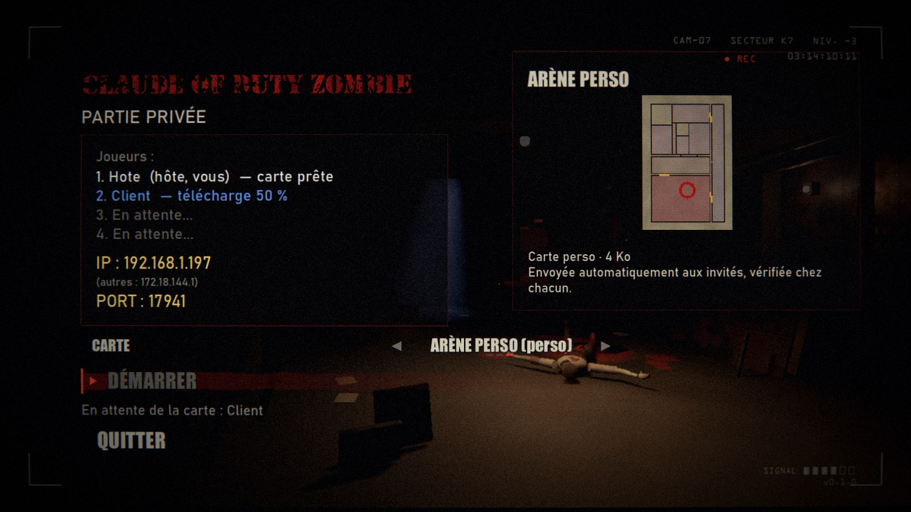

- **Paquet canonique** : seulement les cinq JSON, tels que l'éditeur les
  réécrit (`EditorMap.file_texts`), dans un JSON trié
  `{"format": 1, "fichiers": {"carte.json": "…", …}}` en UTF-8. Son
  **SHA-256** identifie la carte : même carte = même empreinte sur toutes les
  machines. Tout le monde, hôte compris, joue la carte depuis son cache
  `user://maps_cache/<sha256>/` (identifiant de jeu `partage:<sha256>`) : les
  géométries sont identiques partout.
- **Cache** : le dossier est nommé par l'empreinte (jamais par un nom venu de
  l'hôte) ; une carte déjà en cache n'est pas retéléchargée (elle est
  revérifiée : empreinte recalculée, contrôle complet) ; 32 cartes au plus,
  les plus anciennes sont effacées.
- **Contrôle de légitimité** (`scripts/game/map/custom_map_guard.gd`), à la
  réception, à l'import d'une archive et à l'ouverture d'une carte locale pour
  jouer. Une carte n'est **que des données** : jamais `load()`,
  `ResourceLoader`, `.tres`, `.tscn`, script ni image venant du réseau ou d'une
  archive (une ressource Godot peut embarquer du code) ; les textes sont lus en
  UTF-8 strict puis par le lecteur JSON du moteur. Limites dures :

  | Limite | Valeur |
  |---|---|
  | Paquet (et total des cinq fichiers) | 2 Mo |
  | Morceaux réseau | 16 Ko (1 Ko au moins) |
  | Archive .zip | 4 Mo, 64 entrées, tailles décompressées lues avant d'extraire |
  | Profondeur JSON | 6 (lue avant l'analyse) |
  | Pièces / ouvertures / objets / zones / étages | 256 / 512 / 1024 / 64 / 6 |
  | Sommets | 128 par pièce (un cercle de 64 points et de la marge), 4096 en tout |
  | Coordonnées | nombres finis, 0 à 256 m ; surface des pièces (rectangles englobants) 100 000 m² au plus |
  | Formes (format 4) | forme d'une pièce : type connu, centre dans le terrain, rayons 0,1 à 128 m, 3 à 64 points (entier), angle 0 à 360, branches 0,2 à 0,8, aucune autre clé ; mur courbe : rayon 1 à 128 m, ouverture 5 à 360°, 1 à 64 segments, arc dans le terrain ; rotation `rot` : entier de 0 à 359 |
  | Étages | sol -20 à 200 m, hauteur 2 à 30 m ; plafond 1,5 à 30 m ; portes 1,5 à 10 m |
  | Prix | entiers, 0 à 100 000 |
  | Textes | identifiants 32 caractères (lettres, chiffres, `_`, `-`) ; identifiant de carte en minuscules, chiffres et `_` ; noms 64 caractères ; descriptions 600 |

  **Liste blanche** des clés et des valeurs, tirée du catalogue de l'éditeur
  (`MapCatalog`) et donc des bases du jeu : types d'objets et d'ouvertures
  (champ `make` des objets du catalogue), clés de géométrie de chaque outil de
  pose, atouts (`PerkDB`), armes (`WeaponDB`, `KnifeDB`), surfaces
  (`WorldLook.SURFACES`), musiques (`assets/audio/ambience_*`), directions ; une
  clé ou une valeur inconnue est refusée. Tout passe par **une seule fonction
  adaptatrice**, `CustomMapGuard.catalog_source()` : dès qu'elles existent,
  elle prend la table typée `MapCatalog.allowed_kinds()` (format 2 : chaque
  type d'ouverture et d'objet, ses clés, ses clés obligatoires et leurs
  valeurs : identifiant, entier ou nombre borné, vrai / faux, liste de
  valeurs, point, rectangle, couleur `#rrggbb`), `MapCatalog.room_keys()`,
  `MapCatalog.zone_keys()` et `MapCatalog.allowed_surfaces()` (préfabriqués,
  luminaires, textures par pièce, plafond de zone) ; sinon le schéma est
  déduit des objets du catalogue. Les limites dures ci-dessus s'appliquent en
  plus (elles sont plus strictes que celles de l'éditeur : 256 m et 6 étages). **Noms** : pas de
  caractère de contrôle ni de contrôle bidirectionnel, pas de `[` `]` (BBCode),
  `<` `>`, `{` `}`, `\` ni `..` ; affichés dans des `Label` (jamais
  interprétés), nettoyés une seconde fois à l'affichage. Enfin la carte doit
  passer le **validateur de jouabilité** de l'éditeur (`MapRaster` +
  `MapValidator`).

### Format des fichiers

Cinq fichiers JSON dans le dossier de la carte (ou à la racine de l'archive).
Une entrée par ligne (diffs lisibles). Coordonnées en **mètres** dans le plan
de l'éditeur : x vers l'est, y vers le sud, x et y positifs ; le jeu place la
carte en (x + 4,25 ; z = y + 4,25). Chaque élément a un **identifiant stable**
(`p1`, `o3`, `a2`…). Les nombres entiers s'écrivent sans décimale.

**`carte.json`** — la carte :

```json
{
 "format": 4,
 "id": "draft_arena",
 "nom": {"fr":"DRAFT ARENA","en":"DRAFT ARENA"},
 "description": {"fr":"…","en":"…"},
 "musique": "ambience_bunker",
 "hauteur_portes": 2.5,
 "lampes_auto": true,
 "etages": [
  {"sol":0,"hauteur":3.2},
  {"sol":3.5,"hauteur":3.3}
 ]
}
```

`format` : version du format (**4** ; `EditorMap.FORMAT`). Historique : 1 =
premières cartes ; 2 = décor (`prefab`), luminaires (`luminaire`), textures
par pièce et plafond des zones ; 3 = murs en biais (clé `angle` des objets
muraux posés contre un mur en biais) ; 4 = formes libres (coordonnées sans
grille, clé `forme` des pièces, type `mur_courbe`, rotation `rot` au degré
près du décor, des luminaires, des piliers, escaliers et pièges). Une carte
au **format 1, 2 ou 3 se lit telle quelle** (toutes les nouvelles clés sont
facultatives, `EditorMap._migrate`) et s'enregistre au format 4 ; DRAFT
ARENA est restée au format 1 pour le prouver (sa description en maillage est
identique octet pour octet, vérifié par son empreinte SHA-256).
Une carte d'un format plus récent que le jeu est signalée. `id` : dossier ; `musique` : un son
`assets/audio/ambience_*` ; `hauteur_portes` (m) ; `lampes_auto` : une lampe
tous les 6 m dans chaque zone ; `etages` : du bas vers le haut, `sol` (m) et
`hauteur` sous plafond (m) des pièces sans rien au-dessus.

**`pieces.json`** — les pièces :

```json
{
 "pieces": [
  {"id":"p3","nom":"Entrepôt","etage":0,"zone":"z3","contour":[[2.5,4.5],[17,4.5],[17,17],[2.5,17]],"double_hauteur":true},
  {"id":"p5","nom":"Passerelle","etage":1,"zone":"z5","contour":[[2.5,4.5],[7.5,4.5],[7.5,9.5],[2.5,9.5]],"surface_murs":"brick","surface_sol":"parquet","surface_plafond":"wood"}
 ]
}
```

`contour` : les sommets (au moins 3) du trait des murs ; `zone` : un `id` de
`zones.json` ; facultatifs : `plafond` (hauteur sous plafond, m),
`double_hauteur` (true), et (format 2) les **textures** `surface_sol`,
`surface_murs`, `surface_plafond` : clés de `WorldLook.SURFACES` ; absentes,
celles de la zone. Une pièce rectangle a 4 sommets alignés sur les axes ; un
côté en biais est simplement un côté dont les deux sommets ne sont ni sur la
même ligne ni sur la même colonne (rien d'autre à écrire). Les sommets
peuvent être quelconques (au millimètre) : un côté qui n'est pas droit sur la
grille de 0,5 m devient un vrai mur oblique.

Format 4 : `forme` (facultative) = la forme de base d'origine, pour la
régénérer ; le `contour` fait foi (il est écrit à côté) :

```json
{"id":"p1","nom":"Salle ronde","etage":0,"zone":"z1","contour":[[16,28.937],…],"forme":{"type":"cercle","centre":[16,16],"rx":13,"points":32,"angle":0}}
```

`type` : `cercle` (polygone régulier, `rx` = rayon, `points` 3 à 64),
`ellipse` (`rx`, `ry` : demi-largeur et demi-hauteur, `points`), `triangle`
(`rx`, `ry`), `l` (`rx`, `ry`, `bras` : épaisseur des branches, 0,2 à 0,8) ;
`angle` : rotation en degrés, sens horaire vu de dessus. Une forme illisible
écrite à la main est ignorée (la pièce reste un polygone).

**`ouvertures.json`** — portes, débris, passages, fenêtres :

```json
{
 "ouvertures": [
  {"id":"o1","type":"porte","etage":0,"position":[17,26.75],"largeur":2,"prix":750},
  {"id":"o3","type":"debris","etage":0,"position":[5.75,21.5],"largeur":2,"prix":1250},
  {"id":"o4","type":"passage","etage":0,"position":[11.75,17],"largeur":4},
  {"id":"o5","type":"fenetre","etage":0,"position":[11.25,4.5]}
 ]
}
```

`type` : `porte`, `debris`, `porte_courant` (sans prix), `passage` (sans
prix), `fenetre` (1 m, sans largeur) ; `position` : le **milieu** de
l'ouverture, **sur le trait du mur** ; `largeur` (m, multiple de 0,5 ; pour
un nombre pair de demi-mètres, le milieu tombe à 0,25 m de la grille). Sur un
mur en biais, `position` est aussi sur le trait et `largeur` se mesure le
long du mur ; son orientation se lit sur le côté de pièce qui passe par là.

**`objets.json`** — tout le reste :

```json
{
 "objets": [
  {"id":"x1","type":"pilier","etage":0,"rect":[9,9.5,11.5,12]},
  {"id":"x2","type":"escalier","etage":0,"rect":[2.5,9.5,5,16],"monte":"n"},
  {"id":"m1","type":"mur","etage":0,"a":[4,4],"b":[4,9],"epaisseur":0.5},
  {"id":"s1","type":"depart","etage":0,"position":[12,26]},
  {"id":"a2","type":"atout","atout":"titan","etage":0,"position":[17,14],"mur":"e"},
  {"id":"w1","type":"arme","arme":"m14","etage":0,"position":[13.25,33],"mur":"s"},
  {"id":"w2","type":"arme","arme":"mp5k","etage":0,"position":[16,4],"mur":"n","angle":45},
  {"id":"b2","type":"boite","etage":0,"position":[20.5,29.25],"mur":"e","depart":true},
  {"id":"t1","type":"piege","etage":0,"rect":[5,5,7,9]},
  {"id":"c1","type":"courant","etage":1,"position":[2.5,7.5],"mur":"o"},
  {"id":"d1","type":"prefab","prefab":"sacs_sable","etage":0,"position":[10.25,3.25],"rot":90},
  {"id":"lu1","type":"luminaire","luminaire":"suspension","etage":0,"position":[7.5,5.5],"rot":0,"couleur":"#ffc88a","intensite":2.2,"portee":10,"courant":true,"vacille":false},
  {"id":"lu2","type":"luminaire","luminaire":"applique","etage":0,"position":[0,5],"mur":"o","couleur":"#40a0ff","intensite":1.4,"portee":7,"courant":true,"vacille":false}
 ]
}
```

- Rectangles (`pilier`, `escalier`, `piege`) : `rect` = [x0, y0, x1, y1]. Un
  pilier a son contour sur le trait (comme un mur de pièce) ; les marches et la
  zone de piège sont les cases à l'intérieur. `monte` : `n`, `e`, `s`, `o`.
  Format 4 : `rot` (facultatif) = rotation du rectangle autour de son centre,
  entier de 0 à 359, sens horaire vu de dessus (`monte` se lit avant la
  rotation) : `{"id":"x1","type":"pilier","etage":0,"rect":[9,17,11,19],"rot":30}`.
- `mur` libre : segment `a` → `b` (droit ou en biais), `epaisseur` 0,5, 1,5 ou 2,5 m.
- `mur_courbe` (format 4) : arc de cercle en segments droits, `centre`,
  `rayon` (1 à 128 m), `debut` (direction du premier bout, degrés dans le sens
  horaire depuis le nord), `ouverture` (5 à 360°, dans le sens horaire),
  `segments` (1 à 64), `epaisseur` :
  `{"id":"m1","type":"mur_courbe","etage":0,"centre":[16,16],"rayon":7,"debut":290,"ouverture":100,"segments":8,"epaisseur":0.5}`.
- Objets muraux (`atout` + `atout`, `arme` + `arme`, `grenades`, `boite` +
  `depart`, `pap`, `courant`, `poste_central`, `levier`) : `position` = milieu
  de l'objet **sur le trait du mur**, `mur` = direction du mur vu depuis
  l'objet (`n` : le mur est au nord). Contre un mur en biais (format 3) :
  `angle` = direction exacte du mur vue depuis l'objet, en degrés dans le
  sens horaire depuis le nord (`n` = 0, `e` = 90, `s` = 180, `o` = 270 ; 45 :
  mur au nord-est), nombre fini de 0 à 360 ; `mur` garde la direction
  cardinale la plus proche. Sans `angle`, l'objet suit `mur` comme avant. Identifiants d'atouts et d'armes : ceux
  de `PerkDB` / `WeaponDB` / `KnifeDB` (`titan`, `lazarus`, `m14`, `bowie`…).
- Objets au sol (`depart`, `apparition`, `teleporteur`, `arrivee`, `lampe`,
  `caisse`, `baril`) : `position` = centre. Un seul départ : les 4 joueurs se
  placent autour ; 2 à 4 départs : un joueur sur chacun.
- `prefab` (format 2) : `prefab` = une clé de `MapCatalog.PREFABS`
  (`gravats`, `gros_gravats`, `eboulis`, `debris_epars`, `planches`, `poutre`,
  `lustre_tombe`, `caisses`, `tonneaux`, `sacs_sable`, `table_renversee`,
  `chaise_renversee`, `chaise`, `bureau`, `etagere`, `fauteuils`,
  `fauteuil_casse`, `pupitre`, `projecteur_film`, `chariot`, `epave_voiture`) ;
  `position` = centre de l'emprise ; `rot` = 0, 90, 180 ou 270 (degrés, sens
  horaire vu de dessus ; à 0, le devant est au sud) ; format 4 : tout entier
  de 0 à 359 (emprise tournée).
- `luminaire` (format 2) : `luminaire` = une clé de `MapCatalog.LIGHTS`
  (`ampoule`, `suspension`, `neon`, `lustre`, `applique`, `lampe_bureau`,
  `projecteur`, `bougies`, `feu`) ; `position` = centre (applique : sur le
  trait du mur, avec `mur` comme un objet mural) ; `rot` ; `couleur`
  « #rrggbb » ; `intensite` (0,1 à 4) ; `portee` (2 à 20 m) ; `courant`
  (true : s'allume avec le courant) ; `vacille` (true : grésille).

**Types et valeurs admis** (contrôle des cartes reçues) : une seule source,
le catalogue.
- `MapCatalog.allowed_kinds()` : pour chaque `type` de `ouvertures.json` et
  `objets.json`, `{"file", "required": [clés obligatoires], "keys": {clé:
  spec}}` ; spec = `{"t": "id"}` (identifiant a-z, 0-9, _), `{"t": "int" |
  "number", "min", "max"}`, `{"t": "bool"}`, `{"t": "enum", "values": [...]}`
  (atouts, armes, prefabs, luminaires, directions, rotations…), `{"t":
  "point"}` ([x, y] en m, 0 à `MapCatalog.MAX_COORD`), `{"t": "rect"}`,
  `{"t": "color"}` (« #rrggbb »). Tout type ou toute clé absent est à refuser.
  Format 3 : `angle` des objets muraux et des luminaires = `{"t": "number",
  "min": 0, "max": 360}` (nombre fini ; un NaN, un infini, un texte ou un angle
  sur un objet qui n'est pas mural sont refusés). Format 4 : `rot` du décor,
  des luminaires, des piliers, escaliers et pièges = `{"t": "int", "min": 0,
  "max": 359}` ; type `mur_courbe` (`centre` point, `rayon` et `ouverture`
  nombres bornés, `segments` entier de 1 à 64, `debut`, `epaisseur`).
- `MapCatalog.allowed_surfaces()` : les textures admises (clés triées de
  `WorldLook.SURFACES`).
- `MapCatalog.room_keys()` / `MapCatalog.zone_keys()` : clés admises d'une
  pièce et d'une zone, même format (+ `{"t": "text" | "names" | "polygon" |
  "shape"}` ; `shape` : la forme de base d'une pièce, contrôlée par
  `CustomMapGuard._forme`).

**`zones.json`** — zones et zone de départ :

```json
{
 "depart": "z1",
 "zones": [
  {"id":"z1","nom":{"fr":"Salle des machines","en":"Engine room"},"sol":"concrete_dark","murs":"wall_concrete"},
  {"id":"z5","nom":{"fr":"Passerelle","en":"Catwalk"},"sol":"wood"}
 ]
}
```

`sol`, `murs`, `plafond` (facultatifs ; `plafond` depuis le format 2) : textures par défaut des
pièces de la zone, clés de `WorldLook.SURFACES`. Un fichier illisible
est signalé à l'ouverture (fichier, ligne, erreur) ; un format plus récent que
celui du jeu aussi.

## 7. Comment le jeu construit la carte

| Fichier | Rôle |
|---|---|
| `scripts/editor/editor_map.gd` | `EditorMap` : la carte (cinq JSON), lecture, écriture, archive .zip, dossier des cartes. |
| `scripts/editor/map_geom.gd` | `MapGeom` : géométrie 2D (contours, bords communs avec tolérance, cases, rotations). |
| `scripts/editor/map_shapes.gd`, `map_snap.gd`, `map_transform.gd`, `map_panels_shape.gd` | Formes libres : `MapShapes` (cercle, ellipse, triangle, L, mur courbe), `MapSnap` (grille, grille fine, libre, aimants), `MapTransform` (rotations libres, régénération d'une forme), propriétés des formes et angles. |
| `scripts/editor/map_rules.gd` | `MapRules` : règles de pose et leurs raisons (FR/EN). |
| `scripts/editor/map_catalog.gd`, `map_icons.gd` | Inventaire tiré des bases du jeu, décor (`PREFABS`), luminaires (`LIGHTS`), types admis (`allowed_kinds`…), icônes et aperçus des textures. |
| `scripts/editor/map_object_list.gd` | `MapObjectList` : l'onglet « Objets sur la carte » (pages de 50, filtres, survol). |
| `scripts/game/map/editor_prefabs.gd` | `EditorPrefabs` : décor et luminaires construits par le jeu (sans modèle). |
| `scripts/editor/map_raster.gd` | `MapRaster` : carte -> grille de cases de 0,5 m par étage. |
| `scripts/editor/map_validator.gd` | `MapValidator` : validateur et indicateurs BO1. |
| `scripts/editor/map_layout_export.gd` | `MapLayoutExport` : grille validée -> description en maillage (format de `MeshMapLayout`). |
| `scripts/editor/map_editor.gd`, `map_canvas.gd`, `map_panels.gd`, `map_hotbar.gd`, `map_inventory.gd`, `map_slot.gd` | L'interface (`scenes/editor/map_editor.tscn`). |
| `scripts/editor/map_preview_panel.gd`, `map_preview_world.gd`, `map_preview_camera.gd`, `map_preview_builder.gd` | Aperçu 3D en direct (§2 ter) : panneau et fenêtre détachée, monde de l'aperçu (conversion hors du fil principal, morceaux reconstruits, options, surlignage, sélection par un rayon), caméras (orbite, vol libre, vue joueur), construction par morceaux avec le code de `MeshMapBuilder`. |
| `scripts/game/map/editor_map_def.gd` | `EditorMapDef` : carte de l'éditeur côté jeu (`perso:<id>`, `partage:<sha256>`, ou script de carte livré). |
| `scripts/game/map/custom_map_guard.gd` | `CustomMapGuard` : contrôle de légitimité, paquet canonique et SHA-256, cache, lecture sûre d'un dossier ou d'une archive. |
| `scripts/game/map/map_share.gd`, `map_transfer.gd` | `MapShare` (envoi aux invités, `/root/Net/MapShare`) et `MapTransfer` (réception par morceaux). |
| `scripts/game/map/mesh_map_geometry.gd` | `MeshMapGeometry` : architecture 3D construite par le jeu (portage de `tools/blender/mesh_map.py`). |

1. **Grille** (`MapRaster`) : une case de 0,5 m **centrée** sur chaque multiple
   de 0,5 m. Les cases que traverse le contour d'une pièce sont des murs (un
   mur de 0,5 m centré sur le trait ; le bord commun de deux pièces = les mêmes
   cases : un seul mur), celles dont le centre est à l'intérieur son sol, de la
   zone de la pièce. Ouvertures : les cases du mur sur leur largeur. Double
   hauteur : à l'étage du dessus, contour en mur, intérieur en vide ; une pièce
   d'étage au-dessus du vide y pose son plancher (mezzanine). Escalier : cases
   de marches, vide au-dessus. Objets : leurs cases. Zones : la zone de départ
   devient `a` (celle que le jeu ouvre au début), les autres `b`, `c`…
   **Murs en biais** : les cases **coupées** par le mur de 0,5 m (même un
   peu : marquage prudent, `MapGeom.slab_cells`) sont des murs, de sorte que
   la grille ne laisse jamais passer à travers ; les côtés colinéaires de deux
   pièces fusionnent en un seul mur oblique (`MapValidator.oblique_walls`,
   pièce de chaque côté) ; une ouverture en biais prend les cases coupées sur
   sa largeur, ses deux côtés sont vérifiés par le validateur
   (`_diag_opening`) ; un objet mural en biais prend les cases de son emprise
   tournée, hors cases du mur. Les cases qui ne sont que des cases de murs en
   biais (`diag_cells`) ne sont pas construites en blocs.
   **Formes libres** : seul un côté droit dont les deux bouts sont sur la
   grille de 0,5 m (`MapGeom.is_grid_seg`) reste en blocs de la grille ; tout
   autre côté (en biais, ou droit hors de la grille) suit le chemin des murs
   en biais. Les côtés colinéaires à 3 cm près (`MapGeom.JOIN_TOL`) forment
   une seule ligne (un mur mitoyen) ; la part d'un mur oblique qui longe un
   côté de la grille n'est pas construite deux fois. Pilier tourné ou hors de
   la grille : un pavé oblique (type `pilier`, cases coupées) ; mur courbe : un
   mur oblique par segment ; escalier tourné : cases dont le centre est dans
   le rectangle tourné, vide au-dessus, pied et palier vérifiés dans son
   repère (`MapValidator.diag_stairs`) ; piège tourné : ses cases, et le vrai
   rectangle pour le jeu (`diag_traps`) ; décor tourné au degré près : cases
   dont le centre est dans l'emprise tournée.
2. **Validation** (`MapValidator`, §5).
3. **Description en maillage** (`MapLayoutExport`) : salles (sols, plafonds,
   dalles d'étage), murs, allèges et linteaux en blocs, garde-corps,
   escaliers (marches et rampe de collision), cours des fenêtres, zones,
   marqueurs (objets muraux par la face du mur), lampes, décor (`props` :
   modèle ou objet construit, `blockers` : ses `CollisionBox`), luminaires
   (lampes avec `color`, `power`, `flicker`, `fixture`), textures (sols et
   plafonds par pièce ; murs fusionnés sur une grille de demi-cases, chaque
   face avec la texture de la pièce qui la touche), réglages de la carte
   (`map_def` : noms des zones dans la langue du jeu, prix des portes, zones
   ouvertes l'une sur l'autre, départ de la boîte, téléporteur à relier si un
   poste central est posé). Murs en biais : clé `obliques` (`a`, `b`, `y0`,
   `y1`, `thick`, `mat_n` / `mat_m` : texture de chaque face, `openings` :
   portes, fenêtres et passages découpés, `joint` : raccord d'angle) ; le sol
   et le plafond le long d'un mur en biais sont les cases coupées par le mur
   **découpées selon le vrai contour** de la pièce (salles `biais_*`,
   triangulées), le reste de la pièce garde ses rectangles de cases ; portes
   et fenêtres en biais : milieu exact, lacet et direction vers l'intérieur
   du mur ; cour d'une fenêtre en biais tournée comme le mur. Formes libres :
   les morceaux de sol le long des murs obliques ont leur boîte de zone
   (testée après celles des salles de la grille) ; escalier tourné : `a` et
   `b` au milieu du pied et du haut des marches ; piège tourné : `area` avant
   rotation et `yaw` (le jeu, `ElectricTrap`, électrifie le rectangle tourné).
4. **Géométrie** (`MeshMapGeometry`) : les mêmes objets que le `.glb` de
   `mesh_map.py` (`<matériau>__<salle>__<type>`, collisions en pavés et prismes),
   branchés par `MeshMapBuilder` ; `MeshNav` cuit le navmesh, `MeshMapLayout`
   fournit zones et emplacements aux systèmes du jeu. Un mur en biais est un
   pavé oblique (type `biais` : le rendu pose le motif le long du mur, sans
   étirement) avec une texture par face, et sa collision un pavé
   `CollisionBox` tourné comme lui (jamais une collision de modèle Blender) :
   balles, grenades, impacts, joueurs et zombies suivent le vrai mur, et le
   navmesh des zombies et des chiens est cuit dessus (chemins qui le
   contournent, porte en biais reliée par son passage). **Aucune étape Blender** :
   une carte de l'éditeur se joue aussitôt, y compris dans le `.exe`.

Déclarer une carte livrée avec le jeu : ses JSON dans `assets/maps/<id>/`, un
script de 3 lignes (`scripts/game/map/maps/<id>.gd` : `extends EditorMapDef`
et `_init_editor("res://assets/maps/<id>/", "<id>")`), une ligne dans
`Game.MAP_SCRIPTS` ; l'ajouter à `Game.MENU_MAPS` la propose dans les menus.

## 8. DRAFT ARENA

Carte d'essai de 18 × 28,5 m sur 2 étages (`assets/maps/draft_arena/`) :
salle des machines (départ, M14, LAZARUS), couloir de service (MP5K, boîte de
départ), entrepôt à double hauteur avec son pilier (TITAN BREW, boîte,
escalier), atelier (ouvert sur l'entrepôt par un passage), passerelle à
l'étage (boîte, courant) ; portes 750 et 1000, débris 1250 ; 7 fenêtres.
Recréée dans ce format à partir de l'ancien dessin : même grille case par
case, donc la même carte en jeu (mêmes salles, murs, escaliers, fenêtres,
portes, zones et objets ; seules les deux armes murales se décalent de
0,25 m). Rapport du validateur : 0 erreur, 0 avertissement ; boucle
Couloir → Salle des machines → Atelier → Entrepôt (3000 points de portes),
grande boucle de training de 63 m, passerelle en impasse (poste de camping),
TITAN BREW à 1250 points de portes.

Preuves automatiques :
- `tests/test_map_editor.gd` : règles de pose (porte refusée sans deux pièces
  collées, acceptée sur le bord commun et reliant ces deux pièces ; fenêtre
  seulement sur un mur extérieur avec la place des zombies ; objets muraux
  contre un mur, face vers l'intérieur ; objets au sol dans une pièce sans
  chevauchement ; pièces collées mais pas superposées), mur mitoyen unique,
  validateur (erreurs pointées, messages FR/EN), passage libre, double
  hauteur, mezzanine et escalier, JSON lisibles, enregistrement et archive
  .zip relus à l'identique, JSON écrit à la main, annuler / rétablir dans
  l'éditeur, inventaire tiré des bases du jeu, conversion en carte jouable
  (emplacements, zones, géométrie construite par le jeu), DRAFT ARENA migrée
  valide, cartes perso trouvées par le jeu.
- `tests/test_map_editor_decor.gd` : pagination (0, 50, 51, 2000 éléments),
  tri et filtres de la liste, survol carte ↔ ligne dans l'éditeur, 2000
  éléments fluides, chaque décor et chaque luminaire posé ou refusé selon les
  règles (lampe sur un bureau, suspensions qui se chevauchent, applique hors
  d'un mur), rotation R, textures enregistrées, relues et construites (mur
  mitoyen à deux faces), lecture du format 1, types admis
  (`allowed_kinds`), carte jouable construite par le jeu (décor,
  `CollisionBox`, lumières colorées, feu hors du réseau électrique), archives
  refusées (trop grosse, bombe, trop d'entrées, nom ou chemin inattendu) et
  identifiants invalides.
- `tests/autotest/map_editor.gd` (captures) : bouton du menu principal, trois
  pièces au glisser, porte refusée puis posée, objets par l'inventaire,
  vérification, Ctrl+S, rechargement, Ctrl+Z / Ctrl+Y, archive, polygone,
  copier / coller, poignée ; puis une salle décorée (décor et luminaires de
  l'inventaire, R, refus, couleur, textures), l'onglet « Objets sur la
  carte » (survol, page 2) et la pièce en jeu (TESTER).
- `tests/test_map_editor_diagonal.gd` : aimantation d'angle (0, 45, 90°,
  angle libre, rectangle à 45°), mur mitoyen en biais unique, porte, fenêtre
  et objets muraux sur un mur en biais acceptés et refusés selon les règles,
  validateur, sol qui suit le vrai contour (triangulation, pièce concave),
  collisions (un rayon et un corps ne traversent pas le mur oblique, la
  fenêtre laisse passer), navigation (chemin qui contourne le mur, passage par
  la porte en biais), format 3 relu à l'identique, formats 1 et 2 lus, DRAFT
  ARENA sans rien d'oblique.
- `tests/autotest/map_editor_diagonal.gd` (captures) : octogone au polygone,
  losange à la Pièce rectangle + R, mur libre en biais, angle libre (Alt),
  porte refusée puis posée en biais, fenêtres, arme et atout en biais,
  vérification, format 3 ; puis TESTER : rayon et joueur arrêtés par le mur,
  zombies qui entrent par la fenêtre en biais et rejoignent le joueur en
  contournant le mur en biais sans le traverser, un rampant aussi.
- `tests/test_map_editor_freeform.gd` : modes d'aimantation (grille, grille
  fine, libre, inversion Maj, aimants aux sommets et aux côtés, mémorisés),
  saisie au clavier (polygone, mur, rectangle, cercle, mur courbe ; + / - et
  molette), formes de base (points, rayon exact, côtés à plat, ellipse,
  triangle, L, arc), nombre de points d'une forme posée (et refus sans rien
  changer), rotation libre d'une pièce avec son contenu, d'un décor et d'un
  pilier, poignée de rotation (15°, Alt, annuler), mur mitoyen hors de la
  grille à 3 mm près, pièce sans grille contre un mur de la grille (pas de mur
  en double), porte sur un côté à 17°, salle ronde de 32 points (sol continu,
  maillages fusionnés, rayons et corps arrêtés par le mur rond, le mur courbe
  et le pilier tourné, navigation qui les contourne), escalier et piège
  tournés, format 4 relu à l'identique, formats 1 à 3 lus, DRAFT ARENA
  identique octet pour octet, contrôle des cartes reçues (formes, rotations
  et murs courbes piégés refusés).
- `tests/autotest/map_editor_freeform.gd` (captures) : salle ronde de 32
  points au cercle et au clavier, G G (libre), annexe au polygone aimantée au
  cercle, côté tapé au clavier, porte réduite pour tenir sur le côté du
  cercle, fenêtres, mur courbe au clavier, pilier tourné de 30° à la poignée,
  vérification, format 4 ; puis TESTER : rayons arrêtés par le mur rond et le
  pilier, zombies entrés par la fenêtre de la salle ronde qui rejoignent le
  joueur sans traverser le pilier ni le mur courbe.
- `tests/test_map_preview.gd` : l'aperçu 3D construit la même description et
  les mêmes nœuds que le jeu sur DRAFT ARENA (maillages, collisions,
  `CollisionBox`, lampes identiques, portes, 7 fenêtres barricadées, atouts,
  armes, boîte, courant, objets figés), carte inachevée affichée, mise à jour
  toute seule après un ajout, une suppression et une annulation (seules les
  lampes refaites pour un luminaire), options (plafonds, courant, étages,
  éclairage plein), sélection par un rayon et surlignage, vue joueur arrêtée
  par un mur et passant la porte, réglages mémorisés (valeurs piégées
  ignorées), aucun rendu aperçu masqué ou sans focus, temps sur 50 pièces.
- `tests/autotest/map_preview.gd` (captures) : P sur DRAFT ARENA, orbite au
  clic droit et à la molette, pièce tracée et luminaire posé qui apparaissent
  dans l'aperçu, clic dans l'aperçu qui choisit la pièce, vol libre à la
  touche d'avance du jeu, vue joueur posée par Ctrl + double-clic et arrêtée
  par le mur, repère sur la 2D, fenêtre détachée (hors écran, sans focus) et
  refermée, P : plus aucun rendu.
- `tests/autotest/map_editor_play.gd` : TESTER sur DRAFT ARENA, partie solo sur
  la carte de l'éditeur, retour dans l'éditeur.
- `tests/autotest/draft_arena.gd` : la carte se joue (zombies aux fenêtres,
  portes, débris, escalier, tout accessible à pied).
- `tests/test_map_share.gd` : paquet canonique et empreinte stable, morceaux
  dans le désordre, manquants, en double, trop gros, empreinte fausse,
  contrôle de légitimité (clé ou type inconnu, chaîne géante, infini,
  coordonnée énorme, chemin `../`, faux JSON, JSON trop profond, BBCode dans
  le nom, fichier en plus...), DRAFT ARENA acceptée, carte à murs en biais
  acceptée (même empreinte) et angles refusés (400, -5, infini, texte),
  cache par hash, archive .zip piégée refusée.
- `sh tools/mp_test.sh custommap` : hôte + invité sans fenêtre ; carte perso
  choisie avant l'arrivée de l'invité, téléchargée, DÉMARRER grisé pendant le
  téléchargement, cartes corrompue et piégée refusées (partie non démarrée),
  cache réutilisé, partie sur la même carte.

## 9. Conseils de conception (BO1)

- **Départ** : 150 à 250 m², 2 à 4 fenêtres à plus de 6 m du départ, deux
  sorties (Kino : hall avec deux portes à 750), une arme à 500 au mur (M14 ou
  Olympia), LAZARUS (Quick Revive).
- **Rythme des portes** : 750 pour la première, puis 1000, 1250 (Kino : 750,
  750, 1000, 1000, 1250 × 4) ; 5 à 10 portes ; ce qu'il y a derrière chaque
  porte doit valoir le prix (une arme, un atout, un emplacement de boîte, le
  courant, un raccourci qui ferme une boucle).
- **Boucles** : au moins une grande boucle de salles (Kino : deux) et un
  espace dégagé pour tourner autour d'un obstacle (25 à 40 m de tour) ;
  couloirs de 2 à 4 m, jamais moins de 1,5 m sur un trajet de training.
- **Fenêtres** : environ une pour 50 à 80 m² de zone ; à moins de 25 m à pied
  de tout point ; jamais dans le dos immédiat d'une arme au mur.
- **Boîte** : un emplacement par grande salle (Kino : 9), départ souvent une
  porte plus loin que le départ ; **courant** au bout d'un chemin qui coûte ;
  **TITAN BREW** (Juggernog) derrière 1 à 3 portes, dans un coin défendable.
- **Étages** : une passerelle ou un balcon donne un poste de tir et une impasse
  ; escaliers de 2 m ou plus de large pour que la horde passe.

## 10. Limites et prochaines étapes

- **Sols plats par étage** : pas encore de pente ni de petites marches entre
  deux pièces d'un même étage.
- **Murs en biais et formes libres** : le bord d'une mezzanine en biais
  au-dessus du vide a encore un garde-corps en escalier de cases ; la
  vérification compte un mur hors de la grille « large » (les cases qu'il
  touche, 0,5 à 1 m) : un couloir sans grille de moins de 2 m peut être
  signalé trop étroit ; une ouverture tient sur un seul côté droit (0,5 m de
  mur plein à chaque bout) : sur un cercle, il faut des côtés assez longs
  (moins de points ou un plus grand rayon) ; les chevauchements d'objets
  tournés se comptent par leur rectangle englobant ; les objets muraux
  suivent leur mur (pas de rotation propre) ; pas encore d'ajout ni de
  suppression d'un sommet au clavier.
- Pas de porte en haut ou en bas d'un escalier (les deux zones d'un escalier
  sont ouvertes l'une sur l'autre) ; pas de portes liées ; pièges électriques
  seulement.
- Décor posé au sol seulement (pas encore de décor accroché aux murs, hors
  appliques) ; les luminaires sont des lampes omnidirectionnelles (le
  projecteur de chantier éclaire tout autour de lui).
- Cartes perso en multijoueur : réseau local ou IP directe seulement (pas de
  serveur de cartes) ; une carte en cours de téléchargement ne se joue pas
  hors du salon où elle a été reçue (elle reste dans le cache).
- Architecture simple : textures par pièce et par zone (sols, murs,
  plafonds), pas encore de plinthes, lambris ni moulures.
- Aperçu 3D : sur une grande carte, la conversion reste la plus longue étape
  (≈ 1,4 s pour 50 pièces, surtout la pose des lampes automatiques et les
  murs de `MapLayoutExport`), faite hors du fil principal ; les objets de jeu
  y sont figés (ni animation, ni son) ; la vue joueur traverse les portes
  fermées.
