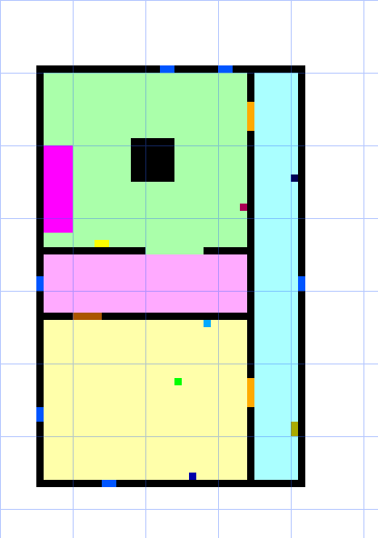
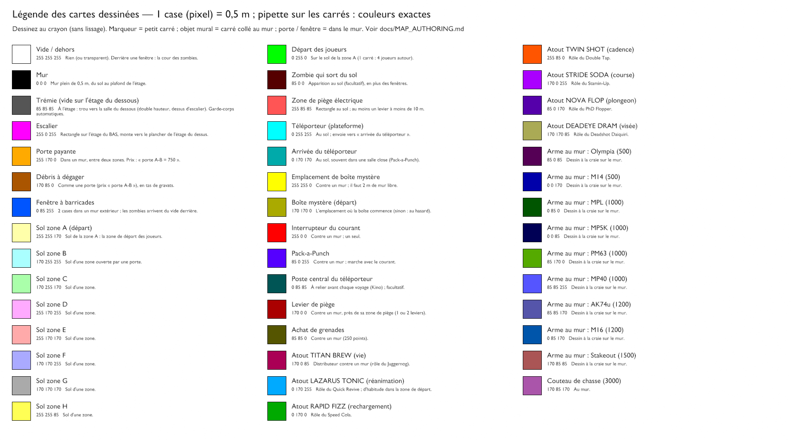
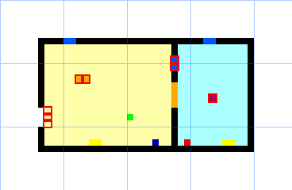
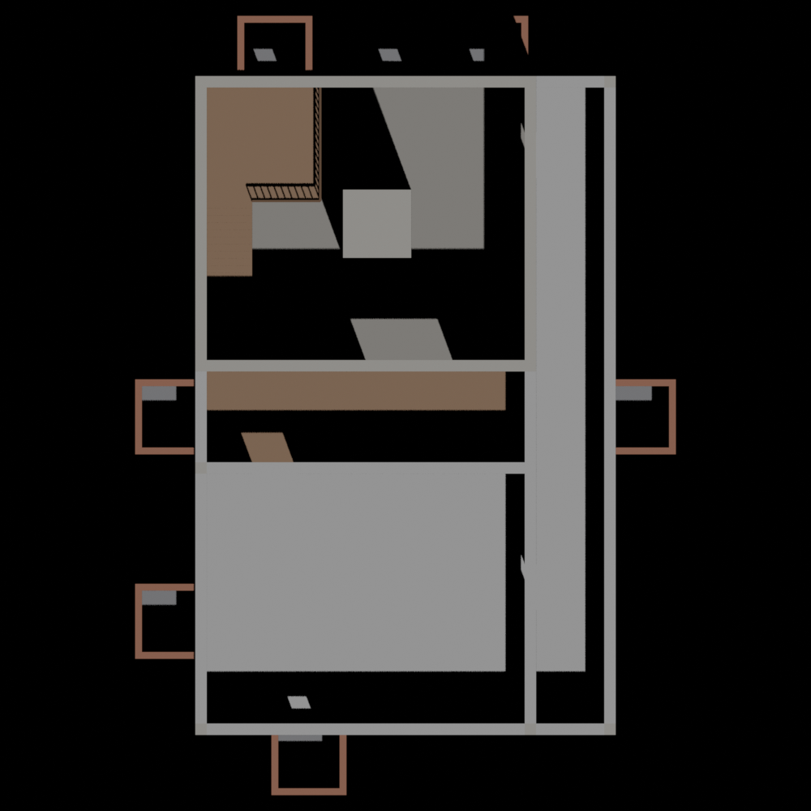
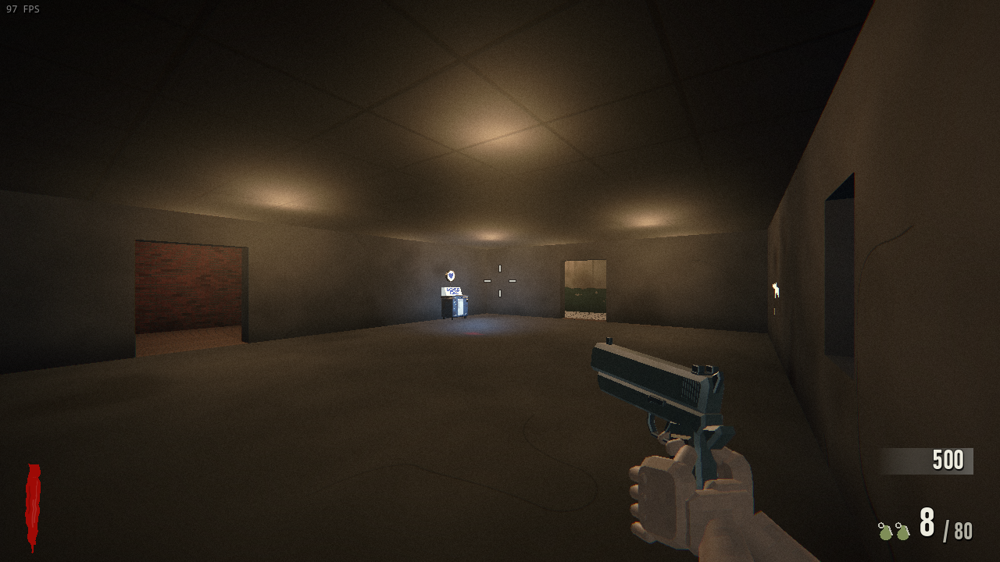
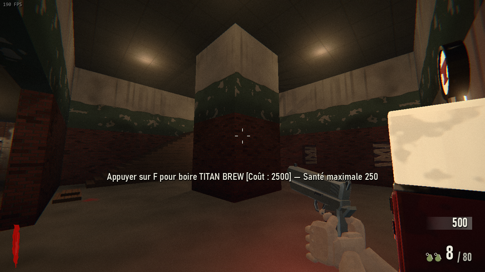
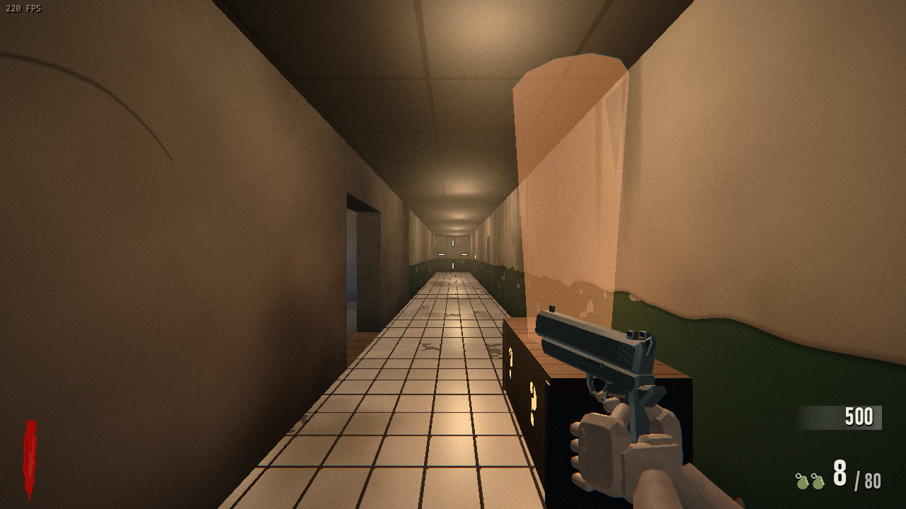
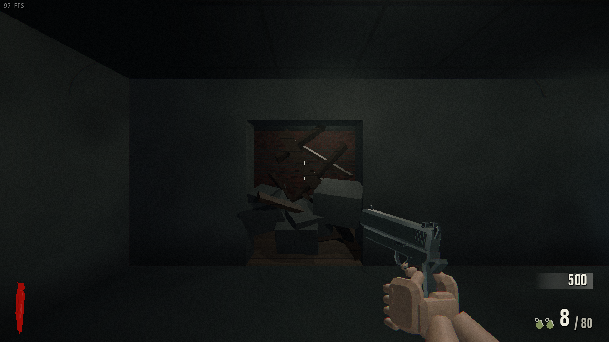

# Concevoir une carte en la dessinant

But : pouvoir concevoir une carte **simplement, sans bug et amusante** avant de
la construire dans le jeu. Ce document compare les façons de décrire une carte,
justifie la méthode retenue, en donne le format exact (légende, échelle, règles,
propriétés), les outils, le validateur et ses indicateurs « façon BO1 », puis
un guide pas à pas. Preuve de concept : la carte d'essai **DRAFT ARENA**
(`--map=draft_arena`, hors menus), dessinée, convertie, construite et testée
par cette méthode.

**En bref : un dessin PNG par étage (une case = 0,5 m, une couleur par type
d'élément, peint dans n'importe quel logiciel, même Paint) + un petit fichier
texte `carte.txt` (nom, étages, noms des zones, prix des portes). Une commande
valide le tout (erreurs pointées dans le dessin, indicateurs d'amusement),
écrit la description `layout.json` au format actuel de `MeshMapLayout`, et
Blender construit la géométrie 3D.**




---

## 1. Comparaison des méthodes

Ce qui existe déjà dans le projet : les cartes **grille ASCII** (BUNKER K-7,
test_arena : `MapData`, un caractère par case, une seule hauteur) et les cartes
**en maillage à étages** (KINO, test_levels : `layout.json` écrit à la main ou
par un script Python, `tools/blender/kino/make_layout.py`, construit par
`tools/blender/mesh_map.py`). KINO a montré les pièges d'une description à la
main : murs parasites qui coupent une salle, salle close sans ses murs, objets
muraux du mauvais côté, zones inaccessibles, fenêtres qui ne mènent nulle part,
apparitions sur des îlots du navmesh, portes mal orientées, escaliers bloqués.
Tous viennent du même défaut : **on écrit des coordonnées sans voir le plan**,
et rien ne vérifie la carte avant de la jouer.

Méthodes évaluées :

- **(a) Image PNG à légende de couleurs** (l'idée de départ) : chaque pixel est
  une case ; sa couleur dit ce qu'elle est (mur, sol de telle zone, porte,
  fenêtre, atout…). N'importe quel logiciel : Paint (déjà dans Windows),
  Paint.NET, GIMP, Krita, LibreSprite, Aseprite, Piskel (en ligne).
- **(b) Éditeur de niveaux 2D libre** :
  - **Tiled** (<https://www.mapeditor.org>, éditeur sous GPL‑2.0, bibliothèque
    libtiled sous BSD ; installeur de quelques dizaines de Mo). Formats TMX (XML) et
    JSON (`.tmj`). Calques de tuiles, calques d'objets (rectangles, points,
    polygones), groupes de calques (un par étage), **propriétés typées** sur
    chaque objet (chaîne, entier, réel, booléen, couleur, fichier, objet, classes
    personnalisées) : un objet « porte » peut porter `cost = 750`, un objet
    « atout » `perk = titan`.
  - **LDtk** (<https://ldtk.io>, licence MIT, par l'auteur des niveaux de Dead
    Cells ; application à installer). Format `.ldtk` (JSON). Calques
    **IntGrid** (une grille d'entiers colorés : exactement notre légende),
    calques d'**entités** à champs typés (entier, réel, texte, énumération,
    couleur, point, référence à une autre entité, tableaux), règles
    d'« auto-calque », plusieurs niveaux dans un monde (avec une profondeur
    pour empiler des étages).
- **(c) Dessin vectoriel SVG** (Inkscape, <https://inkscape.org>, GPL) : formes
  exactes, identifiants et attributs posés dans l'éditeur XML ; il faut lire
  des chemins SVG (transformations, courbes, unités) : gros convertisseur, et
  les attributs sont peu accessibles à un non-programmeur.
- **(d) Éditeur intégré à Godot** (greffon ou scène : `TileMapLayer` avec des
  couches de données personnalisées, `GridMap`, script `@tool`) : aperçu 3D
  immédiat, rien à installer de plus, mais il faut ouvrir l'éditeur Godot,
  écrire et maintenir un greffon, et les `.tscn` se lisent mal dans un diff.
- **(e) Description texte** (ASCII étendu comme BUNKER K-7, ou JSON écrit à la
  main comme test_levels) : diffs parfaits, aucun outil, mais les
  métadonnées vivent ailleurs que la case (tables de correspondance), les
  étages et les hauteurs sont pénibles, et on ne « voit » pas le plan.

| Critère | (a) PNG + légende | (b) Tiled / LDtk | (c) SVG Inkscape | (d) Godot | (e) Texte / JSON |
|---|---|---|---|---|---|
| Simplicité pour un non-programmeur | ★★★ Paint suffit | ★★ outil à apprendre | ★ XML à la main | ★ éditeur de jeu | ★ syntaxe |
| Rapidité d'itération | ★★★ peindre, relancer | ★★★ | ★★ | ★★ | ★★ |
| Étages, hauteurs | ★★ une image par étage, trémies | ★★★ calques / niveaux | ★ | ★★★ | ★ |
| Métadonnées (prix, types, zones) | ★★ couleur = type ; le reste dans `carte.txt` | ★★★ champs typés | ★★ attributs | ★★★ | ★★ tables séparées |
| Risque d'erreur | ★★ (lissage des pinceaux : refusé par le validateur) | ★★★ | ★ | ★★ | ★ |
| Validation automatique | ★★★ grille = simple à vérifier | ★★★ | ★ géométrie libre | ★★ | ★★ |
| Rendu 3D fidèle | ★★★ même chaîne `mesh_map.py` | ★★★ | ★★ | ★★★ | ★★★ |
| Diffs git lisibles | ★ image binaire (mais `layout.json` et `rapport.txt` générés, eux, se lisent) | ★★★ JSON | ★★ | ★ | ★★★ |
| Coût d'outillage | ★★★ rien à installer ; ~1 500 lignes | ★★ installer l'éditeur ; convertisseur de son JSON | ★ | ★ greffon | ★★★ déjà là |

**Recommandation : (a) hybride — un PNG par étage + un fichier texte de
propriétés.** Raisons :

1. **On voit le plan et on le modifie en quelques clics**, dans le logiciel que
   l'on connaît ; ce que l'on peint est ce que l'on obtient (une case = une
   case du jeu). C'était l'idée de l'utilisateur, et elle tient.
2. **Tout ce qui a un emplacement est une couleur** (mur, zone, porte, fenêtre,
   chaque atout, chaque arme au mur, boîte…) : aucun lien caché entre le dessin
   et un tableau. Le peu qui n'a pas d'emplacement (nom de la carte, hauteurs
   d'étage, noms des zones, prix des portes par paire de zones) tient dans
   `carte.txt`, lisible et diffable.
3. **La grille rend la validation simple et sûre** : chaque piège de KINO devient
   une règle vérifiée case par case (§4), avec la position fautive en pixels,
   comme on la lit dans la barre d'état du logiciel de dessin.
4. **Rien de nouveau côté jeu** : la sortie est le `layout.json` déjà lu par
   `MeshMapLayout` et construit par `mesh_map.py` (salles, blocs, garde-corps,
   escaliers à rampe, zones, marqueurs).
5. **Zéro installation** ; l'image binaire est le seul défaut (diff illisible),
   compensé par le `layout.json` généré (une ligne par salle, bloc ou objet) et
   par `rapport.txt`, versionnés, qui montrent ce qui a changé.

LDtk est la meilleure alternative (IntGrid = notre légende, entités typées = nos
objets) et Tiled la plus répandue ; elles ne sont **pas retenues** parce qu'il
faut les installer et les apprendre pour un gain faible sur des cartes BO1
(plans orthogonaux, objets posés contre les murs). Le cœur du convertisseur
travaille sur une grille de clés de légende : lire un calque IntGrid de LDtk ou
un calque de tuiles de Tiled au lieu d'un PNG serait un petit ajout si le
besoin s'en faisait sentir (§8).

---

## 2. Format

### Échelle et repères
- **1 case (pixel) = 0,5 m** (`tools/maps/legende.json`, `echelle`). Nord en haut
  de l'image. Case (x, y) de l'image -> monde Godot x = 4 + 0,5·x, z = 4 + 0,5·y
  (le décalage de 4 m garde x, z ≥ 0 pour `NetCodec` et laisse la place des
  cours derrière les fenêtres du bord).
- **Tailles BO1** en cases : couloir 4 à 8 (2 à 4 m ; couloir hall-théâtre de
  Kino : 4 m), salle 20 à 40 (10 à 20 m), mur 1 (0,5 m ; 0,4 m à Kino), porte 3
  à 6 (1,5 à 3 m), fenêtre 2 (1 m), escalier 3 à 5 de large (1,5 à 2,5 m) et
  9 à 12 de long pour un étage de 3,5 m (30 à 38°).
- Hauteurs : sol de chaque étage dans `carte.txt` ; les salles d'un étage ont
  leur plafond sous la **dalle de 0,3 m** de l'étage du dessus ; seul le dernier
  étage déclare son plafond. Portes : 2,5 m ; fenêtres : allège 0,95 m et
  linteau 2,35 m (ceux des barricades du jeu).

### Légende
Image prête à l'emploi (carrés aux couleurs **exactes**, à prendre à la
pipette) : [`map_authoring/legende.png`](map_authoring/legende.png), aussi dans
le modèle `tools/maps/modele/`. Source unique : `tools/maps/legende.json`
(l'image est rendue par `sh tools/blender.sh tools/maps/legend.py <png>`). Une
couleur à moins de 30 (distance RVB) de celle de la légende est acceptée ; deux
couleurs de la légende sont à 85 au moins l'une de l'autre, donc jamais confondues.



| Élément | RVB | Hex | Règle |
|---|---|---|---|
| Vide / dehors | 255, 255, 255 | `#FFFFFF` | Rien (ou transparent). Derrière une fenêtre : la cour des zombies. |
| Mur | 0, 0, 0 | `#000000` | Mur plein de 0,5 m, du sol au plafond de l'étage. |
| Trémie (vide sur l'étage du dessous) | 85, 85, 85 | `#555555` | À l'étage : trou vers la salle du dessous (double hauteur, dessus d'escalier). Garde-corps automatiques. |
| Escalier | 255, 0, 255 | `#FF00FF` | Rectangle sur l'étage du BAS, monte vers le plancher de l'étage du dessus. |
| Porte payante | 255, 170, 0 | `#FFAA00` | Dans un mur, entre deux zones. Prix : « porte A-B = 750 ». |
| Débris à dégager | 170, 85, 0 | `#AA5500` | Comme une porte (prix « porte A-B »), en tas de gravats. |
| Fenêtre à barricades | 0, 85, 255 | `#0055FF` | 2 cases dans un mur extérieur ; les zombies arrivent du vide derrière. |
| Sol zone A (départ) | 255, 255, 170 | `#FFFFAA` | Sol de la zone A : la zone de départ des joueurs. |
| Sol zone B | 170, 255, 255 | `#AAFFFF` | Sol d'une zone ouverte par une porte. |
| Sol zone C | 170, 255, 170 | `#AAFFAA` | Sol d'une zone. |
| Sol zone D | 255, 170, 255 | `#FFAAFF` | Sol d'une zone. |
| Sol zone E | 255, 170, 170 | `#FFAAAA` | Sol d'une zone. |
| Sol zone F | 170, 170, 255 | `#AAAAFF` | Sol d'une zone. |
| Sol zone G | 170, 170, 170 | `#AAAAAA` | Sol d'une zone. |
| Sol zone H | 255, 255, 85 | `#FFFF55` | Sol d'une zone. |
| Départ des joueurs | 0, 255, 0 | `#00FF00` | Sur le sol de la zone A (1 carré : 4 joueurs autour). |
| Zombie qui sort du sol | 85, 0, 0 | `#550000` | Apparition au sol (facultatif), en plus des fenêtres. |
| Zone de piège électrique | 255, 85, 85 | `#FF5555` | Rectangle au sol ; au moins un levier à moins de 10 m. |
| Téléporteur (plateforme) | 0, 255, 255 | `#00FFFF` | Au sol ; envoie vers « arrivée du téléporteur ». |
| Arrivée du téléporteur | 0, 170, 170 | `#00AAAA` | Au sol, souvent dans une salle close (Pack-a-Punch). |
| Emplacement de boîte mystère | 255, 255, 0 | `#FFFF00` | Contre un mur ; il faut 2 m de mur libre. |
| Boîte mystère (départ) | 170, 170, 0 | `#AAAA00` | L'emplacement où la boîte commence (sinon : au hasard). |
| Interrupteur du courant | 255, 0, 0 | `#FF0000` | Contre un mur ; un seul. |
| Pack-a-Punch | 85, 0, 255 | `#5500FF` | Contre un mur ; marche avec le courant. |
| Poste central du téléporteur | 0, 85, 85 | `#005555` | À relier avant chaque voyage (Kino) ; facultatif. |
| Levier de piège | 170, 0, 0 | `#AA0000` | Contre un mur, près de sa zone de piège (1 ou 2 leviers). |
| Achat de grenades | 85, 85, 0 | `#555500` | Contre un mur (250 points). |
| Atout TITAN BREW (vie) | 170, 0, 85 | `#AA0055` | Distributeur contre un mur (rôle du Juggernog). |
| Atout LAZARUS TONIC (réanimation) | 0, 170, 255 | `#00AAFF` | Rôle du Quick Revive ; d'habitude dans la zone de départ. |
| Atout RAPID FIZZ (rechargement) | 0, 170, 0 | `#00AA00` | Rôle du Speed Cola. |
| Atout TWIN SHOT (cadence) | 255, 85, 0 | `#FF5500` | Rôle du Double Tap. |
| Atout STRIDE SODA (course) | 170, 0, 255 | `#AA00FF` | Rôle du Stamin-Up. |
| Atout NOVA FLOP (plongeon) | 85, 0, 170 | `#5500AA` | Rôle du PhD Flopper. |
| Atout DEADEYE DRAM (visée) | 170, 170, 85 | `#AAAA55` | Rôle du Deadshot Daiquiri. |
| Arme au mur : Olympia (500) | 85, 0, 85 | `#550055` | Dessin à la craie sur le mur. |
| Arme au mur : M14 (500) | 0, 0, 170 | `#0000AA` | Dessin à la craie sur le mur. |
| Arme au mur : MPL (1000) | 0, 85, 0 | `#005500` | Dessin à la craie sur le mur. |
| Arme au mur : MP5K (1000) | 0, 0, 85 | `#000055` | Dessin à la craie sur le mur. |
| Arme au mur : PM63 (1000) | 85, 170, 0 | `#55AA00` | Dessin à la craie sur le mur. |
| Arme au mur : MP40 (1000) | 85, 85, 255 | `#5555FF` | Dessin à la craie sur le mur. |
| Arme au mur : AK74u (1200) | 85, 85, 170 | `#5555AA` | Dessin à la craie sur le mur. |
| Arme au mur : M16 (1200) | 0, 85, 170 | `#0055AA` | Dessin à la craie sur le mur. |
| Arme au mur : Stakeout (1500) | 170, 85, 85 | `#AA5555` | Dessin à la craie sur le mur. |
| Couteau de chasse (3000) | 170, 85, 170 | `#AA55AA` | Au mur. |

### Règles de dessin
- **Outil crayon, sans lissage** (pas de pinceau adouci, pas de flou, pas de
  redimensionnement) : une couleur inconnue est refusée avec sa position et la
  couleur de la légende la plus proche.
- **Une zone = une couleur de sol.** Deux salles de même couleur reliées par une
  ouverture sans porte forment une seule zone ; deux zones de couleurs
  différentes qui se touchent sans mur sont « ouvertes l'une sur l'autre »
  (activées ensemble, comme la mezzanine de test_levels). La zone de départ est
  toujours **A** (le jeu ouvre la zone « a » au début).
- **Tout sol est fermé** : entre un sol et le vide, il faut un mur (ou une
  fenêtre, qui se pose *dans* le mur).
- **Porte / débris** : un rectangle posé à la place du mur, mur aux deux bouts,
  sol d'une zone d'un côté et d'une **autre** zone de l'autre ; 2 cases au moins
  de large (3 conseillées). Sens et largeur sont lus dans le dessin : une porte
  ne peut pas être « mal orientée ».
- **Fenêtre** : 2 cases dans un mur de 1 case, sol d'une zone à l'intérieur,
  vide dehors, et 2,5 × 3 m de vide libre derrière (le convertisseur y construit
  la cour à trois murs où les zombies apparaissent).
- **Marqueur = petit carré** (1 ou 2 cases) posé sur le sol. **Objet mural** :
  carré collé contre le mur visé (le côté est déduit du mur touché ; dans un
  angle, décalez-le d'une case) ; il faut du mur derrière toute sa largeur et du
  sol libre devant (boîte : 4 × 2 cases ; atout, Pack-a-Punch : 3 × 2 ; arme :
  2 × 1). Deux objets ne se chevauchent pas.
- **Départ** : un carré vert dans la zone A, à 1 m au moins des murs ; les
  4 joueurs se placent autour et regardent vers le milieu de la zone.
- **Étages** : une image par étage, **même taille**, superposables. À l'étage,
  ce qui est au-dessus d'une salle à double hauteur ou d'un escalier est peint
  en **trémie** ; le plancher d'étage qui borde une trémie reçoit un garde-corps
  (sauf en haut de l'escalier) ; la trémie doit être entourée de murs d'étage
  (ou de plancher). Le blanc au-dessus d'une salle = un plafond normal.
- **Escalier** : rectangle magenta sur l'étage du bas ; du sol à son pied d'un
  côté court, du plancher de l'étage du dessus au bout opposé ; trémie au-dessus
  de tout l'escalier ; 3 cases de large au moins, 40° au plus.

### Propriétés : `carte.txt`
Une ligne `clé = valeur` par propriété, `#` pour les commentaires (modèle
commenté : `tools/maps/modele/carte.txt`).

```text
id = draft_arena                       # dossier assets/maps/<id>/, --map=<id>
nom = DRAFT ARENA
description = Une phrase pour l'écran de sélection.
musique = ambience_bunker
etage 0 = etage0.png, sol 0            # sol de l'étage (m)
etage 1 = etage1.png, sol 3.5, plafond 6.8   # le dernier donne son plafond
zone A = Salle des machines            # noms affichés sur les portes
porte A-B = 750                        # prix par paire de zones
porte A-D = 1250                       # (vaut pour les débris aussi)
porte C-E = courant                    # ouverte par le courant
porte B-F = 1250 liées                 # un achat ouvre toutes les portes B-F
sol A = concrete_dark                  # matériaux (clés de WorldLook.SURFACES)
murs A = wall_concrete
hauteur des portes = 2.5
```

---

## 3. Outils et commandes

| Fichier | Rôle |
|---|---|
| `tools/maps/legende.json` | Légende (clé, type, RVB, nom, règle) : source unique. |
| `tools/maps/map_drawing.gd` | `MapDrawing` : lecture du dessin et de `carte.txt`, **validateur**, indicateurs d'amusement, rapport texte et images. |
| `tools/maps/map_drawing_export.gd` | `MapDrawingExport` : dessin validé -> `layout.json` (format de `MeshMapLayout` / `mesh_map.py`). |
| `tools/maps/draw2layout.gd` | Ligne de commande (Godot sans fenêtre, sans autoloads). |
| `tools/maps/build_map.sh` | Tout en une commande : conversion, Blender, import. |
| `tools/maps/legend.py` | Image de légende (Blender sans fenêtre). |
| `tools/maps/modele/` | Modèle vide : `carte.txt` commenté, `etage0.png` blanc 80 × 60, `legende.png`. |
| `scripts/game/map/drawn_map_def.gd` | `DrawnMapDef` : carte dessinée côté jeu (réglages lus dans la section `map_def` du `layout.json`). |

```sh
# Conversion + validation + géométrie + import (la commande à retenir) :
sh tools/maps/build_map.sh assets/maps/<id>/dessin/carte.txt
# Seulement la validation et le layout.json (1 s) :
godot --headless --path . -s res://tools/maps/draw2layout.gd -- assets/maps/<id>/dessin/carte.txt
# Image blanche pour commencer :
godot --headless --path . -s res://tools/maps/draw2layout.gd -- --vierge etage1.png 80 60
# Légende :
sh tools/blender.sh tools/maps/legend.py docs/map_authoring/legende.png
```

Sorties : `assets/maps/<id>/layout.json` (généré, ne pas modifier à la main) et
`<id>.glb` ; à côté du dessin, `rapport.txt` (versionné : son diff montre
l'effet d'une retouche sur les indicateurs), `rapport_etageN.png` (dessin
agrandi ×8, quadrillage tous les 5 m, erreurs entourées de rouge et
avertissements d'orange) et `apercu_dessus.png` (vue de dessus rendue par
Blender) — ces images sont ignorées par git.

Déclarer la carte dans le jeu : un script de 3 lignes
(`scripts/game/map/maps/<id>.gd` : `extends DrawnMapDef` et
`_init_drawn("<id>")`) et une ligne dans `Game.MAP_SCRIPTS` ; l'ajouter à
`Game.MENU_MAPS` la propose dans les menus.

Ce que produit le convertisseur, avec les conventions existantes de
`mesh_map.py` : une salle (`rooms`) par rectangle de même zone et même plafond
(dalles d'étage `floor_slab`, `no_ceiling` sous une dalle, plafond à double
hauteur sous une trémie), les murs, allèges, linteaux de portes et de fenêtres
en `blocks`, les garde-corps (`rails`), les escaliers (`stairs` : marches
visibles et rampe de collision), les cours des fenêtres (salles `dehors_N` et
leurs trois murs), les boîtes de zones (`zones`, `zone_order`, étages hauts
d'abord), les marqueurs (objets muraux donnés par la face du mur et la direction
du mur, portes avec lacet, largeur et profondeur, fenêtres avec leur apparition,
lampes sur une grille de 6 m) et la section `map_def` (nom, zones, prix, zones
ouvertes l'une sur l'autre, départ de la boîte).

---

## 4. Le validateur

La carte est **refusée** (aucun `layout.json` écrit) au moindre défaut ; chaque
message donne la position dans le dessin (x, y en pixels, étage).

Erreurs (règles qui rendent impossibles les pièges rencontrés sur KINO) :
- couleur inconnue (pinceau lissé, transparence partielle) ;
- sol au bord du vide sans mur (**salle close sans ses murs**) ;
- zone coupée en morceaux sans passage (**mur parasite qui coupe une salle**) ;
- zone ou passage inaccessible depuis le départ, toutes portes ouvertes
  (**zones inaccessibles, pièce close sans accès**) ;
- porte hors d'un mur, entre deux morceaux de la même zone, côté bordé de deux
  zones, sans prix, trop étroite (**portes mal orientées** : impossible, le sens
  vient du dessin) ;
- fenêtre qui ne donne pas sur le dehors, mauvaise taille, sans place pour la
  cour des zombies (**fenêtres qui ne mènent nulle part**, **apparitions sur des
  îlots** : chaque apparition est dans la cour de sa fenêtre) ;
- zone sans fenêtre (sauf la salle d'arrivée du téléporteur) ;
- départ hors de la zone A, collé à un mur, ou à moins de 7 m de toutes les
  fenêtres de la zone A (le jeu n'y ferait apparaître aucun zombie :
  `Spawner.MIN_PLAYER_DIST`) ;
- objet mural qui ne touche pas de mur, dans un angle, sans la place devant ou
  sans mur derrière (**objets muraux collés du mauvais côté** : impossible, le
  côté vient du mur touché) ;
- aucune boîte, deux « boîte (départ) », deux interrupteurs, deux distributeurs
  du même atout, téléporteur sans arrivée, levier sans piège à moins de 10 m,
  piège sans levier ;
- passage de 0,5 m (trop étroit pour les zombies et les joueurs), en comptant
  l'emprise des objets pleins (boîte, distributeurs) ;
- escalier sans palier, sens ambigu, trop étroit, trop raide, recouvert par
  l'étage du dessus ; trémie au rez-de-chaussée, au-dessus du vide ou ouverte
  sur le vide (**escaliers bloqués**) ;
- `carte.txt` : propriété inconnue, matériau inconnu, étages mal déclarés,
  hauteur sous plafond insuffisante.

Avertissements et indicateurs d'amusement (inspirés de BO1, jamais bloquants) :
- **boucles** : cycles du graphe des zones (portes ouvertes) avec le coût pour
  les ouvrir, et blocs isolés autour desquels on tourne (pilier, îlot de murs,
  trémie entourée de plancher) avec la longueur du tour (BO1 : 25 à 40 m) ;
  avertissement s'il n'y en a aucune (« training » impossible) ;
- **impasses** (zone à une seule sortie ; avertissement si c'est le départ) et
  **passages obligés** (goulots du graphe des zones) ; couloirs de 1 m ;
- **courbe d'ouverture** : les portes dans l'ordre d'un joueur qui achète la
  moins chère d'abord, et le total pour tout ouvrir ; avertissement si la
  première porte n'est pas entre 500 et 1000 (BO1 : 750, achetée vers la fin de
  la manche 1 ou en manche 2) ;
- **répartition** : emplacements de boîte par zone (avertissement s'ils sont
  tous dans la même, ou moins de 3), atouts et coût pour les atteindre, arme bon
  marché au mur dans la zone de départ, LAZARUS au départ ;
- **coin Juggernog** : zone du TITAN BREW, points de portes pour l'atteindre,
  impasse ou zone de passage (avertissement s'il est dans la zone de départ) ;
- **apparitions** : fenêtre la plus proche du départ, distance à pied au plus
  loin d'une fenêtre dans chaque zone (avertissement au-delà de 30 m) ;
  surface et nombre de fenêtres de chaque zone.

Exemple d'un dessin volontairement fautif (image du rapport, défauts entourés) :



```text
ERREURS (la carte est refusée) :
  - fenêtre en (x 27, y 9) : elle doit être dans un mur extérieur, avec le sol d'une zone d'un côté et du vide (dehors) de l'autre
  - porte en (x 12, y 12) : elle doit être posée dans un mur (mur aux deux bouts), avec du sol de chaque côté
  - Atout TITAN BREW (vie) en (x 33, y 15) : doit toucher un mur (collez le carré contre le mur)
  - sol au bord du vide sans mur en (x 7, y 17) (3 case(s)) : fermez la pièce par un mur noir (une fenêtre se pose DANS un mur)
```

---

## 5. Guide : de l'idée au jeu

1. **Esquisser sur papier** la boucle de la carte : la zone de départ, 2 sorties,
   l'ordre des portes (750, 1000, 1250…), où sont le courant, la boîte, le
   Juggernog (TITAN BREW), une grande boucle pour tourner en rond.
2. **Copier le modèle** `tools/maps/modele/` dans `assets/maps/<id>/dessin/`
   (garder le fichier `.gdignore`), ouvrir `etage0.png` et `legende.png` côte à
   côte, zoomer fort, **crayon de 1 pixel**.
3. **Peindre** : murs noirs (rectangles pleins, puis vider l'intérieur avec la
   couleur de la zone), une couleur par zone (A = départ), portes orange et
   fenêtres bleues dans les murs, objets contre les murs, carré vert du départ.
   Étage : une deuxième image de même taille, trémie gris foncé au-dessus des
   doubles hauteurs et des escaliers.
4. **Remplir `carte.txt`** : `id`, `nom`, étages, noms des zones, un prix par
   paire de zones reliées par une porte.
5. **Convertir** : `sh tools/maps/build_map.sh assets/maps/<id>/dessin/carte.txt`.
6. **Lire le rapport** (dans le terminal et `rapport.txt`) ; ouvrir
   `rapport_etage0.png` : chaque erreur est entourée de rouge à sa case. Corriger
   le dessin, relancer (1 s tant qu'il y a des erreurs). Puis regarder les
   indicateurs : boucles, impasses, courbe d'ouverture, coin Juggernog.
7. **Construire** : une fois la carte acceptée, la même commande lance Blender
   (géométrie et vue de dessus `apercu_dessus.png`) et l'import Godot.
8. **Déclarer et tester** : script de carte `extends DrawnMapDef`, entrée dans
   `Game.MAP_SCRIPTS`, puis `--map=<id>` en jeu, ou un scénario sur le modèle de
   `tests/autotest/draft_arena.gd` (`HEADLESS=1 sh tools/scenario.sh <nom>`) ;
   `sh tools/check.sh` avant de livrer.
9. **Itérer** : chaque retouche = peindre, relancer `build_map.sh`, rejouer.
   Le test `test_map_drawing.gd` vérifie que le `layout.json` versionné de
   draft_arena correspond toujours à son dessin (même règle conseillée pour
   toute carte dessinée).

### Pièges
- Pinceau lissé, gomme adoucie, redimensionnement, enregistrement en JPEG :
  couleurs intermédiaires refusées. Toujours PNG, crayon, sans anticrénelage.
- Une fenêtre peinte **à côté** du mur (sur le sol) au lieu d'**à la place** du
  mur ; un carré d'objet mural posé **dans** le mur au lieu de contre lui.
- Une zone peinte d'une couleur légèrement différente : elle devient une autre
  zone (le rapport liste les zones et leurs surfaces : vérifiez-les).
- Oublier les murs de l'étage autour d'une trémie (le vide de la salle à double
  hauteur serait ouvert) ou la trémie au-dessus d'un escalier (plafond sur les
  marches).
- Une porte sans prix dans `carte.txt`, ou un prix pour une paire de zones qui
  n'a pas de porte (avertissement).

### Conseils de conception (BO1)
- **Départ** : 150 à 250 m², 2 à 4 fenêtres à plus de 6 m du départ, deux
  sorties (Kino : hall avec deux portes à 750), une arme à 500 au mur (M14 ou
  Olympia), LAZARUS (Quick Revive).
- **Rythme des portes** : 750 pour la première, puis 1000, 1250 (Kino : 750,
  750, 1000, 1000, 1250 × 4) ; 5 à 10 portes ; ce qu'il y a derrière chaque
  porte doit valoir le prix (une arme, un atout, un emplacement de boîte, le
  courant, un raccourci qui ferme une boucle).
- **Boucles** : au moins une grande boucle de salles (Kino : deux, qui se
  rejoignent en coulisses) et un espace dégagé pour tourner autour d'un obstacle
  (25 à 40 m de tour) ; couloirs de 2 à 4 m, jamais moins de 1,5 m sur un trajet
  de training.
- **Fenêtres** : environ une pour 50 à 80 m² de zone (Kino : 22 pour une dizaine
  de zones) ; à moins de 25 m à pied de tout point, pour que les zombies arrivent
  vite ; jamais dans le dos immédiat d'une arme au mur.
- **Boîte** : 1 emplacement par grande salle (Kino : 9), départ souvent une porte
  plus loin que le départ ; **courant** au bout d'un chemin qui coûte (Kino : en
  coulisses, derrière 3 portes) ; **Juggernog** derrière 1 à 3 portes, dans un
  coin défendable.
- **Étages** : une passerelle ou un balcon donne un poste de tir et une impasse
  (bon pour camper, dangereux pour le training) ; escaliers de 2 m ou plus de
  large pour que la horde passe.

---

## 6. Preuve de concept : DRAFT ARENA

Carte originale de 26 × 37 m, 2 étages, dessinée avec cette méthode
(`assets/maps/draft_arena/dessin/` : `etage0.png`, `etage1.png`, `carte.txt`) :
salle des machines (A, départ, M14, LAZARUS), couloir de service (B, MP5K,
boîte de départ), entrepôt à double hauteur avec son pilier (C, TITAN BREW,
boîte, escalier), atelier (D, ouvert sur l'entrepôt), passerelle à l'étage (E,
boîte, courant) ; portes A-B 750 et B-C 1000, débris A-D 1250 ; 7 fenêtres ;
3 emplacements de boîte ; 2 atouts ; 2 armes au mur ; courant. Déclarée hors
menus : `--map=draft_arena` (`scripts/game/map/maps/draft_arena.gd`).

Rapport du validateur (0 erreur, 0 avertissement) :

```text
  - Départ : fenêtre la plus proche à 7.6 m, apparition utilisable la plus lointaine à 10.6 m
  - Zones : A Salle des machines (154 m², 2 fenêtres) ; B Couloir de service (84 m², 1 fenêtre) ; C Entrepôt (161 m², 2 fenêtres) ; D Atelier (56 m², 1 fenêtre) ; E Passerelle (25 m², 1 fenêtre)
  - Boucles entre zones (portes ouvertes) : 1 — B → A → D → C → B (3000 points de portes)
  - Boucle de training autour du bloc en (x 34, y 18, étage 0) : tour au plus près ≈ 63 m en passant les portes
  - Boucle de training autour du bloc en (x 18, y 19, étage 0) : tour au plus près ≈ 14 m (petit : BO1 ≈ 25-40 m)
  - Impasse : zone E n'a qu'une sortie (vers C) : bon coin pour camper, piège pour le training
  - Passage obligé (goulot) entre C et E (escalier)
  - Courbe d'ouverture (moins cher d'abord) : 750 (porte 3, ouvre B) → 1000 (porte 1, ouvre C, D, E) → 1250 (débris A-D, ferme une boucle) ; total pour tout ouvrir 3000 points
  - Coin TITAN BREW (rôle du Juggernog) : zone C, 1250 points de portes depuis le départ, zone de passage (3 sorties)
  - Distance à pied au plus loin d'une fenêtre, par zone : A 15 m, B 16 m, C 15 m, D 15 m, E 7 m
```

Lecture « BO1 » : la grande boucle A-B-C-D (63 m) existe dès que tout est
ouvert, le pilier de l'entrepôt ne fait qu'un petit tour (14 m) : la carte se
joue mais un vrai training demanderait un bloc plus grand ; la passerelle est
une impasse (poste de camping) ; le TITAN BREW coûte 1250 (les débris), dans la
fourchette de BO1.

Vue de dessus (Blender, `mesh_map.py`) et captures en jeu :







Preuves automatiques :
- `tests/autotest/draft_arena.gd` (dans `check.sh`, sans rendu) : 7 fenêtres,
  3 boîtes (départ dans le couloir, une à l'étage), atouts, armes et prix à leur
  place ; en manche 1, les zombies n'apparaissent qu'aux fenêtres de la zone A,
  **arrachent les planches, enjambent la fenêtre et rejoignent le joueur** ;
  chaque apparition est rattachée à sa fenêtre ; portes fermées
  infranchissables ; porte achetée 750 et débris 1250 (le tas disparaît) ; toutes
  portes ouvertes et courant rétabli, **tout est accessible à pied** (objets,
  fenêtres, chaque salle) ; un zombie **monte l'escalier** jusqu'à la passerelle,
  un autre en descend, un troisième vient du départ par l'atelier. Avec rendu
  (`sh tools/scenario.sh draft_arena`), captures dans `tests/_out/shots/`.
- `tests/test_map_drawing.gd` : légende sans ambiguïté et image de légende aux
  couleurs exactes, constantes égales à celles du jeu, carte correcte acceptée et
  exportée, et une vingtaine de dessins fautifs refusés avec le bon message à la
  bonne case (couleur inconnue, sol sans mur, fenêtres, portes, zone close, zone
  sans fenêtre, départ, objets muraux, mur parasite, passage étroit, escaliers,
  trémie), indicateurs d'amusement, pièges / téléporteur / Pack-a-Punch, modèle
  lisible, et `layout.json` de draft_arena à jour avec son dessin.

---

## 7. Côté jeu

- `DrawnMapDef` lit la section `map_def` du `layout.json` (nom, description,
  musique, noms des zones, prix, `open_links`, départ de la boîte, téléporteur à
  relier s'il y a un poste central).
- `Door` sait être un **tas de débris** (`debris` dans la description) :
  planches, gravats et une poutre qui bouchent le passage, invite « Dégager les
  débris », le tas s'enfonce dans le sol à l'achat ; `MeshMapLayout.doors`
  transmet le drapeau.
- Rien d'autre ne change : les cartes existantes (KINO, BUNKER K-7, test_arena,
  test_levels) sont intactes.

## 8. Limites et prochaines étapes

- **Sols plats par étage** : pas encore de pente (le parterre de Kino) ni de
  petites marches entre deux salles d'un même étage ; à ajouter comme propriété
  de zone (`pente C = …`) ou couleur « rampe ».
- **Plan orthogonal à 0,5 m** : pas de murs en biais ni de courbes (BO1 en a peu :
  l'arrondi du Foyer de Kino se ferait en escalier de cases).
- Pas de porte en haut ou en bas d'un escalier (les deux zones d'un escalier sont
  ouvertes l'une sur l'autre) ; pas de portes liées à des paires de zones
  différentes ; pièges électriques seulement (pas de fosse à feu ni de
  tourelle) ; pas de décor (tables, caisses) : il se poserait en couleurs
  « décor bloquant » ou par la clé `props` existante.
- Téléporteur, Pack-a-Punch et pièges sont convertis et testés en unitaires,
  pas encore joués dans un scénario.
- Architecture en maquette grise (matériaux par zone seulement) : la passe
  artistique reste à faire dans Blender, carte par carte.
- **Prochaine étape conseillée** : redessiner une carte complète avec cette
  méthode (par exemple une version dessinée de BUNKER K-7, ou une nouvelle carte
  de la taille de Five), jouer les indicateurs contre le ressenti en partie, et
  ajuster les seuils. Si l'on veut un éditeur à calques plus tard, un lecteur
  LDtk (calque IntGrid = légende, entités = objets) alimenterait le même
  validateur.
