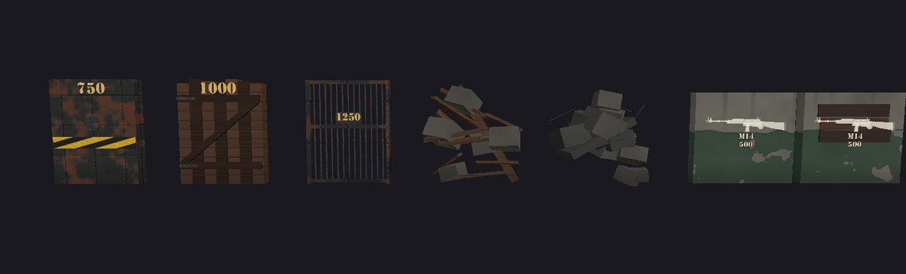
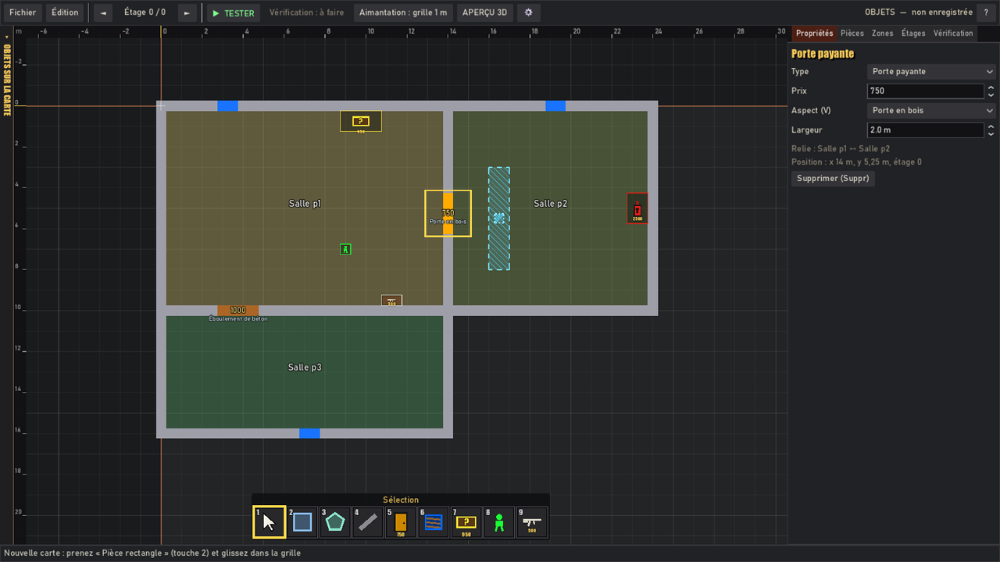

# Objets de l'éditeur de cartes : variantes, barrière invisible, escaliers, décor libre, portes à zombies, effets

Complément de `docs/MAP_AUTHORING.md` (éditeur, format des cinq JSON,
partage réseau) pour les ajouts des **formats 5 à 11** des cartes
(format 7 : décor posé librement, § 8 ; format 8 : portes à zombies, § 9 ;
format 9 : barrière invisible en polygone, § 2, et chevauchements du décor,
§ 10 ; format 10 : prefabs de la carte, § 11, et effets, § 12 ; format 11 :
effets purs et zones, § 12 ; format 15 : caisse au hasard posée au sol, § 15) :

1. les **variantes d'aspect** d'un type d'objet (plusieurs modèles de porte,
   de débris) ;
2. la **barrière invisible** (« clip » de BO1) : un volume tracé en polygone
   qui arrête joueurs et zombies sans se voir en jeu ;
3. (format 6) les **types d'escaliers** et leurs **ancres** pour les zombies
   (§ 4).




---

## 1. Variantes d'aspect

### Ce qui existe

| Type (`type`) | Variantes (`variante`) | Par défaut |
|---|---|---|
| `porte` (porte payante) | `blindee` Porte blindée / Armoured door · `bois` Porte en bois / Wooden door · `grille` Grille en fer / Iron gate | `blindee` |
| `debris` (débris à dégager) | `planches` Planches et gravats / Planks and rubble · `gravats` Éboulement de béton / Concrete cave-in | `planches` |

La variante ne change **que le visuel** : même prix, même largeur, même
collision, même ouverture (la porte monte dans le linteau, les débris
s'enfoncent), même invite. Une grille en fer arrête donc les balles comme une
porte pleine (choix de jeu : pas de tir à travers une porte fermée).

Les modèles sont construits par le jeu, sans fichier importé
(`scripts/game/interact/door.gd` : `_build_steel`, `_build_wood`,
`_build_gate`, `_build_debris`, `_build_rubble`), avec les surfaces du jeu
(`WorldLook.SURFACES` : bois, bois sombre, acier, tôle rouillée, béton) —
aucun élément graphique d'Activision.

Les fenêtres ont, depuis le format 8, trois **types** (fenêtre, porte à
zombies simple, porte double : § 9) choisis comme une variante (V, liste
**Type (V)**). Pas de variante pour les portes du courant, les passages, la caisse au
hasard, le décor et les luminaires (chaque modèle est déjà un objet du
catalogue : `MapCatalog.PREFABS`, `MapCatalog.LIGHTS`).

### Dans l'éditeur

- **Objet choisi** (outil Sélection) : onglet Propriétés, liste
  **Aspect (V)**, ou touche **V** (aspect suivant, en boucle ; Ctrl+Z
  annule) ; aussi menu Édition > Aspect suivant.
- **Objet tenu** (porte ou débris dans la barre rapide) : **V** avant
  de poser choisit l'aspect des prochains objets posés (comme R pour la
  rotation) ; changer de case revient à l'aspect par défaut.
- **Plan** : sous le prix d'une porte ou de débris, le nom de l'aspect quand
  ce n'est pas celui par défaut (zoom suffisant).
- Changer le **type** d'une ouverture (porte → débris) remet l'aspect par
  défaut (les variantes sont propres à un type).
- **Aperçu 3D** et **partie** : le bon modèle (mêmes fonctions de
  construction que le jeu).

### Format

Clé facultative `"variante"` dans `ouvertures.json` (portes, débris) :

```json
{"id":"o1","type":"porte","altitude":0,"position":[14,5.25],"largeur":2,"prix":750,"variante":"bois"}
```

Une arme murale (`type` `arme`) d'une carte d'avant est ignorée au
chargement, avec un avertissement (armes murales retirées du jeu).

- **Absente** : l'aspect par défaut, c'est-à-dire exactement l'aspect d'avant
  les variantes. L'éditeur **n'écrit jamais** la variante par défaut (choisir
  « Porte blindée » retire la clé) : une carte sans variante garde ses octets,
  son empreinte SHA-256 de partage et sa description en maillage.
- Lecture d'un fichier écrit à la main : une variante inconnue ou d'un autre
  type est retirée (`EditorMap._normalize`), l'objet garde l'aspect par défaut.
- Chaîne : `MapRaster` (table `MapValidator.variants` : id -> variante, sans
  les aspects par défaut) → `MapLayoutExport` (clé `variant` des marqueurs
  `doors`, seulement si elle n'est pas celle par défaut) →
  `MeshMapLayout` (`data.variant`) → `Door.variant`. Côté
  jeu, une valeur inconnue construit l'aspect par défaut (`Door.look()`).

## 2. Barrière invisible

### À quoi elle sert

Comme les « clips » invisibles des cartes de BO1 : empêcher de monter sur un
décor, fermer un recoin où l'on se coincerait, garder les joueurs hors d'un
endroit sans ajouter de mur visible, canaliser la horde.

| Ce qui la touche | Effet |
|---|---|
| Joueurs | arrêtés (couche BARRIER du masque du joueur) |
| Zombies | arrêtés, et leurs **trajets la contournent** (navmesh cuit avec la couche BARRIER) |
| Balles | passent (les tirs ne visent que la couche 1) |
| Fente au couteau (attaque de loin) | pas de fente à travers (même contrôle que pour une barricade) |
| Grenades, peluche leurre | passent (`Throwable.FLIGHT_MASK` = couche 1 et zombies) |
| Ligne de vue des zombies (`MeshNav.world_line_clear`) | coupée, comme par un décor « barrière » |
| Chiens de l'enfer | trajets autour d'elle (même navmesh) ; leur corps n'a pas la couche BARRIER dans son masque, comme pour les fauteuils et les autres décors « barrière » |

C'est le même comportement que les décors dont le blocage est « barrière »
(`MapCatalog.PREFABS[..].bloque`) : un choix fidèle aux clips de BO1 (on tire
à travers, on ne passe pas).

### Dans l'éditeur

- Inventaire (E), catégorie **Construction** : **Barrière invisible** /
  Invisible barrier (outil `poly`, format 9). Tracée comme une pièce
  polygone : un **clic par sommet** (côtés à 0, 45 ou 90° sur la grille ;
  Alt : angle libre ; G : grille fine ou libre ; saisie au clavier de la
  longueur et de l'angle du côté), fermée par un **double-clic**, un clic sur
  le **premier point** ou **Entrée** ; Retour arrière retire le dernier
  point, Échap ou clic droit annule. Un L, une croix, un contour qui épouse un
  meuble tourné : une seule barrière.
- Règles de pose (`MapRules.check_clip`) : **n'importe où** — dans une pièce,
  à cheval sur un mur, dehors, par-dessus n'importe quel objet (et un objet
  peut se poser par-dessus elle : elle n'entre jamais dans les
  chevauchements, `MapRules.NO_OVERLAP_CHECK`). Seuls refus : moins de 3 ou
  plus de 64 sommets, un côté de moins de 5 cm, des côtés qui se croisent,
  moins de 0,04 m² (format 17 : coordonnées libres, négatives comprises,
  sans borne).
- Édition (outil Sélection) : une **poignée carrée par sommet** (glisser :
  le sommet suit, refusé si le contour se croise), glisser la barrière la
  déplace, poignée ronde de rotation (15°, Alt : au degré près), R (90°),
  Ctrl+C / Ctrl+V, Suppr, Ctrl+Z. Elle bouge et tourne avec la pièce qui
  contient son centre, comme les autres objets.
- Dessin : polygone bleu clair translucide, **hachuré** à 45° (hachures
  coupées au contour, même concave), contour en tirets, sommets marqués,
  icône au milieu, hauteur écrite dessous quand elle n'est pas « jusqu'au
  plafond ».
- Propriétés : case **Jusqu'au plafond (hauteur de la pièce)** (cochée par
  défaut : pas de clé `hauteur`) ; décochée, champ **Hauteur** de 0,5 m et plus (sans maximum de conception depuis le format 17)
  au **dixième de mètre** (`MapCatalog.CLIP_HEIGHT_STEP`) ; la hauteur en jeu
  est rappelée dessous, avec le nombre de sommets et la surface ; Pivoter,
  Supprimer, et le rappel de ce qu'elle bloque.
- Vérification : ses cases (0,5 m) dont le centre est dans le polygone
  (`MapRaster.clip_cells`, un bord droit sur la grille compte comme [x0,
  x1[ : 0,5 m posé sur la grille = une rangée de cases) sont **pleines**
  pour le validateur (passages, accessibilité, trajets à pied) comme un
  décor qui bloque ; une barrière qui coupe une zone en deux est donc
  signalée comme un mur. Posées après tout le reste, elles ne changent
  jamais une case de mur, d'escalier ou d'objet de jeu qu'elles recouvrent.
- **Aperçu 3D** : le prisme bleu translucide du polygone, à sa hauteur ; menu
  **Affichage ▾ > Montrer les barrières invisibles** (coché par défaut,
  mémorisé avec les autres réglages de l'aperçu, clé `clips`).

### En jeu

Une `CollisionBox` (objet Godot du projet, `scripts/game/map/collision_box.gd`,
**jamais** une collision de modèle Blender) avec `barrier = true` : couche
`Barricade.BARRIER_LAYER`, **aucun maillage**. Elle passe par la clé
`blockers` de la description en maillage, comme les collisions du décor.
Format 9 : `poly` donne les sommets en x, z autour de `center` ; la
`CollisionBox` en fait un **prisme** de hauteur `size[1]`, découpé en
morceaux convexes (`Geometry2D.decompose_polygon_in_convex`), une
`ConvexPolygonShape3D` par morceau (un L = deux formes). `size` x et z : son
rectangle englobant ; `center` : le centre de ce rectangle, à mi-hauteur.

```json
{"center":[20.75,1.6,9.75],"size":[1,3.2,5],"yaw":0,"poly":[[-0.5,-2.5],[0.5,-2.5],[0.5,2.5],[-0.5,2.5]],"barrier":true,"surface":"concrete","clip":true,"eid":"i1"}
```

Hauteur : `hauteur` de l'objet (m depuis le sol de son niveau) ; absente, du
sol jusqu'au plafond réel de la pièce (au moins 2 m). Le navmesh est cuit sur ces
formes : les zombies contournent le polygone exact. `clip` et `eid` servent
seulement à l'aperçu 3D (`MapPreviewBuilder` y pose le prisme translucide,
`prism_mesh`) ; `CollisionBox.from_dict` les ignore et `MeshMapBuilder` ne
construit rien de visible. Sans `poly` (collisions du décor, tabliers
d'escalier), la `CollisionBox` reste le pavé `size` d'avant.

Une barrière invisible ne retire **jamais** un élément de la carte (aperçu 3D
et jeu) : un objet de jeu qu'elle recouvre reste construit, avec un simple
avertissement « une barrière invisible posée devant gêne son accès » ; un
escalier dont un bout est sous une barrière reste construit, avec un
avertissement ; les lampes automatiques ignorent les barrières (elles sont
au plafond). Exception : un objet **indispensable** que la barrière enferme
(les joueurs ne peuvent plus l'atteindre) est une **erreur** — interrupteur
du courant, caisse au hasard, départ des joueurs ; les autres objets (non
exigés par la carte) restent un avertissement.

### Format

Type `bloc_invisible` de `objets.json` (identifiants `i1`, `i2`…) :

Format 9 (écrit par l'éditeur) :

```json
{"id":"i1","type":"bloc_invisible","altitude":0,"sommets":[[16,3],[17,3],[17,8],[16,8]]}
{"id":"i2","type":"bloc_invisible","altitude":0,"sommets":[[2,2],[6,2],[6,3],[3,3],[3,6],[2,6]],"hauteur":1.2}
```

- `sommets` = [[x, y], ...] (m, 3 à 64 points, `MapCatalog.CLIP_POINTS`) :
  le **vrai** contour (pas un contour sur le trait comme un pilier), dans
  l'ordre du tracé ; `hauteur` (facultative, m, 0,5 et plus, au centimètre) :
  absente, du sol au plafond réel de la pièce.
- **Cartes d'avant** (formats 5 à 8) : `rect` = [x0, y0, x1, y1] et `rot`
  (entier de 0 à 359, sens horaire vu de dessus). À la lecture
  (`EditorMap.normalize_clip`, appelé par `_normalize` pour toute carte,
  même écrite à la main), le rectangle devient le polygone de ses 4 coins
  (rotation comprise, au millimètre) et `rect` / `rot` disparaissent : même
  place, même collision, mêmes cases ; la carte s'enregistre ensuite au
  format 9. Le jeu, le validateur et l'éditeur savent aussi lire une barrière
  `rect` qui n'est pas passée par la lecture (`MapRaster.clip_poly`).
- `hauteur` illisible ou sous 0,5 m : retirée (jusqu'au plafond) ; au-dessus
  de la garde technique `MapVertical.TECH_Z` (10 km, format 17 ; avant : 30 m) : bornée.

## 3. Contrôle des cartes reçues (réseau, archives)

Une seule source, le catalogue (`MapCatalog.allowed_kinds()`), lue par
`CustomMapGuard` (docs/SECURITY.md) :

- `variante` : `{"t": "enum", "values": MapCatalog.variants(type)}`, déclarée
  **seulement** pour les types qui ont des variantes (`porte`, `debris`,
  `arme`, `escalier` et, format 8, `fenetre` : `fenetre`, `porte`,
  `porte_double`). Refusés : une variante inconnue (`"titane"`), d'un autre
  type (`"planche"` sur une porte, `"bois"` sur une fenêtre), qui n'est pas un
  texte, un chemin (`"res://…"`), une clé `variante` sur tout autre type ; une
  fenêtre garde `largeur` à 1 (la largeur d'une porte suit son type).
- `bloc_invisible` : clés `id`, `type`, `altitude` (`etage` au format 16 et avant), `sommets` (format 9 :
  `{"t": "points", "min": 3, "max": 64}`, chaque point [x, y] fini, négatifs
  compris, format 17) **ou** `rect` (cartes d'avant) — l'un des
  deux est obligatoire (`CustomMapGuard._check_object`) —, `rot` (entier 0
  à 359), `hauteur` (nombre fini de 0,5 à `MapVertical.TECH_Z`) ; toute autre clé est refusée.
  Puis le validateur de jouabilité.
- `carte.json` : `chevauchement_decor` (format 9, § 10), vrai / faux
  seulement.
- Une variante n'est jamais un nom de fichier ni un chemin : le jeu choisit
  son modèle dans une liste fixe écrite dans le code.

Les barrières et les variantes voyagent avec la carte (les cinq JSON du
paquet canonique) : l'hôte et les invités construisent les mêmes objets.

Escaliers (format 6) : `variante` parmi les huit types, `sens` (`droite`,
`gauche`), `garde_corps` (booléen), `cotes` (`ouverts`, `fermes`) ; toute
autre valeur est refusée (contrôle et tests : `tests/test_stairs.gd`).
L'ancien réglage `marches` (nombre de marches) n'existe plus depuis le
04/10/2026 : les marches sont toujours automatiques (≈ 18 cm, comme en jeu,
élévations comprises). Une carte qui l'avait le perd à sa relecture ; une
carte reçue qui le porte reste acceptée s'il est entre 3 et 60. Claude
(serveur MCP, `editor_apply`) ne peut plus l'écrire : refus « le nombre de
marches n'est plus réglable » (absent du schéma de `editor_catalog`).

## 4. Escaliers (format 6)

### Les types

Deux outils dans l'inventaire (Construction) : **Escalier qui monte**
(icône ↑, glisser du bas, au niveau affiché, vers le haut) et **Escalier qui
descend** (icône ↓, glisser du haut, au niveau affiché, vers le bas). Son
**type** est sa variante (touche **V**, liste **Type (V)**
des propriétés). Contrairement aux autres variantes, le type change la
forme des marches, leur collision et le trajet des zombies.

| Type (`variante`) | Nom | Forme | Largeur tracée minimale |
|---|---|---|---|
| `droit` (défaut, clé absente) | Escalier droit / Straight stairs | une volée sur tout le rectangle | 1,5 m |
| `palier` | Droit avec palier / Straight with landing | deux volées et un palier au milieu (1 à 2 m) | 2 m |
| `quart` | En L (quart tournant) / L-shaped | volée, palier d'angle, volée tournée de 90° ; sortie sur le côté où il tourne, au bout ; le coin libre reste du sol | 3,5 m |
| `demi_tour` | En U (demi-tour) / U-shaped | volée, palier sur toute la largeur, volée qui revient ; noyau plein entre les deux ; sortie du côté du pied | 3,5 m |
| `large` | Escalier d'honneur / Grand stairs | une volée, garde-corps des deux côtés par défaut | 3,5 m |
| `service` | Escalier de service / Service stairs | une volée étroite, en file indienne | 1,5 m |
| `colimacon` | En colimaçon / Spiral stairs | un tour complet autour d'un noyau puis un palier de sortie au-dessus du début de la vis ; sortie en face du pied | 4,5 m de côté, 3,2 m entre les niveaux |
| `rampe` | Rampe / Ramp | plan incliné sans marches | 2 m |

Le rectangle tracé est « sur le trait » (comme un mur) : les marches
occupent ses cases intérieures (0,25 m de retrait de chaque côté). Pente
maximale : 40° (validateur), mesurée volée par volée (palier : volées plus
courtes ; colimaçon : sur l'axe des zombies).

Réglages (propriétés ; absents du fichier à leur valeur par défaut) :
**Tourne vers** (`sens` : `droite` / `gauche`, types L, U et colimaçon),
**Garde-corps** (`garde_corps`), **Côtés fermés** (`cotes` : limons pleins
jusqu'à la main courante), **Sortie en haut** (`sortie` : `gauche` /
`droite` vu en montant, absente = en face ; types droit, palier, large,
service et rampe : palier plat en haut, volée plus courte, on sort sur ce
côté ; choisie automatiquement à la pose quand le haut des marches touche un
mur), **Arrivée : altitude** (`altitude_haut`). Le nombre de marches n'est pas réglable : il est
automatique (≈ 18 cm par marche). La hauteur est celle entre ses deux niveaux
(`altitude_haut` − `altitude` ; il peut sauter des niveaux, voir ci-dessous).

Dessin du plan : volées et leurs marches, paliers, colimaçon, flèches de
montée et, au zoom, les pointillés du couloir des zombies avec ses deux
ancres (point jaune : entrée ; orange : sortie). L'aperçu 3D et la partie
construisent le même escalier (`MeshMapGeometry`, code commun).

### Plusieurs niveaux, escalier qui descend, sortie sur le côté

Format 17 (niveaux libres, docs/MAP_AUTHORING.md § 4) : un objet `escalier`
a deux altitudes absolues, **`altitude`** (sol du pied) et
**`altitude_haut`** (sol d'arrivée) ; `monte` donne le sens de la montée.
La montée est `altitude_haut − altitude` : elle n'est plus celle d'un étage,
un escalier relie **deux niveaux quelconques** (un demi-niveau par une rampe,
ou plusieurs niveaux d'un coup). `altitude_haut` est toujours écrite par
l'éditeur ; dans un fichier écrit à la main sans elle, l'arrivée est le
premier niveau au-dessus du pied dont une pièce contient le haut des marches,
sinon 3,5 m plus haut.

- **Escalier qui monte** : tracé sur le niveau affiché (le pied), il arrive au
  premier niveau au-dessus dont une pièce contient le haut des marches.
- **Escalier qui descend** : posé depuis le niveau affiché (le haut), il est
  enregistré avec son pied au premier niveau plus bas dont une pièce le
  contient, `altitude_haut` = le niveau affiché, `monte` inversé
  (`MapRules.stair_dir`) ; refusé au niveau le plus bas (« pas de niveau sous
  le plus bas… »).
- **Arrivée : altitude** (propriétés) : choisir un autre niveau d'arrivée,
  nommé comme dans le menu des niveaux ; un escalier peut **sauter des
  niveaux**. Sa trémie (le vide au-dessus des marches) est posée sur chaque
  niveau traversé (`altitude` < sol ≤ `altitude_haut`, clé « tremie_mi#id »
  pour les niveaux intermédiaires) ; le plancher d'un niveau intermédiaire
  au-dessus des marches est une erreur (« … un escalier qui saute des niveaux
  monte dans un vide (pièce haute) ; déplacez la pièce ou l'escalier »).
- **Dégagement** : le plafond réel doit laisser 2,1 m au-dessus des marches,
  de l'arrivée et du palier du haut (`MapValidator._stair_headroom`).
- **Palier dans le mur commun** : quand la pièce du pied et la pièce
  d'arrivée sont côte à côte à des altitudes différentes (demi-niveau),
  l'arrivée peut traverser leur mur commun : un palier est construit dans
  l'épaisseur du mur (`MapRaster._landing`, `MapRules._landing_ok`, retombée
  au-dessus : `MapLayoutExport._landing_lintel`).
- **Sortie sur le côté** (`sortie` : `gauche` / `droite` vu en montant,
  absente = en face ; types droit, palier, large, service, rampe, sur la
  grille ou tourné ; `MapCatalog.tidy_stair` la retire d'un L, d'un U ou d'un
  colimaçon) : palier plat en haut à `altitude_haut` (largeur de
  l'escalier, profondeur 1 à 1,5 m, `StairGen.side_depth`), volée sur le
  reste de la longueur, bord de sortie sur le côté choisi, garde-corps du
  côté opposé et au bout. Les cases d'arrivée sont au-delà de ce bord : le
  bout du haut peut alors **toucher un mur**. Conditions : plafond réel ≥
  `altitude_haut` + 2,1 m sur le palier et la sortie, passage de 0,95 m au
  moins (`StairGen.walk_width`), rien de bloquant, volée raccourcie à 40° au
  plus (« allongez-le à X m »).
- **Choix automatique à la pose** : pour un escalier NOUVEAU sans `sortie`
  dont l'arrivée en face tombe dans un mur ou sur un obstacle, la pose essaie
  la sortie à droite, puis à gauche, puis le sens retourné, et le dit
  (« Arrivée sur le côté droit : le haut des marches touche un mur ») ;
  sinon un refus qui explique pourquoi en face, à droite et à gauche. Un
  escalier déjà posé ne change **jamais** de sortie tout seul (déplacement,
  pièce montée ou descendue : son refus propose « Sortie en haut ») ; le
  validateur lit `sortie`, il ne choisit jamais.
- **Pièce déplacée verticalement** (docs/MAP_AUTHORING.md § 4) : un escalier
  rattaché à la pièce par son pied n'emporte que son pied (`altitude`), un
  escalier qui arrive dans la pièce n'a que son arrivée qui suit
  (`altitude_haut`) ; les deux pièces ensemble : tout l'escalier.

Cases d'un escalier (`MapRules.stair_parts`, les mêmes que le validateur) :
marches (et trémie, à chaque niveau traversé jusqu'à l'arrivée), **départ**
(sol du niveau du pied devant la première marche) et **arrivée** (plancher
du niveau d'arrivée au-delà de la dernière, ou au-delà du bord latéral avec
`sortie`). À la pose (`MapRules.check_stair`, aussi pour les éléments envoyés
par le serveur MCP et les éléments devenus invalides) :

- pas dans la trémie d'un autre escalier, ni sur son arrivée ; pas sur le
  départ d'un autre escalier du même niveau ;
- trémie (niveaux traversés) libre : ni escalier, ni son départ, ni
  l'arrivée d'un autre escalier, ni pilier ou décor ;
- départ sur le sol libre d'une pièce à `altitude` ; arrivée sur le
  plancher libre d'une pièce à `altitude_haut` (bord d'une mezzanine
  au-dessus d'une pièce haute compris) ; sans pièce à l'altitude d'arrivée :
  refus (« aucune pièce à l'altitude d'arrivée… ») ;
- 40° au plus (droit, large, service, rampe : « allongez-le à … m »).

Chaque refus dit quoi et où, en français et en anglais, en nommant les
niveaux par leur altitude (« niveau 3,5 m ») ; le plan montre le départ
(vert), l'arrivée (bleu), la trémie et les cases fautives (rouge), sur le
niveau affiché et, en pointillés, sur l'autre. Pendant le tracé, départ et
arrivée sont montrés en continu. Le plan écrit « monte à 3,5 m » ou
« descend à 0 m » sur l'escalier, qui se choisit depuis ses deux niveaux.

Validateur : le niveau d'arrivée vient de `altitude_haut` (`v.stair_to`) ; le
sens tracé (`monte`, `MapValidator.stair_up`) départage les niveaux empilés ;
sans lui, le seul sens possible (cartes écrites à la main). Messages précis
(arrivée qui tombe sur la trémie d'un autre escalier, trémie occupée par un
autre escalier…), cases en cause au niveau concerné. Cage d'escalier :
volées côte à côte (alternées, un niveau sur deux au même endroit), jamais
deux volées l'une au-dessus de l'autre.

Ancien format (16 et avant) : l'escalier appartenait à l'étage du bas
(`etage` = k) et montait à l'étage k + 1 ; il est converti au chargement
(`altitude` = sol de l'étage k, `altitude_haut` = sol de l'étage k + 1 ; au
dernier étage, 3,5 m plus haut et l'erreur reste).

Tests : `tests/test_stairs_floors.gd` (immeuble de 5 niveaux : cage, volées
décalées, hauteurs différentes, pièce haute, petite pièce d'arrivée ; chaque
refus et son message ; escalier qui descend), `tests/test_levels_free.gd`
(demi-niveau et rampe, escalier qui saute un niveau, plancher intermédiaire,
dégagement), `tests/test_stairs_top_wall.gd` (sortie sur le côté, choix
automatique, refus) ; scénarios `stairs_floors` (le joueur monte à pied du
rez-de-chaussée au 5e niveau et redescend ; un zombie qui court le suit dans
les deux sens), `levels_play` (zombies sur un demi-niveau et un escalier qui
saute un niveau), `stairs_types` et `stairs_hordes` (une baie avec une sortie
sur le côté).

### Géométrie et collision (`StairGen`)

`scripts/game/map/stair_gen.gd` : plan commun au jeu, à l'aperçu 3D, au
validateur et au plan de l'éditeur. Entrée « stairs » de la description en
maillage : `a` (milieu du bord du pied, sol du bas), `b` (milieu du bord
opposé de l'emprise, sol du haut), `w`, et seulement s'ils ne sont pas par
défaut `kind`, `turn` (-1 : à gauche), `steps`, `rail`, `closed` (un
escalier d'avant garde exactement sa description et son aspect).

- **Collision** : sous chaque volée, un prisme plein en pente douce (jamais
  de marche de collision : le joueur n'a pas de montée de marche, les
  zombies flottent 0,3 m au-dessus du sol) ; paliers pleins à fleur des
  volées ; colimaçon en 32 secteurs minces qui se chevauchent d'un
  demi-degré (on passe dessous au pied) ; garde-corps et limons en panneaux
  minces jusqu'à la main courante.
- **Tablier** : au haut de CHAQUE escalier (KINO compris), une
  `CollisionBox` invisible (objet du projet, jamais un modèle Blender) de
  0,6 m sur le palier, à fleur du sol d'arrivée : aucune fente entre la
  dernière marche et le sol (la famille de bugs des hauts d'escalier de
  KINO) ; posée par `MeshMapBuilder._add_architecture`, donc aussi dans
  l'aperçu.
- **Navmesh** : cuit sur ces collisions (surface continue, sans trou au
  bord ; le rayon d'agent de 0,4 m garde le navmesh loin des garde-corps).

### Ancres des zombies (`StairLane`, `MeshNav`)

Chaque escalier porte un **couloir d'ancres** (`StairGen.plan(...).lane`) :
une **ancre d'entrée** 0,75 m devant le pied (sol du bas), des points sur
l'axe de chaque volée (au plus 1 m d'écart), à chaque palier et à chaque
virage, et une **ancre de sortie** 0,9 m au-delà du haut, sur le palier
d'arrivée. Chaque point a sa demi-largeur permise : largeur de la volée
moins le garde-corps ou le noyau, le rayon de la capsule (0,3 m) et une
marge (0,12 m) ; moitié moins aux ancres (la horde se resserre pour passer
une porte).

- Au chargement, `MeshNav.set_stairs` crée les couloirs ; dès que le serveur
  de navigation a synchronisé la carte (`ensure_anchors`), chaque ancre est
  posée sur le navmesh : à sa place, sinon décalée le long du bord (le décor
  masque le milieu du pied), toute la volée droite qui part de ce bord
  passant alors en face de l'ancre, sans écart ; un escalier dont un bout
  n'a aucune place libre est signalé dans le journal (`[MeshNav] escalier
  ... couloir d'ancres désactivé`) et laissé au navmesh seul. Quand le navmesh, rogné
  de 0,4 m, ne relie pas les deux ancres par les marches (escalier d'un mètre),
  l'escalier devient un passage du navmesh (`NavigationLink3D` d'une ancre à
  l'autre, coût = longueur du couloir, coupé tant qu'une porte payante sur
  le couloir est fermée). Un chemin qui ne fait que longer le pied (bande
  devant les marches de la scène de KINO) reste celui du navmesh.
- `MeshNav.find_path(from, to, lane_bias)` : un chemin du navmesh qui
  emprunte un escalier (il entre dans son emprise par un bout et en sort
  par l'autre) est réécrit : chemin jusqu'à l'ancre du bout d'arrivée,
  points du couloir, puis chemin depuis l'ancre de l'autre bout (partagé
  par la horde pendant un pas physique), dans les deux sens, plusieurs
  escaliers à la suite. Un zombie déjà engagé entre une ancre et les marches,
  ou déjà sur les marches, repart de sa place sur le couloir (jamais
  renvoyé en arrière). `last_lane_marks()` donne l'escalier de chaque point.
- Écart latéral : chaque zombie suit le couloir à son propre écart
  (`Zombie.lane_bias()`, de -1 à 1 d'après son identifiant), borné à la
  demi-largeur de chaque point ; aux virages, l'écart suit l'onglet des deux
  volées. Une horde de 10 monte de front sans s'empiler contre un bord.
- Suivi (`Zombie._follow_path`) : un point du couloir n'est jamais sauté par
  la ligne de vue (pas de raccourci par l'angle d'un palier) ; il est
  atteint à 0,25 m, ou passé quand le zombie franchit le plan
  perpendiculaire à sa direction d'arrivée sans en être à plus de 0,6 m ;
  sur les marches, séparation réduite (0,35), virage net (30 m/s²), 3 m/s au
  plus à l'approche d'un virage serré (L, U), file : on cède (moitié de la
  vitesse, plus aucun pas vers lui, léger recul) à un voisin à moins de
  0,67 m, devant ou à côté, plus avancé sur le couloir (`StairLane.left_to` :
  reste à parcourir, même mesure pour toute la horde, donc de deux voisins
  un seul cède et le plus avancé passe ; pas de bouchon à l'ouverture d'un
  escalier de service), un chemin recalculé sur les marches restant « sur le
  couloir » dès son premier tronçon, et poussée
  vers l'axe au-delà de la demi-largeur (`MeshNav.lane_push`). La poursuite en ligne droite est interdite si la
  ligne passe sur une emprise d'escalier (`MeshNav.crosses_stairs`) : plus de
  zombie qui fonce dans le flanc d'un escalier.
- Marcheurs, coureurs, sprinteurs, rampants et chiens de l'enfer (même
  code, `Hellhound` hérite de `Zombie`) ; même vitesse et mêmes animations
  qu'ailleurs (aucun déplacement forcé le long des marches). Multijoueur :
  tout est calculé par le serveur, les clients voient les marionnettes
  (rien de nouveau sur le réseau).

### Cartes existantes

Les escaliers de KINO (layout.json, `stairs`) et de DRAFT ARENA ont leurs
ancres sans rien changer à leur aspect ni à leurs données. Les marches de
la scène de KINO : la première rangée de fauteuils masque le milieu de leur
pied ; l'ancre d'entrée de l'escalier ouest se pose dans l'allée libre à
côté (64,5 ; 51,4) et les zombies montent en face d'elle ; celle de
l'escalier est dans l'allée qui lui fait face (85,4 ; 51,4). Aucun décor
n'a été déplacé. BUNKER K-7 (grille, un seul niveau) n'a pas d'escalier.

### Preuves automatiques

- `tests/test_stairs.gd` (unitaire) : marches ≤ 0,3 m et pente de chaque
  type ; couloir à une capsule au moins de chaque bord, garde-corps et
  noyau, pour tout écart ; ancres hors des marches ; collision construite
  sans fente ni rebord (saut du sol ≤ 0,3 m le long du couloir) et sous toute
  la largeur de marche, tablier à fleur ; escalier d'avant construit à
  l'identique ; écart d'une horde (10 couloirs distincts, bornés), deux
  sens, projection ; format 6 relu à l'identique, valeurs par défaut non
  écrites, valeurs illisibles retirées, formats 1 et 5 lus sans changement ;
  validateur (huit types acceptés et exportés, coin libre du L, sortie du U,
  colimaçon trop petit refusé, largeurs) ; contrôle des cartes reçues.
- Scénarios `stairs_types` (marcheur, sprinteur, rampant, chien) et
  `stairs_hordes` (horde de 10 coureurs) sur la carte d'essai (un hall et
  une mezzanine par type) : montée et descente de chaque type, tous
  arrivés, jamais plus de 3 s immobiles sur les marches, dans la largeur du
  couloir.
- `kino_stair_lanes` (`## @carte kino`) : les onze escaliers de KINO, marches
  de la scène comprises.

## 5. Versions du format

`EditorMap.FORMAT` = **15** (format 13 : volume des effets, § 12 ; format 14 :
`echelle` et `incl` du décor, § 14 ; format 15 : caisse au hasard au sol, § 15 ;
format 16 : textures de la carte, docs/MAP_AUTHORING.md § 4).
Toutes les nouvelles clés sont
facultatives : une carte au format 1 à 15 se lit telle quelle (`EditorMap._migrate` ; un
escalier sans `variante` est droit, une applique sans `hauteur` est à 2 m,
une fenêtre sans `variante` est la fenêtre d'avant ; seule conversion : la
barrière invisible rectangle devient un polygone de 4 sommets, § 2 ; format
11 : un effet qui construisait un objet reçoit le décor équivalent, § 12) et
s'enregistre au format courant ; DRAFT ARENA (format 1) reste identique octet
pour octet dans sa description en maillage. Un jeu plus ancien signale une
carte d'un format plus récent que le sien comme « plus récente » (et son
contrôle refuserait les clés qu'il ne connaît pas).

- Format 6 : types d'escaliers (§ 4).
- Format 7 : décor posé librement, hauteur d'une applique (§ 8).
- Format 8 : portes à zombies simple et double (§ 9).
- Format 9 : barrière invisible en polygone (§ 2), réglage
  `chevauchement_decor` (§ 10).
- Format 10 : effets (type `effet`, § 12).
- Format 11 : effets purs (objets des effets devenus des décors, décor mural
  et au plafond) et zone des effets (clé `zone`, § 12).
- Format 12 : hauteurs de pose (`z`, `hauteur` au sol, `descente`, § 13).
- Format 14 : échelle et inclinaison du décor (§ 14).
- Format 15 : caisse au hasard posée au sol (`boite` sans `mur`, avec `rot`,
  § 15) ; une caisse sans `mur` d'une carte plus ancienne reçoit `mur` : `n`.
- Format 16 : textures de la carte (dossier `textures/<id>/`, surfaces
  « map:<id> », docs/MAP_AUTHORING.md § 4).
- Format 17 : niveaux libres (docs/MAP_AUTHORING.md § 4).
- Format 18 : porte d'évacuation obligatoire (type `evacuation`) et schéma
  des vagues `carte.vagues` (§ 16).

## 6. Ajouter une variante ou un type à variantes

1. `MapCatalog.VARIANTS` : `[identifiant, nom FR, nom EN]`, la première
   ligne étant l'aspect d'avant (par défaut). Le contrôle des cartes, la liste
   « Aspect (V) », la touche V et la lecture suivent tout seuls.
2. Construire le modèle dans la classe du jeu (`Door`…) en lisant
   `m.data.variant` ; une valeur inconnue doit donner l'aspect par défaut.
3. Pour un nouveau type : transmettre la variante dans `MapLayoutExport`
   (`md.variants[eid]`, seulement si elle existe) et dans `MeshMapLayout`.
4. Tests : `tests/test_map_objects.gd`.

## 7. Preuves automatiques

`tests/test_map_objects.gd` (unitaire, sans fenêtre) :
- catalogue : variantes de chaque type (noms FR / EN), entrée « Barrière
  invisible », types et valeurs admis ;
- JSON : variantes et barrière (rotation, hauteur) relues et réécrites à
  l'identique, aspect par défaut = clé absente, format 4 lu sans rien
  ajouter, variante inconnue écrite à la main retirée ;
- contrôle des cartes : carte acceptée et jouable, variantes et barrières
  piégées refusées (9 cas) ;
- validateur : cases de la barrière pleines, 0,5 m = une rangée, règles de
  pose ;
- jeu : chaque variante construit son propre modèle (et la porte blindée à
  l'identique sans la clé) ; barrière = une
  `CollisionBox` sur la couche BARRIER sans maillage, rayon de balle et de
  grenade qui passe, rayon et corps de joueur arrêtés, pavé visible dans
  l'aperçu seulement ; navmesh cuit : le chemin d'un zombie contourne la
  barrière ;
- éditeur : touche V sur l'objet choisi (boucle, retour à la clé absente,
  Ctrl+Z) et sur l'objet tenu (aperçu de pose), barrière de 0,5 m tracée.

`tests/test_map_clip_polygon.gd` (unitaire, format 9) : barrière acceptée
partout (en L, dehors, à cheval sur un mur, sur la caisse au hasard, 0,2 m
d'épaisseur) et contours refusés (2 sommets, côtés croisés, x négatif,
minuscule, côté de 1 cm, plat, 65 sommets) ; objets sous elle toujours
valides ; rectangle d'avant relu en polygone (coins, surface, mêmes cases,
même collision), relu à l'identique, accepté par le contrôle ; polygones
piégés refusés (6 cas) ; en jeu, L concave = plusieurs formes convexes sur
la couche BARRIER, rayons arrêtés sur les bras et libres dans le creux, au-
dessus de la hauteur réglée et pour les balles ; prisme de l'aperçu à la
bonne hauteur ; dans l'éditeur, tracé clic par clic (fermé sur le premier
point ou par Entrée), poignées de sommets, contour croisé refusé,
déplacement, R, Ctrl+Z, suppression, « Jusqu'au plafond » et Hauteur au pas
de 0,1 m appliquée en jeu ; réglage `chevauchement_decor` (§ 10). Scénario
`map_objects_play` : barrière tracée à la souris en polygone, enregistrée,
rouverte, joueur arrêté et zombie qui la contourne en partie.

## 8. Décor posé librement (format 7)

### Ce qui change

Le **décor** (`MapCatalog.DECOR_TYPES` : caisse en bois, baril, prefabs de la
catégorie « Décor et obstacles », lampe, luminaires) se pose **où l'on
veut** :

| Avant | Maintenant |
|---|---|
| refusé s'il touchait la rangée de cases d'un mur (« touche un mur : posez-le plus au milieu de la pièce ») | contre un mur, dans un angle, à moitié dans le mur, centre sur le trait du mur ; il suffit qu'il touche le sol d'une pièce (`MapRules.room_touching`) |
| caisse et baril construits et heurtés sur leurs cases arrondies (0,5 m) | bloc et collision à leur vraie place, au centimètre |
| applique aimantée par cases le long du mur, refusée au-dessus d'une porte ou d'une fenêtre et près des angles, toujours à 2 m | partout le long du mur (jusqu'à la face du mur voisin dans un angle, au-dessus d'une porte ou d'une fenêtre), au centimètre sans grille, au quart de mètre avec ; **hauteur** au choix (propriétés, champ **Hauteur**) |

Toujours refusés : un décor hors de toute pièce, posé sur un objet de jeu
ou sur un autre décor (sauf la lampe posée sur un meuble porteur, et sauf
si la carte autorise les chevauchements, § 10), une applique loin de tout
mur. Rotation : comme avant (R : 90° ; poignée ronde,
15°, Alt : au degré près) pour les prefabs et luminaires ; la caisse et le
baril n'ont pas de rotation. Aimantation : touche **G** (grille 1 m, grille
fine, libre au centimètre) ; **Maj** maintenu inverse le mode le temps d'un
geste (pose fine sans changer de réglage).

Les **objets de jeu** (portes, débris, fenêtres, passages, caisse au
hasard, interrupteur, leviers, pièges, départs,
apparitions, téléporteur) gardent leurs règles de pose (un objet de jeu
doit rester accessible, comme dans BO1).

### Murs : aspect et intégrité

- **Aspect** : la texture de chaque face de mur ne dépend que des pièces qui
  le bordent, jamais d'un objet posé devant (`MapLayoutExport._side_zone`,
  `_under_decor`). Avant le format 7, une case de sol sous un décor
  bloquant était, pour l'export, une case pleine **sans zone** : la face de
  mur qui la touchait prenait la texture de la pièce d'à côté (mur mitoyen)
  ou la texture par défaut « wall » (mur extérieur). C'était le « papier
  peint qui change » quand on poussait un décor contre un mur.
- **Pas de trou** : une caisse ou un baril ne rend pleines que ses cases de
  sol (comme les prefabs) ; une case de mur reste un mur.
- **Pas de scintillement** : un bloc de caisse ou de baril qui entre dans un
  mur est rentré de 5 mm de chaque côté (`MapLayoutExport.DECOR_WALL_INSET`) :
  aucune de ses faces n'est dans le plan d'une face de mur (une caisse d'1 m
  posée dans un mur mitoyen de 0,5 m a sa face sur celle de la pièce d'à
  côté).
- Les modèles et les pavés de collision des prefabs suivent déjà leur vraie
  position (`MapLayoutExport._props`, `_blockers_of`) ; ils peuvent entrer
  dans un mur, le mur reste entier.

### Vérification

Un décor contre ou dans un mur n'est jamais une erreur. Un décor posé
**devant une porte, des débris ou une fenêtre** est signalé par un
avertissement (onglet Vérification : « un décor posé devant gêne le
passage », « gêne l'entrée des zombies ») ; la carte reste jouable. Une
zone rendue inaccessible par du décor reste une erreur (accès, comme pour un
mur). Le départ des joueurs garde sa règle (1 m libre autour).

### Format

Clé facultative `"hauteur"` d'un luminaire **mural** (`objets.json`) :

```json
{"id":"x7","type":"luminaire","luminaire":"applique","altitude":0,"position":[6.37,0],"mur":"n","hauteur":0.65}
```

- m au-dessus du sol, au centre de l'applique, 0,2 m et plus (garde technique `MapVertical.TECH_Z`, format 17 ; avant : 30 m)
  (`MapCatalog.WALL_LIGHT_HEIGHT`) ; **absente** : 2 m (l'applique d'avant) ;
  jamais écrite à 2 m (`MapCatalog.set_wall_light_height`).
- En jeu, bornée à 15 cm sous le plafond de la pièce
  (`MapLayoutExport._fixture`).
- Lecture : valeur illisible, ou clé sur un luminaire qui n'est pas mural,
  retirée (`EditorMap._normalize`). Contrôle des cartes reçues :
  `{"t": "number", "min": 0.2, "max": 30}` (texte, négatif, 500 : refusés).
- Le décor posé au centimètre ou dans un mur n'a pas de clé nouvelle
  (`position` en mètres, `rot`, `mur`, `angle` comme avant) : seule la
  hauteur demande le format 7.

### Preuves automatiques

- `tests/test_map_decor_free.gd` (unitaire) : textures de tous les murs
  relevées (sondes 5 cm derrière chaque face) identiques avec 11 décors
  poussés contre les murs (le test échouait avant la correction), porte et
  débris aux bouts des murs ; règles de pose (décor
  dans les murs, au centimètre, tourné ; objets de jeu refusés) ; applique
  partout le long d'un mur, au centimètre ou au quart de mètre, calcul de
  `wall_decor_along` ; hauteur (construite, bornée sous le plafond,
  enregistrée, relue, contrôlée, format 6 inchangé) ; caisse et baril dans
  les murs (murs entiers, bloc à sa place et en retrait, bloc sur la grille
  identique à avant) ; avertissements du validateur.
- Scénario `map_decor_free` (vrai éditeur, sans fenêtre) : bureau, caisse,
  baril et porte glissés à la souris contre les murs, textures
  inchangées dans les données de l'aperçu 3D (`MapPreviewWorld.compute`) et
  du jeu ; baril, caisse, étagère tournée de 37° et applique posés au
  centimètre, hauteur réglée dans les propriétés ; enregistrée, rouverte,
  TESTER : collisions à la vraie place (rien à la place arrondie), mur
  mitoyen entier, applique éclairée à sa hauteur.

## 9. Portes à zombies (format 8)

### Les types

L'entrée des zombies (« Fenêtre à zombies » de l'inventaire, type
`fenetre`) a trois types, choisis comme une variante : touche **V** (objet
tenu avant de le poser, ou objet choisi) ou liste **Type (V)** des
propriétés ; le plan écrit PORTE ou DOUBLE PORTE sur l'ouverture.

| Type (`variante`) | Nom | Largeur | Planches | Arrachent à la fois | Attendent derrière | Passages |
|---|---|---|---|---|---|---|
| `fenetre` (défaut, clé absente) | Fenêtre / Window | 1 m | 6 | 3 (milieu, gauche, droite) | 0 | 1 (enjambement) |
| `porte` | Porte à zombies (simple) / Zombie door (single) | 1 m | 6 | **1** | 3 | 1 (enjambement du battant cassé) |
| `porte_double` | Porte à zombies double / Zombie double door | 2 m | 10 (5 par battant) | **2** (un par battant) | 4 | 2 (un par battant) |

La fenêtre garde exactement son aspect, sa découpe et ses règles (KINO,
BUNKER K-7 et les cartes d'avant ne changent pas). Les règles des planches
sont celles des fenêtres de BO1 : réparation en maintenant [F] depuis
l'intérieur, collé aux planches et tourné vers elles (portée
`Barricade.REPAIR_REACH` = 0,8 m du centre du joueur à la face intérieure
de la barrière, sur toute la largeur de l'ouverture plus 0,35 m de chaque
côté, même niveau ; vérifiée aussi par l'hôte en multijoueur ; sans gain de
ferraille), coup à travers quand il reste 3 planches au plus, joueurs
arrêtés par l'ouverture même sans planches (la cour reste hors jeu, comme
derrière les fenêtres de BO1).

### Aspect : une vraie porte de 10 cm

Une **vraie porte** défoncée, pas un trou dans le mur
(`scripts/game/barricades/zombie_door_model.gd`, construite par le jeu, sans
fichier importé ni élément graphique d'Activision) :

- ouverture découpée **du sol** à 2,1 m (`MapValidator.ZOMBIE_DOOR_TOP`,
  `Barricade.DOOR_HEIGHT`), sans allège ; un seuil plein sous la porte
  (bloc à fleur du sol, ou bas du mur en biais) ; mur au-dessus ;
- bâti (montants et traverse de 7 cm), seuil, chambranle autour de
  l'ouverture sur la face du mur, socles ;
- battant(s) **cassé(s) à mi-hauteur** : seule la moitié basse reste sur
  ses gonds (planches debout cassées vers 0,95 m, `ZombieDoorModel.LEAF_TOP`,
  à des hauteurs différentes, bouts éclatés en dents de scie, une planche
  plus courte ; barre du bas entière, celle du haut cassée), le haut de
  l'ouverture vide (la penture du haut, tordue, reste seule sur le bâti) ;
  les zombies enjambent ce reste de battant comme une allège de fenêtre ;
  porte double : deux moitiés basses, gonds de chaque côté ;
- planches de la barricade clouées en travers devant le battant (porte
  double : 5 par battant, en miroir), arrachées une à une comme aux fenêtres ;
- bois brun veiné avec restes de peinture vert-de-gris (bâti plus sombre ;
  planches de la barricade grises), pentures en fer (`WorldLook.SURFACES`
  « metal »).

**Épaisseur** : tout l'assemblage (bâti, chambranle, battants, planches
au repos) tient dans une tranche de **10 cm** (`ZombieDoorModel.Z_BACK` à
`Z_FRONT` : de 16 à 26 cm du milieu du mur, côté salle). La porte est posée
**dans la face intérieure du mur** (chambranle 1 cm en saillie, planches à
fleur) : vue de la salle, c'est une porte dans son mur ; le reste de
l'épaisseur du mur (0,4 m) est l'embrasure, côté cour des zombies. Les
battants cassés restent dans leur plan, sans s'ouvrir vers la salle. Mesuré sur la géométrie
construite (`tests/test_zombie_doors.gd`).

**Collision** : une seule, la barrière invisible (couche BARRIER, joueurs et
zombies arrêtés, balles qui passent) : toute la largeur de l'ouverture, du
sol à 2,1 m, et **exactement l'épaisseur du mur** (0,5 m,
`Barricade.DOOR_BARRIER_DEPTH`), centrée sur son milieu. Rien ne dépasse du
mur, ni dans la salle (le joueur s'approche de la porte comme d'un mur), ni
dans la cour (le zombie tient à sa place, 0,62 m dehors). Le bâti, les
battants et les planches n'ont pas de collision.

**Fenêtres comprises** (toutes les cartes en maillage : KINO, cartes de
l'éditeur) : la barrière de chaque entrée est ajustée au mur réellement
percé (`BarricadeFit`, mesuré sur la description de la carte : épaisseur,
milieu de l'épaisseur, largeur découpée). Elle bouche exactement le trou :
ses faces dans le plan des deux nus du mur, sa largeur celle de la découpe
(1,07 m à KINO). Le joueur qui longe le mur, collé, en diagonale, en sprint
ou à reculons, glisse devant l'ouverture sans arrêt ni accroche. Avant, la
barrière d'une fenêtre faisait 1 m de profondeur partout (murs de 1 m des
cartes grille) : 30 cm de saillie dans les salles de KINO (murs de
0,41 m ; 43 cm à la fenêtre des loges, posée hors du milieu du mur), 25 cm
sur les murs de 0,5 m de l'éditeur, deux coins vifs où le joueur s'arrêtait
net. Les cartes grille (BUNKER K-7) gardent leur barrière de 1 m (murs de
1 m). Tests : `tests/test_barricade_wall_fit.gd` (unitaire, toutes les
entrées de KINO, fenêtre / porte / porte double sur les 4 murs de la grille
et 4 murs en biais) et le scénario `barricade_wall_slide` (KINO et cartes
de l'éditeur : courses le long de chaque entrée, vitesse et normales de
contact mesurées à chaque pas de physique).

### Les zombies

- Apparition : dans la cour derrière la porte (porte double : un point
  derrière chaque battant, `Barricade.DOUBLE_SPAWN_SIDE`).
- Places (`Barricade.TEAR_OFFSETS`, `WAIT_POINTS`) : porte simple, une place
  devant les planches (dans l'embrasure, 0,62 m dehors) et trois places
  d'attente derrière (deux à 1,15 m, une à 2,3 m, à l'écart du point
  d'apparition) ; porte double, une place devant chaque battant (à ±0,5 m)
  et quatre d'attente. Un zombie à une place d'attente s'agite (pose « de
  folie ») et prend la première place libre devant les planches.
- File (`BarricadeRules.queue_max`, `Barricade.queue_full`) : au plus 4
  zombies rattachés à une porte simple (1 + 3), 6 à une double (2 + 4) ; le
  point d'apparition est sauté tant que la file est pleine (fenêtres :
  `WINDOW_QUEUE_MAX` = 3, inchangé).
- Arrachage : même cycle que les fenêtres (`BarricadeRules.tear_tick` :
  2,5 s par planche en moyenne, pause « de folie ») ; porte double, chacun
  arrache d'abord les planches de son battant
  (`BarricadeRules.plank_to_tear_lane`), puis aide l'autre : 10 planches en
  ~12 s à deux, contre ~14 s pour les 6 d'une porte simple à un seul.
- Passage : sans planche, le zombie **enjambe** le battant cassé à
  mi-hauteur, comme l'allège d'une fenêtre (`BarricadeRules.VAULT_TIME` =
  1,1 s, même animation ; `Zombie._vault`, `ZombieAnim`) jusqu'à 1 m dedans, puis poursuit
  le joueur. Une arrivée par passage (`exit_clear(z, lane)`) : deux zombies
  passent de front une porte double.
- Navigation : comme aux fenêtres, l'approche dans la cour et le passage sont
  menés par la barricade (pas de chemin du navmesh à travers l'ouverture : la
  barrière reste là pour les joueurs) ; dedans, le zombie reprend le navmesh
  depuis l'arrivée.
- Réseau : masque des planches (10 bits) diffusé comme celui des fenêtres
  (`Interactable.broadcast_state` ; état complet au lancement en
  `PackedInt32Array`) ; le passage suit l'état VAULT du zombie, les clients
  animent la marche.

### Règles de pose et vérification

Comme une fenêtre : sur un mur **extérieur** (sol d'une pièce d'un côté, du
vide de l'autre), **0,5 m de mur plein** à chaque bout, dans un mur de
0,5 m, **cour libre** derrière : 2,5 m de profondeur sur 3 m (porte simple)
ou **4 m** (porte double, `MapRules.pocket_width`). Changer le type d'une
fenêtre posée est refusé si la porte double ne tient pas à sa place
(`MapRules.apply_variant` ; V passe alors au type suivant qui tient ; message
dans les deux langues). Le validateur revérifie la largeur (« elle fait 2 m
le long d'un mur de 0,5 m »), la cour et les deux côtés.

### Format

```json
{"type":"fenetre","position":[25.1,17.25],"altitude":0,"id":"o1","variante":"porte_double"}
```

- `variante` absente : la fenêtre d'avant (jamais écrite) ; pas de clé
  `largeur` (la largeur suit le type ; une `largeur` autre que 1 est
  refusée par le contrôle).
- Description en maillage (`markers.windows`) : `kind` (`porte`,
  `porte_double`), `w` (largeur), `h` = 2,1 et une ou deux `spawns` ; une
  fenêtre garde exactement ses clés d'avant (`p`, `in`, `h`, `zone`,
  `spawns`). Chaîne : `MapRaster` (`variants`) → `MapValidator.windows`
  (`kind`) → `MapLayoutExport` (découpe, marqueur) → `MeshMapLayout.windows()`
  (`Opening.kind`, `width`) → `Barricade`.

### Preuves automatiques

- `tests/test_zombie_doors.gd` (unitaire) : règles par type (planches,
  zombies qui arrachent, file, battants, réparation alternée), cadence
  simulée (porte double ~2 fois plus rapide par planche), format 8 relu à
  l'identique, fenêtre d'avant décrite à l'identique, type inconnu retiré,
  contrôle (5 cas refusés), validateur (pose, 0,5 m de mur, cour de 4 m, mur
  trop court, changement de type refusé), découpe sans allège sur la grille
  et sur un mur hors grille (seuil plein, mur au-dessus), épaisseur de la
  porte construite ≤ 10 cm, places écartées et hors des apparitions, fenêtre
  construite comme avant ; collisions de la porte (simple, double ; mur de
  la grille, hors grille, en biais) dans l'épaisseur du mur mesurée sur la
  maçonnerie exportée, ouverture fermée sur toute sa largeur et sa hauteur.
- Scénario `zombie_doors` (cartes `tests/fixtures/maps/smallest_door/` et
  `smallest_double_door/`) : manche 1, file de 4 / 6 respectée ; porte
  simple, un seul zombie arrache (jamais deux à la fois) ; porte double, deux
  à la fois, 10 planches en ~12 s ; personne n'entre avant la dernière
  planche ; toute la horde passe le seuil et entre (deux de front à la
  double) ; le joueur ne sort pas ; réparation [F] (+10 par planche).
- Captures (hors check, `## @niveau perf`) : `zombie_door_look` (fenêtre,
  porte simple, double : de face, de biais, de près, à moitié arrachée,
  ouverte, depuis la cour).

## 10. Chevauchements du décor et des obstacles (format 9)

### Le réglage

Onglet Propriétés, rien de choisi (réglages de la carte) : case
**Autoriser les chevauchements décor / obstacles** / Allow decor / obstacle
overlaps. Clé `"chevauchement_decor": true` de `carte.json`
(`MapCatalog.OVERLAP_KEY`) ; décochée, la clé disparaît (une carte d'avant
garde ses octets et ses règles de pose). Valeur illisible ou `false` écrite à
la main : retirée à la lecture (`EditorMap._normalize`) ; contrôle des cartes
reçues : vrai / faux seulement.

### Ce qui peut se chevaucher

Coché, les objets de `MapCatalog.OVERLAP_TYPES` peuvent se recouvrir
**entre eux** :

| Peut chevaucher un autre objet de cette liste | Types |
|---|---|
| Décor (format 7) | `caisse`, `baril`, `prefab` (catégorie « Décor et obstacles »), `lampe`, `luminaire` (au plafond, au mur ou au sol, chacun dans sa couche : plafond, applique, sol) |
| Obstacles | `pilier` (« Pilier / obstacle ») |

Les **objets de jeu** gardent toutes leurs règles, dans les deux sens : un
décor ne se pose jamais sur eux et ils ne se posent jamais sur un décor
(`MapRules._blocking_overlaps`) : portes, débris, portes du courant,
passages, fenêtres et portes à zombies, caisse au hasard, interrupteur du
courant, poste central, leviers, pièges électriques, départs des joueurs,
apparitions, téléporteurs et arrivées, escaliers. Ainsi la carte reste
jouable (une caisse toujours accessible, des escaliers et des pièges
dégagés). Les murs libres
gardent leurs règles. La **barrière invisible** (§ 2) se pose toujours
n'importe où, avec ou sans ce réglage.

### Où c'est appliqué

- Pose et déplacement : `MapRules.place_floor_item` (caisses, barils,
  décor, luminaires au sol et au plafond), `place_wall_decor` (appliques),
  `check_rect` (piliers) ; la lampe posée sur un meuble porteur garde sa clé
  `sur` (hauteur du dessus du meuble).
- Éléments déjà posés (`MapRules.check_existing`, dessin en rouge,
  rotation) : mêmes fonctions, donc rien de rouge pour un chevauchement
  permis ; décocher le réglage remet en rouge les objets qui se recouvrent.
- Vérification (`MapRaster`, `MapValidator`) : le décor et les piliers ne
  rendent pleines que des cases ; deux décors qui se recouvrent ne sont
  jamais une erreur. Un objet de jeu posé sur une case pleine reste une
  erreur (« doit être posé sur le sol d'une pièce »).
- En jeu : chaque objet garde ses collisions (`CollisionBox` du catalogue) ;
  des collisions qui se recouvrent ne gênent pas la physique.

### Preuves automatiques

`tests/test_map_clip_polygon.gd` : caisse sur caisse, bureau sur caisse,
pilier sur caisse refusés par défaut et acceptés avec le réglage ; caisse
sur le départ, départ sur une caisse, escalier sur une caisse toujours
refusés ; objets posés valides, carte valide et jouable ; réglage retiré :
chevauchement de nouveau signalé ; clé écrite, relue, contrôlée (valeur
texte refusée), `false` retiré, carte neuve décochée.

---

## 11. Prefabs de la carte (format 10)

Décor **propre à une carte**, rangé **dans son dossier** à côté des cinq
JSON, réutilisable autant de fois qu'on veut sur la carte. Code :
`scripts/game/map/map_prefab_lib.gd` (format, contrôle, chargement),
`scripts/editor/map_prefab_tools.gd` (inventaire, dialogues).

### Dans l'éditeur

Inventaire (E), catégorie **Prefabs de la carte** / Map prefabs :

- **+ Créer…** : l'inventaire se ferme ; glisser un **rectangle** sur le
  plan autour du décor à grouper (le décor du catalogue, « Décor et
  obstacles », du niveau affiché, dont le centre est dans le rectangle :
  il s'entoure en jaune pendant le glissé ; clic droit : annuler). Nom du
  prefab, case **Remplacer ce décor par le prefab** (cochée : les décors
  choisis disparaissent, un seul prefab est posé à leur place ; Ctrl+Z les
  ramène). Chaque partie garde sa place et sa rotation ; la collision est
  celle des parties (leurs pavés `CollisionBox`, à leur place).
- **Importer…** : un fichier **.glb** ou **.gltf** du disque (aucune
  limite de taille ni de nombre de modèles : c'est au concepteur de la carte
  de gérer ses ressources). Il est **copié** dans la carte (`prefabs/<pid>/model.glb`, écrit à
  l'enregistrement : le fichier d'origine n'est plus lu). Un .gltf n'est
  accepté qu'avec ses données intégrées (adresses `data:`) ; il est réécrit
  en .glb. Emprise et hauteur viennent de la boîte englobante du modèle ; la
  collision est **un pavé** de cette boîte. Le dialogue ⚙ s'ouvre ensuite.
- Sous chaque prefab : **⚙** (nom ; pour un modèle : **échelle**, et
  **collision** solide / barrière / aucune : emprise et pavé recalculés) et
  **✕** (supprimer ; s'il est posé, une confirmation propose de supprimer
  aussi ses objets posés).

Un prefab posé est un **décor** comme les autres (`type` « prefab ») : pose
au sol, rotation (R, poignée ronde, au degré près), règles du décor (posé
librement, contre un mur, chevauchements du § 10), propriétés (le menu
« Décor » propose aussi les prefabs de la carte), liste des objets, aperçu
3D, vérification, jeu.

La bibliothèque des prefabs ne passe pas par l'historique (Ctrl+Z annule la
pose et le remplacement, pas la création ni la suppression d'un prefab). En
session collaborative, **seul l'hôte** change la bibliothèque ; la carte
entière est alors renvoyée aux invités (`MapCollab.broadcast_map`). Les
**modèles importés ne passent pas** par la session (trop lourds pour ses
messages de 2 Mo) : un invité voit une boîte grise à leur place dans son
aperçu 3D ; l'enregistrement et le jeu (carte de l'hôte) ont le modèle.

**Claude** fait les mêmes actions par MCP, sans boîte de dialogue
(`MapAgentPrefabs`, docs/MAP_COLLAB.md § 5.2) : lister (`prefab_list`),
créer un groupe depuis des objets posés ou des parties du catalogue
(`prefab_create`), importer un modèle d'un fichier local ou de données
base64 (`prefab_import_model`), copier des prefabs d'une autre carte de
l'utilisateur ou d'un dossier (`prefab_sources`, `prefab_import`), régler
(`prefab_update`) et supprimer (`prefab_delete`). Mêmes règles : solo ou hôte
seulement, bibliothèque hors de l'historique d'annulation ; le remplacement
du décor par la prefab et la suppression des objets posés d'une prefab sont
des lots de Claude (annulables par `editor_undo_last`).

**Aucun quota de ressources** : ni nombre de prefabs ou de modèles, ni
taille d'un modèle ou de l'ensemble, ni nombre de triangles (avant : 32
prefabs, 8 modèles de 8 Mo, 24 Mo en tout, 150 000 triangles). C'est au
concepteur de la carte de gérer ses ressources ; une très grosse carte coûte
de la mémoire et du temps à chaque joueur (voir « Sûreté »).

### Format

Dossier de la carte :

```
prefabs/<pid>/prefab.json   définition
prefabs/<pid>/model.glb     modèle importé (seulement un prefab modèle)
```

`<pid>` : 1 à 32 caractères parmi a-z, 0-9, `_` (`MapPrefabLib.pid_ok`).
Objet posé (objets.json) : `{"type": "prefab", "prefab": "map:<pid>",
"position", "rot"}`. `prefab.json` :

| Clé | Valeur |
|---|---|
| `format` | 1 |
| `nom` | `{"fr", "en"}` (64 caractères, sans balise) |
| `fp` | emprise en cases de 0,5 m `[x, y]` (1 à 40) |
| `h` | hauteur (m) |
| `bloque` | `solide`, `barriere` ou `non` (comme le décor du catalogue) |
| `surface`, `couleur` | matière des impacts (clé de `WorldLook.SURFACES`), couleur dans l'éditeur `#rrggbb` |
| `boxes` | pavés de collision `[{center [x,y,z], size [x,y,z], yaw (rad), barrier}]` en coordonnées du prefab (32 au plus) : **toujours des `CollisionBox`**, jamais une collision du modèle |
| `parties` (groupe) | `[{decor (id de MapCatalog.PREFABS), pos [x, y] (m, autour du centre, y vers le sud), rot (degrés)}]` (48 au plus) |
| `modele` (modèle) | `{echelle (0,01 à 100), aabb [x0,y0,z0,x1,y1,z1] du modèle brut, sha256 du .glb}` |

Une carte sans prefab n'a pas de dossier `prefabs/` (formats 1 à 9 lus tels
quels). Dans les textes d'une carte (`EditorMap.file_texts`, archive, paquet
réseau, cache), un prefab est une entrée de plus : `prefabs/<pid>/prefab.json`
(texte) et `prefabs/<pid>/model.glb` (base64 en mémoire et dans le paquet
réseau, fichier binaire sur le disque et dans l'archive .zip).

### En jeu

`MapLayoutExport._map_prefab` : un **groupe** devient ses parties (chaque
décor du catalogue à sa place, modèle ou objet construit, sans collision
propre) ; un **modèle** devient un objet `map_model` (décalé pour être
centré et posé au sol, à son échelle) et la description emporte les modèles
posés (`map_models`). Collision : les `boxes` du prefab (`blockers`). Le jeu
charge le .glb avec **GLTFDocument** (aucun pipeline d'import : marche dans
le jeu exporté), sans ses collisions, lumières, caméras, sons ni animations
(`MapPrefabLib.instantiate`). Un modèle absent ou illisible devient une
**boîte grise** de sa taille, avec une erreur au journal (jamais d'arrêt).

### Sûreté (cartes d'autres joueurs)

Contrôle des cartes reçues (`CustomMapGuard.check_texts` →
`MapPrefabLib.check_entries`), avant tout décodage par le moteur :

- noms d'entrée exacts (`prefabs/<pid>/prefab.json` ou `model.glb` : pas de
  `..`, de `/` en trop, de majuscules, d'autre fichier) ;
- **aucun quota** : ni nombre de prefabs ou de modèles, ni taille d'un modèle
  ou de l'ensemble, ni nombre de triangles, de sommets, de nœuds, de
  maillages ou de matériaux ;
- définition valide : `prefab.json` de 64 Ko au plus (`MAX_DEF_BYTES`),
  profondeur JSON bornée, clés et valeurs en liste blanche (`check_def`),
  noms sans balise, emprise de 1 à 40 cases (`MAX_FP`), hauteur, pavés et
  parties dans ±30 m (`MAX_SIZE`), 48 parties (`MAX_PARTS`) et 32 pavés de
  collision (`MAX_BOXES`) au plus, échelle de 0,01 à 100 ;
- modèle : base64 strict, **empreinte SHA-256** égale à celle de
  `prefab.json`, en-tête **GLB** (glTF 2 binaire, morceaux JSON puis BIN,
  tailles exactes, un seul tampon), **aucune adresse `uri`** (tout dans le
  .glb), extensions obligatoires en liste blanche (pas de Draco ni
  meshopt), images **PNG ou JPEG** intégrées de **16384 px** de côté au plus
  (limite des textures du moteur, lu dans leur en-tête), accesseurs jamais
  plus grands que le fichier (pas de « bombe » de mémoire), références des
  nœuds et maillages valides, au moins un maillage (`check_glb`) ;
- chaque prefab cité par un objet posé existe ; un prefab modèle a son
  modèle (et seulement lui).

Paquet réseau : format 2 quand la carte a des prefabs (1 Gio au plus,
`CustomMapGuard.MAX_TRANSFER_BYTES` : borne **technique**, le paquet est un
seul bloc en mémoire) ; une carte sans prefab garde exactement son paquet et
son empreinte d'avant (format 1, 2 Mo). Avant d'annoncer, de recevoir ou de
contrôler un paquet, la mémoire libre est vérifiée (`CustomMapGuard.memory_ok`
: environ 20 fois la taille du paquet, mesurée : texte du moteur en UTF-32,
JSON lu, paquet refait pour la forme canonique, modèles décodés) ; sinon refus
« pas assez de mémoire » (jamais un arrêt du jeu). Archive .zip : sans taille
maximale avec des prefabs (2 Mo sans) ; seul son répertoire central est lu
avant d'extraire ; bombe zip refusée (modèle de plus de 16 Mo comprimé plus
de 100 fois).

Grosses cartes, ce qu'il faut savoir (mesuré : 40 Mo de modèles, paquet de
53 Mo) : contrôle du paquet ≈ 9 à 13 s et ≈ 0,9 Go de mémoire de plus chez
chaque joueur (hôte compris) ; envoi à ≈ 2 Mo/s au plus par invité (morceaux
de 16 Ko, 8 non acquittés, 120 messages/s) ; cache de 32 cartes sur le
disque. TESTER à plusieurs attend tant qu'un téléchargement avance (30 s sans
progrès : retardataire laissé dans l'éditeur). Dans l'éditeur, un invité de
session voit toujours une boîte grise à la place des modèles importés (ils ne
passent pas par la session) ; en partie (salon, TESTER à plusieurs), la carte
passe par `MapShare` avec ses modèles.

### Preuves automatiques

`tests/test_map_prefabs.gd` : prefab groupe tiré du décor posé (parties,
rotation, emprise, collision), enregistré dans le dossier de la carte, relu
et réécrit à l'identique, dossier d'un prefab retiré effacé, format 9 lu tel
quel ; export (une partie = un objet du jeu, collision = pavés du prefab,
tournés avec lui) ; modèle .glb importé (fabriqué par le test avec
GLTFDocument), copié, relu, échelle, export (`map_model`, posé au sol,
CollisionBox barrière), chargé sans collision ; .gltf aux données intégrées
converti, .gltf avec un .bin refusé ; modèle illisible ou absent : boîte ;
contrôle : chemin `..`, fichier en trop, majuscules, prefab cité absent,
modèle qui n'est pas un .glb, mal encodé, empreinte fausse, adresse externe,
extension Draco, accesseur plus grand que le fichier, deux tampons, clé
inconnue, nom avec balise, extension .obj refusés ; fichier de plus de 8 Mo
accepté ; aucun quota (`test_no_quota_many_and_big_models` : 20 modèles dont
un de 9 Mo, un million de triangles annoncés, enregistrés, relus, contrôle,
paquet, annonce de 200 Mo, cache, archive ; bombe zip refusée) ; paquet réseau
(format 2), cache et archive avec prefabs ; éditeur : capture, remplacement,
inventaire, suppression refusée tant que posé, annulation, import et réglages.
`tests/test_map_agent_prefabs.gd` : les commandes de Claude (§ « Dans
l'éditeur »), succès et refus (invité, pid inconnu, fichier absent, .glb
invalide, prefab posée…), 20e modèle et modèle de 9 Mo acceptés.

---

## 12. Effets (format 10 ; effets purs et zones : format 11)

### L'onglet et ses sous-onglets

Inventaire (E ou Tab) : catégorie **Effets** / Effects. Une rangée de
sous-onglets s'affiche au-dessus de la grille (mécanisme générique : une
catégorie de `MapCatalog.CATEGORIES` peut déclarer une liste de
sous-onglets en 4e élément, `MapCatalog.subs_of`, `MapInventory._fill_subs` ;
le sous-onglet choisi est gardé à la réouverture).

Format 11 : **un effet ne contient que de l'effet** (particules, lumières
animées, arcs) : aucun objet solide. L'objet qui l'accompagnait avant (bûches,
torche, tuyau...) est un **décor de l'onglet Décor**, posé à part (colonne
« Décor qui va avec », clé `decor` de `MapCatalog.EFFECTS`). Les identifiants
n'ont pas changé ; les noms qui évoquaient un objet, si.

Zone (m) : défaut, puis bornes min – max ; « l » largeur, « p » profondeur,
« h » hauteur (volume au sol ; étendue verticale d'un effet mural).

| Sous-onglet | Effet (identifiant) : FR / EN | Pose | Zone par défaut (bornes) | Décor qui va avec |
|---|---|---|---|---|
| Flammes | `petit_feu` : Petit feu / Small fire | sol | 0,6 × 0,6 (l, p : 0,3 – 3) | bûches |
| | `brasier` : Grand feu / Bonfire | sol | 1,2 × 1,2 (0,6 – 4) | foyer de pierres |
| | `baril_feu` : Flammes de baril / Barrel flames (0,9 m de haut) | sol | 0,6 × 0,6 (0,3 – 1,5) | — (un baril) |
| | `torche` : Flamme de torche / Torch flame | mur, 2,25 m | l 0,3 (0,2 – 0,6), h 0,6 (0,3 – 0,8) | torche murale (0,45 m plus bas) |
| | `incendie` : Incendie / Blaze | sol | 3 × 2 (1 – 12) | planches calcinées |
| Fumées | `fumee_legere` : Fumée légère / Light smoke (teinte) | sol | 2 × 2 (0,5 – 20) | — |
| | `fumee_noire` : Fumée noire épaisse / Thick black smoke | sol | 2,5 × 2,5 (0,5 – 20) | — |
| | `vapeur` : Jet de vapeur / Steam jet | mur, 1,2 m | l 0,6 (0,2 – 4), h 0,6 (0,2 – 2) | tuyau à vapeur |
| | `brouillard` : Brouillard au sol / Ground fog (teinte) | sol | 4 × 4 × 0,6 (l, p : 2 – 40 ; h : 0,3 – 3) | — |
| Étincelles | `pluie_etincelles` : Pluie d'étincelles / Spark shower | plafond | 1,5 × 1,5 (0,3 – 6) | câble suspendu |
| | `soudure` : Gerbe de soudure / Welding sparks | mur, 1,3 m | l 1 (0,2 – 3), h 0,4 (0,2 – 2) | — |
| | `court_circuit` : Court-circuit / Short circuit | mur, 1,6 m | l 0,8 (0,2 – 2), h 0,5 (0,2 – 2) | boîtier électrique ouvert |
| Électricité | `arc` : Arc électrique / Electric arc (teinte) | sol, 0,7 m (arc à 1 m) | 1,5 × 0,4 (l : 0,5 – 6 ; p : 0,2 – 2) | électrodes |
| | `tesla` : Arcs en boule / Arc burst (teinte) | sol, 0,6 m (boule à 1,4 m) | 2,4 × 2,4 (0,6 – 6) | bobine Tesla |
| | `cable_nu` : Étincelles de câble / Cable sparks (teinte) | plafond | 1 × 1 (0,3 – 3) | câble suspendu |
| Eau | `goutte` : Goutte-à-goutte / Dripping water | plafond | 0,5 × 0,5 (0,3 – 6) | petite flaque |
| | `fuite` : Filet d'eau / Water stream | mur, 2 m | l 0,3 (0,1 – 3), h 0,4 (0,1 – 1) | tuyau qui fuit, petite flaque |
| | `flaque` : Ronds dans l'eau / Water ripples | sol | 1,5 × 1 (0,5 – 10) | flaque d'eau |
| Ambiance | `poussiere` : Poussière en suspension / Floating dust | sol | 3 × 3 × 2 (l, p : 1 – 30 ; h : 0,5 – 8) | — |
| | `braises` : Braises flottantes / Floating embers | sol | 2 × 2 (0,5 – 20) | — |
| | `cendres` : Cendres qui tombent / Falling ash | sol | 3 × 3 (1 – 30) | — |
| | `feux_follets` : Feux follets (115) / Will-o'-wisps (115) (vert, teinte) | sol | 1,5 × 1,5 × 1,2 (l, p : 0,5 – 10 ; h : 0,5 – 4) | — |

Montages (`MapCatalog.EFFECTS[...].mount`) : **sol** (outil « au sol »,
surélevé de `hauteur` m), **mur** (contre un mur comme une applique,
n'importe où le long du mur, à `hauteur` m, dirigé vers la pièce),
**plafond** (sous le plafond de la pièce, la distance au sol est calculée :
les étincelles rebondissent sur le sol, les gouttes y font des ronds).

### Zone (format 11)

Chaque effet a une zone rectangulaire en mètres, centrée sur `position` :

- au sol et au plafond, largeur × profondeur, tournée avec `rot` (tous ces
  effets pivotent : R, poignée ronde, champ Angle, au degré près) ; un
  volume (brouillard, poussière, feux follets) a aussi une hauteur, au-dessus
  de sa hauteur de pose ;
- au mur, largeur le long du mur et hauteur (étendue verticale) ; il porte
  dans la pièce sur une distance fixe (`reach`, dessin seulement).

Éditeur : la zone réelle est dessinée (polygone translucide, contour en
tirets, icône au milieu, diagonales en tirets au plafond ; choisi, ses
dimensions à côté, « 3 × 2 m ») ; on clique n'importe où dedans pour le
choisir (le plus petit élément sous le curseur l'emporte). Poignées
(`MapTransform.effect_handles`, `effect_resized`) : 4 coins et 4 milieux,
dans le repère tourné de l'effet, comme une pièce rectangle ; au mur, les 2
bouts de la largeur. Le côté (ou le coin) opposé reste en place, chaque
dimension est bornée à celles de l'effet (jamais retournée) et arrondie à
5 cm (`MapCatalog.ZONE_STEP`) ; la pose est revérifiée
(`MapRules.check_existing` : toucher le sol d'une pièce, rester contre le
mur). Propriétés : Largeur, Profondeur, Hauteur de zone (selon l'effet).
Emprise, clic, chevauchements, aperçu 3D (surlignage, cadrage) : la zone
(`MapRules.effect_poly`).

En jeu, l'émission (boîte des particules) **remplit la zone** ; le nombre de
particules suit sa surface (son volume pour la poussière et les feux
follets) : densité constante, × intensité, jusqu'au plafond de l'effet
(`cap` du catalogue, 120 à 1500), puis le budget de la carte (9000) ; les
particules gardent leur taille (plus de `body.scale` : une grande zone a plus
de particules, pas de plus grosses ; seules les nappes de fumée grossissent
un peu, ×2 au plus, quand le plafond est atteint, pour rester couvrantes).
Lumières : portée selon la zone (× 0,7 à × 2,5, 20 m au plus), 1 à 3 pour un
incendie selon sa longueur ; budget de 16 par carte inchangé. La flamme de
torche reste petite : sa zone règle seulement la largeur et la hauteur de
la flamme.

### Volume : l'effet reste dans sa boîte

Chaque effet a un **volume** (`MapCatalog.effect_volume`, seule source de
vérité) : la zone au sol, de la hauteur de pose vers le haut (hauteur `h` de
la zone, sinon `vol` du catalogue : 0,15 m pour les ronds dans l'eau, 1,5 m
pour un petit feu, 3,5 m pour la fumée noire..., jamais au-dessus du
plafond ; `"plafond"` : jusqu'au plafond, cendres) ; au plafond, du plafond
vers le bas (`"sol"` : jusqu'au sol, pluie d'étincelles, câble, gouttes) ;
au mur, largeur × hauteur de la zone centrées sur la hauteur, portée
(`reach`) vers la pièce (`"sol"` : jusqu'au sol, soudure, court-circuit,
filet d'eau). C'est la boîte dessinée par l'éditeur (aperçu 3D, élévations,
clic : `MapVertical.effect_span`) et le jeu y garde **tout** ce que l'effet
affiche (`MapEffects.Builder.contain`) : émission, vitesse, gravité,
amortissement, turbulence (vitesse bornée), rebonds, taille des particules
(`MapEffects.part_reach`, trajectoires simulées comme le shader de Godot),
bouts et largeur des arcs, source des lumières (leur éclairage porte
au-delà). Une couche qui déborderait est resserrée : émission d'abord, puis
mouvement (même trajectoire en plus petit), puis taille. Le sol sous un
volume qui y descend (et le dessus d'un baril, `appui`) et le mur derrière
un effet mural cachent ce qui passe au-delà ; le sol de collision des
étincelles et des gouttes est le bas du volume. Tests :
`tests/test_map_effect_volume.gd` ; captures : `sh tools/scenario.sh
map_effects_box_look` (hors check).

Format 13 (`EditorMap._migrate`, `MapCatalog.migrate_effect_13`) : une carte
au format 12 ou moins est convertie au chargement, chaque effet garde sa
taille et sa place. Sans `zone`, un effet dont la zone par défaut a grandi
reçoit l'ancienne (`EFFECT_ZONE_12` ; `taille` d'une carte au format 10 et
moins : ancienne zone × taille) ; une `hauteur` écrite est décalée de
`EFFECT_SHIFT_13` (flamme de torche + 0,45 m : elle est posée 0,45 m
au-dessus de sa torche, clé `ancre`, et bornée comme elle sous un plafond
bas ; arc − 0,3 m ; bobine Tesla − 0,8 m). Les portées (`reach`) sont les
nouvelles. Les fichiers ne sont réécrits qu'à l'enregistrement.

### Décors des effets (onglet Décor, format 11)

Dans `MapCatalog.PREFABS`, construits par le jeu (`EditorPrefabs`, mêmes
maillages qu'avant dans `MapEffects`) ; un effet posé au même point naît là
où il faut (bout de la torche, bout du câble, sortie du tuyau).

| Décor (identifiant) | Montage | Collision |
|---|---|---|
| Bûches (`buches`) | sol | non (on marche dessus) |
| Foyer de pierres (`foyer_pierres`) | sol | barrière (pavé de 1 m de haut : on n'entre pas dans le feu) |
| Planches calcinées (`planches_brulees`) | sol | non |
| Électrodes (`electrodes`, 1 m de haut) | sol | barrière (deux poteaux) |
| Bobine Tesla (`bobine_tesla`, 1,55 m) | sol | solide |
| Flaque d'eau (`flaque_eau`), petite flaque (`petite_flaque`) | sol | non |
| Torche murale (`torche_murale`, 1,8 m) | mur | non |
| Tuyau à vapeur (`tuyau_vapeur`, 1,2 m) | mur | non |
| Boîtier électrique ouvert (`boitier_electrique`, 1,6 m) | mur | non |
| Tuyau qui fuit (`tuyau_fuite`, 2 m) | mur | non |
| Câble suspendu (`cable_suspendu`) | plafond | non |

Décor mural (nouveau, clé `mount` d'un décor) : il se pose comme une
applique (`MapRules.place_wall_decor` : partout le long du mur, au
centimètre), hauteur réglable (clé `hauteur`, `MapCatalog.wall_light_height`,
toujours sous le plafond en jeu), sans rotation propre ; il ne bloque aucune
case. Décor au plafond : accroché sous le plafond de la pièce (couche
« plafond » pour les chevauchements). Un prefab groupe de la carte (§ 11) ne
contient que du décor posé au sol.

### Règles

Aucun objet, aucune collision, aucun dégât (le feu ne brûle pas). Un effet
se pose par-dessus n'importe quoi (décor, objets de jeu, autre effet) et ne
gêne la pose de rien (`MapRules.NO_OVERLAP_CHECK`, `_blocking_overlaps`) ; il
suffit qu'il touche le sol d'une pièce (comme le décor,
`MapCatalog.DECOR_TYPES`). Il ne rend aucune case pleine
(`MapRaster._effect`) : les trajets des zombies et la vérification ne
changent pas, quelle que soit sa zone. Au plus `MapCatalog.MAX_EFFECTS` = 64
effets par carte (refus à la pose ; contrôle des cartes reçues).

Propriétés : autre effet du même sous-onglet et du même montage (la zone
est gardée, bornée au besoin), Intensité (×0,25 à ×2 : densité des
particules et force de la lumière), zone, Hauteur de pose (sol, mur),
Couleur (effets qui se teintent), rotation (sol, plafond) ; rappel du décor
qui va avec. Icône par effet (l'effet seul, fond de la couleur du
sous-onglet).

### En jeu (`MapEffects`, `MapEffect`)

Construits en code par `MeshMapBuilder._build_effects` (partie « décor »,
partagée avec l'aperçu 3D : l'aperçu montre le vrai effet, animé). Chaque
effet empile des couches :

- particules GPU (`GPUParticles3D`, `ParticleProcessMaterial`) : flammes en
  volutes et en langues, cœur lumineux, braises (turbulence), fumée fondue
  éclairée par les lampes et les feux, douce au contact des surfaces
  (proximity fade) ; étincelles étirées dans le sens de leur vitesse
  (`TRANSFORM_ALIGN_Z_BILLBOARD_Y_TO_VELOCITY`) qui rebondissent sur le sol
  (`GPUParticlesCollisionBox3D`, pour les particules seulement) ; gouttes qui
  disparaissent au sol, ronds dans l'eau calés sur leur chute (préchauffage
  décalé du temps de chute) ;
- lumières sans ombre (`OmniLight3D`) : vacillement du feu, éclats de la
  soudure, crépitement électrique, éclair des salves, pulsation des feux
  follets ;
- arcs électriques : panneaux texturés re-tirés au hasard toutes les 35 à
  90 ms, tournés vers la caméra autour de l'axe de l'arc (le seul
  `MeshInstance3D` d'un effet) ;
- salves (court-circuit, pluie d'étincelles, étincelles de câble : 1 à 3
  coups rapprochés) et cycles marche / pause (soudure).

Performance : un seul `_process` léger par effet (aucune allocation par
image) ; au-delà de 38 m de la caméra (27 m en qualité basse) l'effet se
cache, n'émet plus et éteint ses lumières. Qualité graphique
(`RenderQuality.GROUP`) : densité des particules (`amount_ratio`, moitié en
LOW), lumières secondaires éteintes en LOW. Budget de la carte :
`MapEffects.PARTICLE_BUDGET` = 9000 particules (au-delà, toutes réduites
d'autant), `MapEffects.LIGHT_BUDGET` = 16 lumières d'effets (les suivantes
éteintes) ; par effet, 600 particules au plus à sa zone par défaut et son
plafond `cap` à sa zone maximale (tests). Rien n'est synchronisé en réseau :
chaque machine construit le même décor, le hasard est local.

Textures : `assets/textures/fx/` (Kenney « Particle Pack », CC0,
`docs/ASSETS.md`) ; texture absente : dégradé calculé.

### Format

`objets.json` : `{"id": "fx1", "type": "effet", "effet": "brouillard",
"altitude": 0, "position": [x, y]}` et, facultatifs, `rot` (effets au sol et au
plafond), `mur` / `angle` (effets muraux, comme une applique), `intensite`
(0,25 à 2), `zone` (format 11, m : `[largeur, profondeur]` au sol et au
plafond, `[largeur, profondeur, hauteur]` pour un volume, `[largeur,
hauteur]` au mur ; bornes de l'effet), `hauteur` (m, 0 et plus : garde technique `MapVertical.TECH_Z` depuis le format 17, avant : 30 m), `couleur`
(« #rrggbb », effets qui se teintent). Jamais écrits à leur valeur par
défaut ; illisibles ou sans objet : retirés à la lecture, zone bornée et
arrondie à 5 cm (`MapCatalog.tidy_effect`). `taille` (formats 10 et moins,
×0,5 à ×2,5) est encore acceptée et lue comme la zone par défaut × taille.
Décor mural : `{"type": "prefab", "prefab": "torche_murale", "position":
[x, y], "mur": "n", "hauteur": 2.1}` (`angle` contre un mur en biais).
Description en maillage : clé `effects` (`[{fx, p, yaw, ground, room_h,
intensity, zone: [largeur, profondeur, hauteur], color, eid}]` ; une
description d'avant avec `scale` se lit encore), absente d'une carte sans
effet (description inchangée) ; décor mural et au plafond : `props` à leur
place (face du mur à leur hauteur, ou sous le plafond).

### Conversion des cartes d'avant (format 10 et moins)

Au chargement (`EditorMap._migrate`, donc aussi pour une carte jouée, une
carte du cache multijoueur ou une archive importée), chaque effet qui
construisait un objet reçoit le décor équivalent
(`MapCatalog.split_legacy_effect`) : même niveau, même place, même rotation ;
au mur, même mur et même hauteur (la torche porte la flamme) ; la flaque d'un
filet d'eau là où l'eau tombait. `taille` devient la zone. Rien ne
disparaît, rien n'est posé deux fois (décor identique déjà au même endroit :
rien), et la carte est réécrite au format 11 à l'enregistrement : une
seconde lecture ne convertit plus rien. Décors sans réglage de taille : une
ancienne `taille` agrandit l'effet, pas son décor ; les électrodes et la
bobine Tesla ont une hauteur fixe (1 m et 1,4 m, celles des effets par
défaut). Une carte reçue en multijoueur est envoyée déjà convertie (paquet
canonique de l'hôte, format 11). Cartes du dépôt : aucune n'avait d'effet.

### Contrôle des cartes reçues

`zone` : 2 ou 3 nombres de 0,1 à 40 m (`{"t": "dims"}` du catalogue), puis,
pour chaque effet, le bon nombre de dimensions dans SES bornes
(`MapCatalog.effect_zone_ok`, `CustomMapGuard._check_object`) ; `taille`
toujours bornée ; décor : `mur`, `angle`, `hauteur` seulement pour un décor
mural ; les ops de la collaboration passent par le même contrôle
(`MapOps.check_elements`). Catalogue de l'éditeur pour l'agent
(`editor_catalog`) : `effects` (montage, dimensions et bornes de zone,
décor qui va avec) et le montage de chaque décor.

### Preuves automatiques

`tests/test_map_effects.gd` : 6 sous-onglets d'au moins 3 effets (22 en
tout), noms FR / EN, bornes de zone et décor de chaque effet ; chaque effet
est PUR (aucun `MeshInstance3D` hors des arcs, aucune collision, jamais mis
à l'échelle), 600 particules au plus, plafond respecté aux zones extrêmes ;
densité selon la zone (4 fois la surface : 4 fois les particules, même
taille, émission sur toute la zone), plafond, intensité, volume, portée des
lumières, `scale` d'avant ; budget de la carte avec 64 zones immenses ;
qualité basse ; poignées (coins, milieux, bornes, jamais retournée, zone
tournée, effet mural, clic sur la zone, rotation) et réglages remis en
ordre (`taille` convertie, zone bornée, arrondie, par défaut retirée) ;
décors des effets (onglet, construction, pose murale, hauteur, export,
collision, prefabs groupes) ; conversion d'une carte au format 10 (un décor
par objet, à sa place, idempotente, jouable) ; pose par-dessus la caisse au hasard, le
départ, un décor et sous un objet de jeu ; nombre d'effets plafonné ;
aller-retour, export (zone, hauteur, teinte, plafond, rotation) et
construction par le jeu ; contrôle des cartes reçues (zone hors bornes,
mauvaises dimensions, réglage de mur sur un décor au sol, paquet
multijoueur) ; zone dans le vrai éditeur (champs, poignées, bornes).
Captures de revue (hors check, ajout en cours) : `sh tools/scenario.sh
map_effects_look` (plan de l'éditeur avec les zones et les poignées, puis
chaque colonne d'effets en jeu, zones de tailles variées, avec leurs décors).

## 13. Hauteurs de pose (format 12)

Les élévations de l'éditeur (`docs/EDITOR_VIEWS.md`) déplacent les éléments
en hauteur. Trois clés, toutes facultatives, jamais écrites à leur valeur
par défaut (`MapVertical.set_pose_z`, `MapVertical.tidy`) ; aucune
conversion : une carte au format 11 ou moins se lit telle quelle.

| Type | Clé | Sens | Bornes | Par défaut |
|---|---|---|---|---|
| `prefab` (au sol) | `z` | hauteur de pose du décor au-dessus du sol de son niveau (m) | 0 à `TECH_Z` (format 17 ; avant : 30) | 0 (au sol) |
| `luminaire` (au sol) | `hauteur` | pied du luminaire au-dessus du sol (m) ; même clé que l'applique | 0 à `TECH_Z` (format 17 ; avant : 30) | dessus du meuble dessous (`support`) |
| `luminaire`, `effet`, `prefab` (au plafond) | `descente` | distance sous le plafond réel (m) | 0 à 3 | `drop` du luminaire, 0 sinon |

- **Décor posé sur un autre** : un décor qui bloque (`solide`, `barriere`)
  au-dessus du sol doit reposer sur le dessus d'un autre décor sous lui
  (`support` s'il en a un, sinon le haut de son modèle `h`, à 2 cm près) ;
  sinon il est refusé (« décor en l'air : posez-le sur un autre » ; le
  validateur le signale aussi, cartes reçues comprises), et celui qui le
  porte ne bouge, ne pivote ni ne se supprime seul. Un décor
  sans collision (`non`) peut flotter. Deux décors dont les tranches de
  hauteur ne se recouvrent pas ne se « chevauchent » pas pour les règles de
  pose (`MapRules._stacked`). Les cases du dessous restent pleines (trajets
  des zombies) ; les collisions (`CollisionBox`) montent avec le décor.
- **Bornes sous le plafond** (comme l'export en jeu) : applique et décor
  mural jusqu'au plafond réel − 0,15 m, effet mural − 0,2 m, effet au sol
  − 0,1 m, décor au sol jusqu'au plafond moins sa hauteur, luminaire au sol
  moins sa hauteur de lumière.
- **En jeu** (`MapLayoutExport`) : le décor au sol est posé à `z` (modèle et
  collisions), le décor du plafond descend de `descente`, la lumière d'un
  luminaire du plafond est à `descente` sous le plafond (l'objet descend avec
  elle au-delà de son `drop`), un effet du plafond descend de `descente`.
- **Contrôle des cartes reçues** : bornes du tableau (`MapCatalog.allowed_kinds`),
  `z` seulement sur un décor au sol, `descente` seulement sur ce qui est au
  plafond (`CustomMapGuard._check_object`).
- **Preuves** : `tests/test_map_views_edit.gd` (aller-retour du format 12,
  valeurs par défaut retirées, carte au format 11 lue telle quelle, carte
  reçue hors bornes refusée, export des hauteurs, décor empilé),
  `tests/autotest/map_decor_stack.gd` (en partie : collisions empilées à
  0,45 et 1,35 m, un rayon s'arrête sur le décor du dessus, le joueur est
  arrêté par la pile).

## 14. Échelle et rotation 3D du décor (format 14)

Spécification : `docs/EDITOR_SCALE_ROTATE.md` (décisions E1 à E11, questions
tranchées le 03/10/2026) ; maquette : `docs/editor_scale_rotate_mockup/`.

### Ce qui change d'échelle, ce qui pivote

- **Seul le décor** (type `prefab`) change d'échelle : décor du catalogue au
  sol, mural (depuis la face du mur) ou au plafond (depuis l'attache), et les
  prefabs de la carte (groupe ou modèle importé). Échelle **par axe** (X
  largeur, Y profondeur, Z hauteur, dans le repère de l'objet) ou **uniforme**
  (cadenas), de ×0,25 à ×4 ; dimension finale de 5 cm à 30 m, emprise de 20 m
  au plus par côté. Une partie, une copie ou un pavé tourné en biais dans le
  décor impose l'échelle uniforme.
- **Jamais** : objets de jeu (caisse au hasard, courant, leviers, téléporteurs, départs, apparitions), ouvertures,
  construction, luminaires (Q1 : pas dans cette version), effets (ils ont leur
  zone), caisse en bois et baril historiques. Un **prefab de la carte qui contient un
  objet de jeu** est bloqué : cadenas gris, et le message **nomme l'objet**
  (« Échelle impossible : « Coin courant » contient un interrupteur du
  courant (objet de jeu à taille fixe) »). Sélection mixte : bloquée de même (Q2).
- **Inclinaison** (rotation autour des axes X et Y) : seulement le décor posé
  au sol qui change d'échelle. Orientation = Rz(rot) · Ry(incl Y) · Rx(incl
  X), sens positif horaire dans la vue qui regarde l'axe de bout (Dessus pour
  Z, Avant pour Y, Droite pour X). Les anneaux tournent autour des **axes du
  monde** (Q3).
- **Rester posé** (coché par défaut) : le point le plus bas d'un décor incliné
  reste sur son support ; `z` est toujours la hauteur de ce point. Un décor
  incliné ne porte rien ; un décor qui en porte un autre ne s'incline pas et
  ne change pas d'échelle seul.

### En jeu

Modèle mis à l'échelle et incliné (`basis` de la description, seulement quand
il le faut : une carte sans ces clés donne la même description octet pour
octet) ; collisions : ses pavés (`CollisionBox`, jamais le modèle) mis à
l'échelle et orientés avec lui ; trajets des zombies : toutes les cases que
touche la projection au sol d'un décor incliné qui bloque, et son emprise
retirée du navmesh (une pente n'est jamais un passage).

### Format

Clés facultatives d'un objet `prefab`, jamais écrites à leur valeur par
défaut : `echelle` [sx, sy, sz] (0,25 à 4, pas de 0,01) et `incl` [x, y]
(degrés, -180 à 180, au dixième ; décor au sol seulement). Contrôle des cartes
reçues : bornes, inclinaison d'un décor au sol seulement, dimensions finales,
uniforme exigée pour les parties en biais, échelle d'un prefab qui contient un
objet de jeu refusée.

### Preuves automatiques

`tests/test_map_scale.gd` (tableau type par type, prefab avec un objet de jeu,
bornes, aller-retour, carte 13 inchangée, carte reçue hors bornes, caisse
orientée, sens des axes, description en jeu identique, poignées, anneaux) ;
scénarios `map_decor_scale` (partie : collisions d'un décor agrandi et d'un
décor incliné, zombie qui contourne), `map_scale_panel`, `map_scale_handles`,
`map_rotate_rings`, `map_rotate_3d` ; captures de développement
`map_scale_look` (hors check).

## 15. Caisse au hasard posée au sol (format 15)

La caisse au hasard (GAME_CONCEPT.md §4.12 bis) remplace la boîte mystère.
Nom interne gardé : type `boite` des fichiers, classe `MysteryBox`, marqueur
`X` des cartes ASCII ; l'éditeur l'appelle « Caisse au hasard » / « Random
crate » (le décor « caisse » s'appelle « Caisse en bois » / « Wooden
crate »). **Une seule par carte, fixe** : elle ne déménage jamais. Si une
carte en déclare plusieurs, seule la première (ou celle marquée `depart`)
est utilisée. Depuis le format 15, la caisse se pose **au sol, n'importe où
dans une pièce**, tournée librement, ou **contre un mur** comme avant.

### Dans l'éditeur

- **Outil Caisse au hasard** (inventaire) : la caisse suit le curseur,
  posée au sol, au centimètre (à la grille : son emprise de 2 × 1 m calée sur
  les cases pour un quart de tour). **R** la pivote de 90° en main.
- **Aimant de mur** : curseur à moins de **1,3 m** du trait d'un mur (côté de
  pièce, droit ou en biais, ou mur libre de l'outil Mur), elle s'y colle,
  **face à la pièce**, comme un objet mural (mêmes règles : mur plein
  derrière, place devant). **Alt** maintenu : sans aimant. Si ce mur la
  refuse (fenêtre ou porte derrière, mur trop court), elle reste au sol.
- **Glisser** la caisse posée : près d'un mur elle s'y colle, loin d'un mur
  elle se pose au sol ; une caisse murale décollée garde son orientation
  (avant vers la pièce).
- **Orientation** d'une caisse au sol : anneau Z de la vue Dessus (pas de
  15°, Maj ou Alt : au degré près, valeur tapée puis Entrée), champ
  **Angle** des propriétés, R (90°). Une caisse murale suit son mur (pas
  d'anneau).
- **Dessin** (vue Dessus) : son emprise tournée, l'icône, et l'**avant** de
  la caisse (côté où s'ouvre le couvercle, où l'objet tiré apparaît face au
  joueur) en trait épais avec une flèche. Élévations et aperçu 3D : son
  emprise tournée, à 1 m de haut ; l'aperçu 3D construit la vraie caisse (les
  fonctions de construction du jeu).
- **Règles de pose** : dans une seule pièce, emprise de 2 × 1 m tournée,
  **à 0,1 m au moins de la face des murs** (le couvercle ouvert bascule
  derrière la caisse) et de tout mur libre, sans chevaucher un autre objet ;
  refusée dans un mur, à cheval sur deux pièces ou dehors ; refusée aussi
  quand elle est serrée entre deux murs sur deux côtés opposés, à moins de
  **1,5 m** de chacun (elle boucherait un couloir : MAP_DESIGN_RULES §3.2 et
  §6.3). Taille fixe (objet de jeu : jamais d'échelle).
- **Vérification** : ses cases sont **pleines** pour le parcours (on
  l'atteint, on ne la traverse pas) : une caisse qui sépare le sol de part et
  d'autre est une erreur (« elle bouche le passage »), de même qu'une caisse
  à moins de 1 m des apparitions du départ ; un avant tourné vers un mur ou
  un obstacle est signalé (« attention »).

### En jeu

- La caisse est posée **sur son centre**, tournée comme dans l'éditeur ;
  même modèle, même collision (1,8 × 0,85 × 0,85 m), même colonne de lumière
  et même lampe (au-dessus de l'avant), couvercle qui s'ouvre vers
  l'arrière.
- **Tirage** : payé en ferraille (950, provisoire), animé (≈ 4 s) ; l'objet
  tiré (grenade ou peluche leurre aujourd'hui) flotte au-dessus de la caisse
  et seul l'acheteur peut le prendre pendant 12 s ([F]). Il remplit
  l'emplacement de grenade (4 au plus) et remplace ce qu'il contenait.
- **Achat de tous les côtés**, comme le déclencheur de BO1 tout autour du
  coffre : le point visé est le milieu du coffre (au lieu de 0,7 m devant
  pour une caisse murale) ; l'objet tiré flotte au-dessus du coffre, visible
  de partout. **Jamais à travers un mur** : il faut une ligne de vue de l'œil
  du joueur au-dessus du couvercle (murs, portes fermées, machines ; ni
  joueurs ni zombies). Ce contrôle vaut aussi pour une caisse murale (elle
  ne s'achète pas depuis l'autre côté d'un mur mince) et il est refait par
  le serveur à la position de référence du joueur (client modifié).
- **Jamais depuis un autre niveau** (la caisse et tous les objets
  utilisables : courant, portes, barricades, pièges et leviers, téléporteur,
  poste central, réanimation) : les pieds du joueur doivent être à 1,2 m au
  plus du sol de l'objet (`InteractionSystem.LEVEL_HEIGHT`,
  `Interactable.level_y` ; un objet mural compte son sol, pas sa hauteur
  d'accroche). Une marche d'escalier ou un saut passent ; depuis un escalier
  raide, l'écart permis croît avec la distance à plat (pente de 40° et
  0,25 m, `level_gap`, borné à 1,9 m, sous toute hauteur de niveau) avec une
  ligne de vue sans dalle (`stair_sight_ok`) : portes de KINO en haut des
  marches, coéquipier à terre sur l'escalier ; le niveau du dessous ou du
  dessus, non. Le client n'affiche pas l'invite et le serveur refuse la
  demande (portée mesurée en 3D jusque-là, sans limite de hauteur : un
  joueur sous la passerelle pouvait acheter la caisse posée dessus).
- **Zombies** : l'emprise d'une caisse au sol est retirée du navmesh
  (`nav_blocks`) : ils la contournent.

### Format

`objets.json`, type `boite` :

- **au sol** : `position` = centre de la caisse, `rot` = orientation (degrés
  entiers 0 à 359, sens horaire vu de dessus ; à 0 l'avant est au **sud**,
  comme un décor), **sans** `mur` ni `angle` :
  `{"id":"b4","type":"boite","altitude":0,"position":[7,28],"rot":45,"depart":false}` ;
- **contre un mur** (inchangé) : `position` sur le trait du mur, `mur` (et
  `angle` contre un mur en biais), **sans** `rot`.

C'est l'absence de `mur` qui fait une caisse au sol (`MapCatalog.floor_box`) :
aucune nouvelle clé hors `rot`. Conversion : une carte d'un format plus
ancien dont une caisse n'a pas de `mur` (fichier écrit à la main ; le jeu la
mettait contre le mur nord) reçoit `mur` : `n` au chargement ; une carte
écrite à la main **sans** clé `format` aussi, si la caisse n'a ni `mur` ni
`rot` (avec `rot`, c'est une caisse au sol) — toutes les
autres caisses sont lues telles quelles et la description en jeu des cartes
existantes est identique. Contrôle des cartes reçues : `rot` entier de 0 à
359, jamais avec `mur` ou `angle`, aucune `echelle`.

Description en jeu : la caisse au sol rejoint les emplacements
(`markers.box`) avec un **mur fictif** derrière elle (`wall` = son arrière,
`p` à `MysteryBox.SPOT_WALL_GAP` derrière son centre) et `"floor": true`
(achat de tous les côtés) ; son emprise s'ajoute à `nav_blocks`. Le jeu ne
garde que la première caisse (ou celle marquée départ).

Une carte enregistrée avec des atouts, des armes murales, des grenades
murales ou un Pack-a-Punch (objets retirés du jeu) se charge encore : ces
objets sont ignorés, avec un avertissement, dans l'éditeur et dans le jeu.

### Preuves automatiques

`tests/test_map_box_rules.gd` (couloir bouché, départ, grande salle,
objets indispensables enfermés, carte sans `format`) ;
`tests/test_mystery_box_floor.gd` (pose au sol, aimant de mur et mur libre,
refus dans un mur ou dehors, rotation à l'anneau et valeur tapée, caisse
murale décollée, aller-retour du fichier et conversion des cartes d'avant,
contrôle des cartes reçues, validateur et description en jeu, avant face à
un mur signalé, invite de tous les côtés et jamais à travers un mur, caisse
murale non plus) ; `tests/test_map_scale.gd` (description en jeu des caisses
murales identique) ; scénario `map_box_floor_play` (sans rendu : outil
Caisse au hasard, aimant, TESTER, achat par l'avant, couvercle, objet
obtenu, invite derrière et sur le côté, collision, zombie qui contourne) ;
`mp_editorplay` (l'invité achète à la caisse posée au sol) ; captures de
développement `map_box_floor_look` (hors check).

## 16. Porte d'évacuation et schéma des vagues (format 18)

Nouvelle direction du jeu (GAME_CONCEPT.md §4.4 à §4.6).

### Dans l'éditeur

- **Porte d'évacuation** (inventaire *Joueurs et apparitions*, type
  `evacuation`) : objet mural comme l'interrupteur du courant (`position`,
  `mur`, `angle`), emprise 1,5 m le long du mur. **Obligatoire** : le
  validateur refuse une carte sans porte, avec plusieurs portes, ou dont la
  porte ne s'atteint pas depuis le départ **sans ouvrir de porte ni de
  débris** (`MapValidator._counts`, `_evac_access`) ; enfermée par une
  barrière invisible, c'est une erreur (`SHUT_NEEDED`). Règle de conception :
  docs/MAP_DESIGN_RULES.md § 7.1 bis.
- **Schéma des vagues** (panneau de la carte, rien de sélectionné) : pour la
  vague spéciale et la vague de boss, la 1re manche et l'écart (clé
  `carte.vagues`, docs/MAP_AUTHORING.md § Format des fichiers ; `WaveRules`).
  Défaut : spéciale toutes les 5 manches, boss toutes les 15.

### En jeu

- Description en maillage : `markers.evac` = `{p, wall}` (comme `power`) ;
  `map_def.waves` seulement si le schéma n'est pas celui par défaut.
  Cartes en grille : marqueur `@` (`MapDef.EVAC_MARKER`). BUNKER K-7 (salle
  de garde, mur ouest), l'arène de test, `test_levels` et DRAFT ARENA ont une
  porte ; KINO n'en a pas (aucune évacuation possible sur KINO).
- `EvacDoor` (Interactable, id `evac`) : modèle provisoire en blocs de 5 cm
  (bâti, battant, voyant rouge ou vert), collision `CollisionBox`, zone de
  4 × 3,5 m devant la porte marquée au sol pendant la fenêtre.
- Fenêtre d'évacuation (`EvacRules`) : après une vague spéciale ou de boss
  vaincue, 2 min sans zombies (la manche suivante attend) ; les morts
  réapparaissent à l'ouverture. Vote à la porte ([F] / X) : premier appui
  « partir », puis « prêt » et « partir » en alternance. Tous les joueurs non
  morts « prêts » : reprise 3 s plus tard. Tous « partir » et **debout dans
  la zone** au même moment : évacuation de toute l'équipe (un joueur à
  terre bloque). Fin des 2 min : la partie continue. Le serveur décide ;
  l'état (ouverte, temps restant, votes) passe par le message d'état des
  objets (`InteractionSystem._cl_state`).
- Fin de partie : `Game.srv_end_match(evacuated)` -> `_cl_match_end`
  (`MatchResult` : `evacuated`, manche atteinte, durée, zombies abattus ;
  `loot` et `xp` réservés au rapport de fin des lots suivants).

### Preuves automatiques

`tests/test_wave_rules.gd` (schéma par défaut et configurable, lecture
tolérante, format 18, contrôle des cartes reçues, cartes intégrées) ;
`tests/test_evac_rules.gd` (votes, zone, fin du temps, résultat de partie,
validateur : porte exigée et accessible, description en jeu) ; scénario
`evacuation` (vote « partir » à la porte, évacuation, écran de fin ; tous
prêts puis manche suivante) ; `dog_round`.
